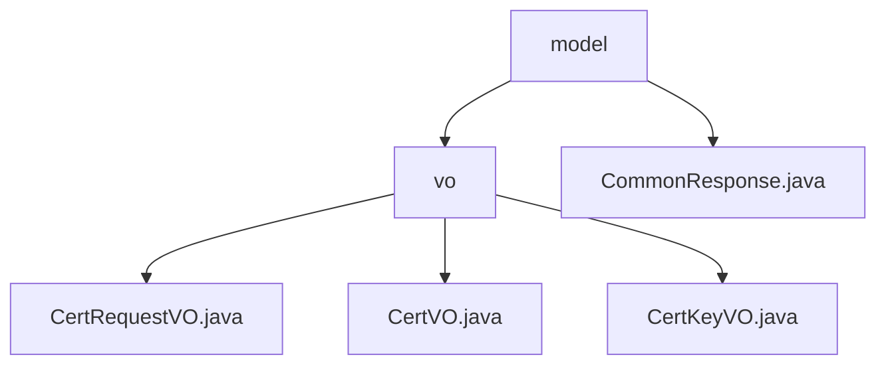

# 基础信息

|      |      |
|------|------|
| 名称 | model |
| 编码语言 | .java |
| 代码路径 | WeFe/manager/manager-service/src/main/java/com/webank/cert/mgr/model |
| 包名 | docs.manager.manager-service.src.main.java.com.webank.cert.mgr.model |
| 概述说明 | 该模块管理数字证书生命周期，含请求、签发和密钥封装功能，提供三个Java类处理相关数据。遵循Java序列化标准，依赖FastJSON框架。支持证书全流程管理及序列化操作。CommonResponse类封装通用响应数据，含状态码、消息和数据体，提供成功和失败处理方法。 |

# 说明

## 概述  
该模块核心职责是实现数字证书全生命周期管理，涵盖申请、签发和密钥关联等流程。采用CertRequestVO、CertVO和CertKeyVO三个可序列化对象分别处理证书请求、实体和密钥元数据，类似工单系统模式。接口遵循Java序列化规范，使用JSONField注解映射字段。关键数据结构包括证书主题（subject_cn）、签发机构及密钥算法（keyAlg）。外部依赖仅为Java基础库和FastJSON框架。例如CertVO通过pCertId实现证书链层级管理，CommonResponse泛型类统一封装响应数据（含状态码/消息/数据体）。

## 主要业务场景  
核心流程为用户申请（CertRequestVO）→签发（CertVO）→密钥绑定（CertKeyVO）的三阶段闭环。CertVO同时记录签发者与申请人信息，支持证书链验证（pCertId父子关联）和密钥检索（基于userId+keyAlg）。交互通过VO对象完成，例如CommonResponse提供成功/失败标准化响应，能识别CertMgrException异常类型。所有操作均支持序列化，适配RPC调用或数据库持久化场景，类似事件总线模式的数据流转。

### 包内部结构视图

该流程图展示了WeFe项目中manager-service模块下model目录的层级结构。顶层是model文件夹，它包含vo子目录和CommonResponse.java文件。vo目录下又包含三个VO类文件：CertRequestVO.java、CertVO.java和CertKeyVO.java。整个结构清晰地反映了Java包的组织方式。

# 文件列表

| 名称   | 类型  | 说明 |
|-------|------|-------------|
| [CommonResponse.java](CommonResponse.md) | file | 通用响应类，包含状态码、消息和泛型数据体，提供成功和失败静态构建方法，支持异常处理和数据封装。 |
| [vo](vo/_module.md) | package | CertRequestVO是封装证书请求数据的Java类，含pkId等字段。CertVO表示证书信息，含主键ID等字段。CertKeyVO表示证书密钥信息，含pkId等字段。三者均实现Serializable接口。 |

