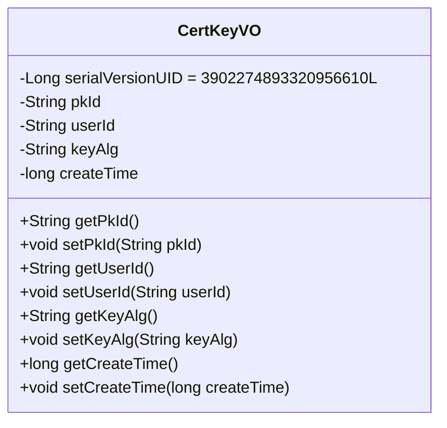

# 基础信息

|      |      |
|------|------|
| 名称 | CertKeyVO |
| 编码语言 | .java |
| 代码路径 | WeFe/manager/manager-service/src/main/java/com/webank/cert/mgr/model/vo/CertKeyVO.java |
| 包名 | com.webank.cert.mgr.model.vo |
| 依赖项 | ['java.io.Serializable'] |
| 概述说明 | CertKeyVO类实现Serializable接口，包含pkId、userId、keyAlg和createTime字段及其getter/setter方法。 |

# 说明

CertKeyVO是一个实现了Serializable接口的Java类，用于表示证书密钥信息。该类包含四个私有字段：pkId表示主键ID，userId表示用户ID，keyAlg表示密钥算法，createTime表示创建时间。每个字段都有对应的getter和setter方法用于访问和修改字段值。该类还定义了一个serialVersionUID用于序列化版本控制。

# 类列表 Class Summary

| 名称   | 类型  | 说明 |
|-------|------|-------------|
| CertKeyVO | class | CertKeyVO类实现序列化，包含pkId、userId、keyAlg和createTime字段及其getter/setter方法。 |

## 类 CertKeyVO

|      |      |
|------|------|
| 访问范围 | public |
| 类型 | class |
| 名称 | CertKeyVO |
| 说明 | CertKeyVO类实现序列化，包含pkId、userId、keyAlg和createTime字段及其getter/setter方法。 |

### UML类图

该代码定义了一个名为CertKeyVO的类，实现了Serializable接口，用于表示证书密钥值对象。类中包含四个私有属性：pkId（主键ID）、userId（用户ID）、keyAlg（密钥算法）和createTime（创建时间），并为每个属性提供了对应的getter和setter方法。serialVersionUID用于保证序列化时的版本一致性。这个类主要用于封装和传输证书密钥相关的数据，适用于需要序列化的场景。

### 内部方法调用关系图

```mermaid
graph TD
    A["类CertKeyVO"]
    B["静态属性: serialVersionUID = 3902274893320956610L"]
    C["属性: String pkId"]
    D["属性: String userId"]
    E["属性: String keyAlg"]
    F["属性: long createTime"]
    G["方法: getPkId()"]
    H["方法: setPkId(String pkId)"]
    I["方法: getUserId()"]
    J["方法: setUserId(String userId)"]
    K["方法: getKeyAlg()"]
    L["方法: setKeyAlg(String keyAlg)"]
    M["方法: getCreateTime()"]
    N["方法: setCreateTime(long createTime)"]

    A --> B
    A --> C
    A --> D
    A --> E
    A --> F
    A --> G
    A --> H
    A --> I
    A --> J
    A --> K
    A --> L
    A --> M
    A --> N
```

该流程图展示了CertKeyVO类的完整结构，这是一个实现Serializable接口的Java值对象类。类包含4个私有属性（pkId、userId、keyAlg、createTime）及其对应的getter/setter方法，以及一个用于序列化的静态serialVersionUID字段。所有方法都直接关联到类主体，形成典型的POJO结构，适用于证书密钥数据的封装和传输。

### 字段列表 Field List

| 名称  | 类型  | 说明 |
|-------|-------|------|
| keyAlg | String | 声明一个私有字符串变量keyAlg，用于存储密钥算法类型。 |
| pkId | String | 私有字符串类型变量pkId，用于存储主键标识。 |
| userId | String | 声明一个私有字符串变量userId。 |
| serialVersionUID = 3902274893320956610L | long | 声明一个私有静态不可变长整型序列化ID，值为3902274893320956610。 |
| createTime | long | 私有长整型变量，记录创建时间。 |

### 方法列表

| 名称  | 类型  | 说明 |
|-------|-------|------|
| setUserId | void | 设置用户ID的方法，将输入参数赋值给类的成员变量userId。 |
| getUserId | String | 获取用户ID的方法，返回字符串类型的userId。 |
| setPkId | void | Java方法：设置主键ID，将输入参数pkId赋值给类的成员变量this.pkId。 |
| getPkId | String | 这是一个Java方法，返回私有变量pkId的值。方法名为getPkId，返回类型为String。 |
| getKeyAlg | String | 获取密钥算法的方法，返回keyAlg值。 |
| setKeyAlg | void | 这是一个Java方法，用于设置密钥算法属性。方法名为setKeyAlg，接受一个字符串参数keyAlg，并将其赋值给类的同名成员变量。 |
| getCreateTime | long | 获取创建时间的方法，返回长整型数值createTime。 |
| setCreateTime | void | 这是一个Java方法，用于设置对象的创建时间，参数为长整型时间戳。 |

