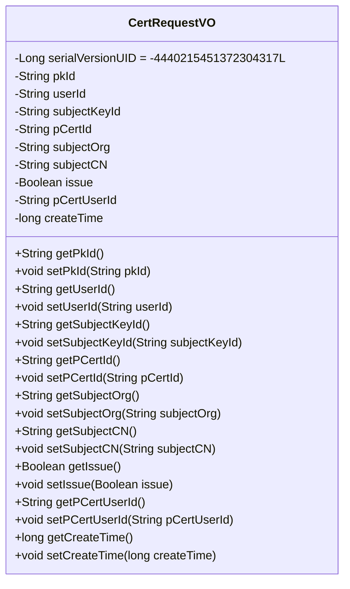

# 基础信息

|      |      |
|------|------|
| 名称 | CertRequestVO |
| 编码语言 | .java |
| 代码路径 | WeFe/manager/manager-service/src/main/java/com/webank/cert/mgr/model/vo/CertRequestVO.java |
| 包名 | com.webank.cert.mgr.model.vo |
| 依赖项 | ['java.io.Serializable', 'com.alibaba.fastjson.annotation.JSONField'] |
| 概述说明 | CertRequestVO类实现Serializable接口，包含证书请求相关字段如pkId、userId、subjectKeyId等，提供getter和setter方法。 |

# 说明

CertRequestVO是一个实现了Serializable接口的Java类，用于表示证书请求信息。类中包含多个私有字段：pkId、userId、subjectKeyId、pCertId、subjectOrg、subjectCN（JSON字段名为subject_cn）、issue、pCertUserId和createTime。每个字段都有对应的getter和setter方法。serialVersionUID用于序列化版本控制。注释显示certRequestContent字段及相关方法被暂时注释掉。该类主要用于封装证书请求的相关数据，支持序列化操作。

# 类列表 Class Summary

| 名称   | 类型  | 说明 |
|-------|------|-------------|
| CertRequestVO | class | CertRequestVO类实现Serializable接口，包含证书请求相关字段如pkId、userId、subjectCN等，提供各字段的getter和setter方法。 |

## 类 CertRequestVO

|      |      |
|------|------|
| 访问范围 | public |
| 类型 | class |
| 名称 | CertRequestVO |
| 说明 | CertRequestVO类实现Serializable接口，包含证书请求相关字段如pkId、userId、subjectCN等，提供各字段的getter和setter方法。 |

### UML类图

这段代码定义了一个名为CertRequestVO的类，实现了Serializable接口，用于表示证书请求的值对象。该类包含多个私有字段，如pkId、userId、subjectKeyId等，以及对应的getter和setter方法。其中subjectCN字段使用了@JSONField注解进行序列化配置。该类的设计主要用于封装证书请求相关的数据，便于在不同层之间传输和处理。

### 内部方法调用关系图

```mermaid
graph TD
    A["类CertRequestVO"]
    B["属性: String pkId"]
    C["属性: String userId"]
    D["属性: String subjectKeyId"]
    E["属性: String pCertId"]
    F["属性: String subjectOrg"]
    G["属性: String subjectCN"]
    H["属性: Boolean issue"]
    I["属性: String pCertUserId"]
    J["属性: long createTime"]
    K["方法: getPkId()/setPkId()"]
    L["方法: getUserId()/setUserId()"]
    M["方法: getSubjectKeyId()/setSubjectKeyId()"]
    N["方法: getpCertId()/setpCertId()"]
    O["方法: getSubjectOrg()/setSubjectOrg()"]
    P["方法: getSubjectCN()/setSubjectCN()"]
    Q["方法: getIssue()/setIssue()"]
    R["方法: getpCertUserId()/setpCertUserId()"]
    S["方法: getCreateTime()/setCreateTime()"]

    A --> B
    A --> C
    A --> D
    A --> E
    A --> F
    A --> G
    A --> H
    A --> I
    A --> J
    A --> K
    A --> L
    A --> M
    A --> N
    A --> O
    A --> P
    A --> Q
    A --> R
    A --> S
```

这段代码定义了一个名为CertRequestVO的Java类，实现了Serializable接口，主要用于证书请求的数据封装。类中包含9个私有属性，每个属性都有对应的getter和setter方法。其中subjectCN属性使用了@JSONField注解指定JSON序列化时的字段名。所有方法均为标准的属性访问器，用于对私有字段进行读写操作，构成一个典型的数据传输对象(Data Transfer Object)模式。

### 字段列表 Field List

| 名称  | 类型  | 说明 |
|-------|-------|------|
| createTime | long | 私有长整型变量createTime，用于存储创建时间。 |
| userId | String | 定义用户ID字符串变量。 |
| pCertUserId | String | 私有字符串变量pCertUserId，用于存储证书用户ID。 |
| subjectKeyId | String | 私有字符串变量，存储主题密钥标识符。 |
| issue | Boolean | 布尔类型私有变量issue，用于表示问题状态。 |
| subjectCN | String | JSON字段映射：私有字符串subjectCN对应JSON键名subject_cn。 |
| pCertId | String | 私有字符串变量pCertId，用于存储证书ID。 |
| serialVersionUID = -4440215451372304317L | long | 定义了一个私有静态常量serialVersionUID，值为-4440215451372304317L，用于序列化版本控制。 |
| pkId | String | 私有字符串类型主键ID。 |
| subjectOrg | String | 私有字符串变量，存储主体组织信息。 |

### 方法列表

| 名称  | 类型  | 说明 |
|-------|-------|------|
| getSubjectOrg | String | 方法返回主题组织字符串。 |
| getSubjectCN | String | 获取主题CN的字符串值。 |
| setPkId | void | 设置主键ID的方法，将参数pkId赋值给类的pkId成员变量。 |
| setIssue | void | 设置问题状态的方法，参数为布尔值issue，用于更新当前对象的问题状态。 |
| getpCertUserId | String | 获取pCertUserId值的公共方法。 |
| getPkId | String | 这是一个Java方法，返回名为pkId的字符串类型成员变量。 |
| setSubjectCN | void | 方法setSubjectCN用于设置subjectCN属性的值，参数为字符串类型。 |
| getUserId | String | 获取用户ID的方法，返回字符串类型的userId。 |
| setpCertUserId | void | 设置用户证书ID的方法，将参数pCertUserId赋值给类的同名成员变量。 |
| setUserId | void | 设置用户ID的方法，将参数userId赋值给当前对象的userId属性。 |
| setSubjectOrg | void | 设置主题组织的方法，将输入参数赋值给类的成员变量subjectOrg。 |
| setCreateTime | void | 设置对象创建时间的方法，参数为长整型时间戳。 |
| setpCertId | void | 这是一个Java方法，用于设置对象的pCertId属性值。方法接收一个字符串参数pCertId，并将其赋值给对象的同名成员变量。 |
| getCreateTime | long | 获取创建时间的公共方法，返回长整型变量createTime的值。 |
| getSubjectKeyId | String | 获取subjectKeyId的字符串方法。 |
| getpCertId | String | 这是一个Java方法，返回名为pCertId的字符串变量值。 |
| setSubjectKeyId | void | 设置主题密钥ID的方法，将输入字符串赋值给类的成员变量subjectKeyId。 |
| getIssue | Boolean | 获取issue布尔值的公共方法。 |

