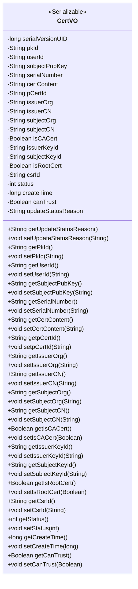

# 基础信息

|      |      |
|------|------|
| 名称 | CertVO |
| 编码语言 | .java |
| 代码路径 | WeFe/manager/manager-service/src/main/java/com/webank/cert/mgr/model/vo/CertVO.java |
| 包名 | com.webank.cert.mgr.model.vo |
| 依赖项 | ['java.io.Serializable', 'com.alibaba.fastjson.annotation.JSONField'] |
| 概述说明 | CertVO类是一个证书值对象，包含证书ID、用户ID、公钥、序列号、内容、签发机构、申请人信息、状态等属性，用于证书管理。 |

# 说明

CertVO是一个实现Serializable接口的Java类，用于表示证书信息。包含主键ID、用户ID、公钥、证书序列号、证书内容、父证书ID等字段。记录签发机构组织名称、常用名，申请人组织名称、常用名，以及是否为机构证书或根证书。还包含签发机构和申请人的私钥ID、证书请求ID、证书状态、创建时间、是否可信任状态及状态更新原因。每个字段都有对应的getter和setter方法，部分字段使用JSONField注解指定序列化名称。

# 类列表 Class Summary

| 名称   | 类型  | 说明 |
|-------|------|-------------|
| CertVO | class | CertVO类表示证书信息，包含主键、用户ID、公钥、序列号、证书内容、签发机构、申请人、证书类型、状态等字段，用于序列化和反序列化证书数据。 |

## 类 CertVO

|      |      |
|------|------|
| 访问范围 | public |
| 类型 | class |
| 名称 | CertVO |
| 说明 | CertVO类表示证书信息，包含主键、用户ID、公钥、序列号、证书内容、签发机构、申请人、证书类型、状态等字段，用于序列化和反序列化证书数据。 |

### UML类图

CertVO类是一个实现了Serializable接口的证书值对象，用于封装证书相关的各类信息。包含证书ID、用户ID、公钥、序列号、证书内容、签发机构、申请人信息、证书类型标识（CA/根证书）、状态、创建时间等属性，并提供完整的getter/setter方法。通过JSONField注解实现字段名映射，支持序列化传输。

### 内部方法调用关系图

该流程图展示了CertVO类的完整结构，包含20个私有属性和对应的getter/setter方法。这是一个典型的Java值对象(VO)设计，用于表示证书相关信息，包含证书标识、颁发者/主体信息、密钥ID、状态标记等核心字段。类实现了Serializable接口表明支持序列化，部分字段使用JSONField注解实现JSON序列化时的字段名映射。所有属性都通过标准getter/setter方法暴露，符合JavaBean规范。

### 字段列表 Field List

| 名称  | 类型  | 说明 |
|-------|-------|------|
| issuerOrg | String | 声明一个私有字符串变量issuerOrg，用于存储发行方机构信息。 |
| subjectCN | String | JSON字段映射：私有字符串subjectCN对应JSON键"subject_cn"。 |
| isCACert | Boolean | JSON字段映射：私有布尔类型isCACert对应JSON键名is_ca_cert。 |
| pCertId | String | 私有字符串变量pCertId，用于存储证书ID。 |
| updateStatusReason | String | JSON字段映射：updateStatusReason，用于存储状态更新原因。 |
| userId | String | 声明一个私有字符串变量userId。 |
| pkId | String | 私有字符串类型主键ID |
| canTrust | Boolean | 私有布尔型变量，表示是否可信。 |
| isRootCert | Boolean | JSON字段映射，属性名为is_root_cert，类型为Boolean。 |
| subjectKeyId | String | 私有字符串变量subjectKeyId，用于存储主题密钥标识。 |
| csrId | String | 私有字符串变量csrId。 |
| certContent | String | 私有字符串变量certContent，用于存储证书内容。 |
| serialVersionUID = 5882479979815938267L | long | 定义序列化版本UID，值为5882479979815938267，确保类版本兼容性。 |
| serialNumber | String | 私有字符串变量serialNumber |
| subjectOrg | String | 声明一个私有字符串变量subjectOrg。 |
| createTime | long | 私有长整型变量，记录创建时间。 |
| issuerCN | String | JSON字段映射：issuer_cn对应issuerCN属性。 |
| status | int | 私有整型变量status，用于表示状态。 |
| subjectPubKey | String | 声明一个私有字符串变量subjectPubKey，用于存储主题公钥。 |
| issuerKeyId | String | 声明一个私有字符串变量issuerKeyId。 |

### 方法列表

| 名称  | 类型  | 说明 |
|-------|-------|------|
| setCsrId | void | 设置CSR ID的方法，将参数csrId赋值给类的成员变量csrId。 |
| setUserId | void | 设置用户ID的方法，将参数userId赋值给当前对象的userId属性。 |
| getSerialNumber | String | 获取序列号的方法，返回字符串类型的serialNumber。 |
| getSubjectCN | String | 获取主题CN的方法，直接返回私有变量subjectCN的值。 |
| getCertContent | String | 方法返回证书内容字符串。 |
| getCsrId | String | 这是一个Java方法，返回字符串类型的成员变量csrId的值。 |
| setIssuerOrg | void | 这是一个Java方法，用于设置issuerOrg属性的值。方法接受一个字符串参数issuerOrg，并将其赋值给类的同名成员变量。 |
| getStatus | int | 获取当前状态值的方法，直接返回status变量。 |
| setSubjectPubKey | void | 设置主题公钥的方法，将输入字符串赋值给类的subjectPubKey成员变量。 |
| getSubjectPubKey | String | 获取subjectPubKey字符串值的方法。 |
| setSubjectKeyId | void | 设置主题密钥ID的方法，将输入字符串赋值给类的成员变量subjectKeyId。 |
| getPkId | String | 获取主键ID的方法，返回pkId。 |
| setStatus | void | 设置状态值的方法，将输入参数status赋值给当前对象的status属性。 |
| setIssuerKeyId | void | 设置颁发者密钥ID的方法，将输入字符串赋值给类成员变量issuerKeyId。 |
| setIsCACert | void | 设置证书是否为CA证书的方法，参数为布尔值isCACert。 |
| setpCertId | void | 设置证书ID的方法，将参数pCertId赋值给类的成员变量pCertId。 |
| setSerialNumber | void | 设置设备序列号的方法，将输入参数赋值给成员变量serialNumber。 |
| getIssuerCN | String | 获取颁发者通用名的方法，返回issuerCN字符串。 |
| setPkId | void | 这是一个Java方法，用于设置对象的pkId属性值。方法接收一个字符串参数pkId，并将其赋值给当前对象的pkId字段。 |
| setIssuerCN | void | 设置证书颁发者的通用名称。 |
| getSubjectOrg | String | 获取subjectOrg字符串的方法。 |
| getIsRootCert | Boolean | 获取根证书状态的方法，返回布尔值isRootCert。 |
| getIsCACert | Boolean | 获取是否为CA证书的布尔值方法。 |
| getpCertId | String | 方法返回字符串类型的pCertId值。 |
| getCreateTime | long | 获取创建时间的方法，返回长整型数值。 |
| setCreateTime | void | 这是一个Java方法，用于设置对象的创建时间，参数为长整型时间戳。 |
| getCanTrust | Boolean | 方法返回布尔值canTrust，表示是否可信。 |
| setCanTrust | void | 这是一个Java方法，用于设置布尔类型的canTrust属性值。 |
| getUpdateStatusReason | String | 获取更新状态原因的方法，返回字符串类型的updateStatusReason。 |
| getIssuerOrg | String | 获取发证机构名称的方法，返回字符串issuerOrg。 |
| getUserId | String | 获取用户ID的方法，返回字符串类型的userId。 |
| getIssuerKeyId | String | 获取发行者密钥ID的方法，返回字符串类型值。 |
| setUpdateStatusReason | void | 设置更新状态原因的方法，将参数值赋给类成员变量updateStatusReason。 |
| setSubjectOrg | void | 这是一个Java方法，用于设置对象的subjectOrg属性值。方法接收一个字符串参数，并将其赋值给对象的成员变量subjectOrg。 |
| setIsRootCert | void | 设置根证书状态的方法，参数为布尔值。 |
| setSubjectCN | void | 设置主题通用名称的方法，将输入参数赋给类的成员变量subjectCN。 |
| getSubjectKeyId | String | 获取主题密钥ID的方法，返回字符串类型的subjectKeyId。 |
| setCertContent | void | 设置证书内容的方法，将输入字符串赋值给类成员变量certContent。 |

