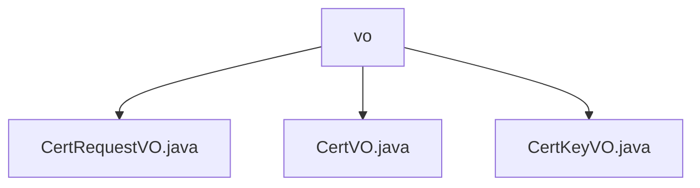

# 基础信息

|      |      |
|------|------|
| 名称 | vo |
| 编码语言 | .java |
| 代码路径 | WeFe/manager/manager-service/src/main/java/com/webank/cert/mgr/model/vo |
| 包名 | docs.manager.manager-service.src.main.java.com.webank.cert.mgr.model.vo |
| 概述说明 | CertRequestVO是封装证书请求数据的Java类，含pkId等字段。CertVO表示证书信息，含主键ID等字段。CertKeyVO表示证书密钥信息，含pkId等字段。三者均实现Serializable接口。 |

# 说明

## 概述  
该模块核心职责是管理数字证书生命周期，包括请求、签发和密钥信息封装。主要提供CertRequestVO、CertVO和CertKeyVO三个可序列化Java类，分别处理证书请求、证书实体和密钥元数据。  

接口规范遵循Java序列化标准，使用JSONField注解处理字段映射。关键数据结构包含证书请求信息（如subject_cn）、证书详情（如签发机构）和密钥属性（如keyAlg）。外部依赖仅需Java基础库和FastJSON序列化框架。例如CertVO通过pCertId维护证书层级关系。  

## 主要业务场景  
典型应用为证书全流程管理：用户发起请求（CertRequestVO）→签发证书（CertVO）→关联密钥（CertKeyVO）。类似工单系统模式，CertRequestVO记录申请信息，CertVO扩展状态跟踪，CertKeyVO提供密码学基础支撑。  

业务流程通过VO对象交互，例如CertVO同时存储签发者（issue）和申请人（subjectOrg）信息。集成案例包括证书链验证（通过pCertId父子关联）和密钥检索（基于userId和keyAlg）。所有操作均支持序列化，适配RPC或持久化场景。

### 包内部结构视图

该流程图展示了WeFe项目中manager-service模块下model/vo目录的结构关系。vo作为父节点，包含三个子节点：CertRequestVO.java、CertVO.java和CertKeyVO.java，这三个都是位于vo目录下的Java类文件。整个结构清晰地呈现了value object类文件的组织方式。

# 文件列表

| 名称   | 类型  | 说明 |
|-------|------|-------------|
| [CertRequestVO.java](CertRequestVO.md) | file | CertRequestVO类实现Serializable接口，包含证书请求相关字段如pkId、userId、subjectKeyId等，提供getter和setter方法。 |
| [CertVO.java](CertVO.md) | file | CertVO类是一个证书值对象，包含证书ID、用户ID、公钥、序列号、内容、签发机构、申请人信息、状态等属性，用于证书管理。 |
| [CertKeyVO.java](CertKeyVO.md) | file | CertKeyVO类实现Serializable接口，包含pkId、userId、keyAlg和createTime字段及其getter/setter方法。 |

