# 基础信息

|      |      |
|------|------|
| 名称 | CertOperationService |
| 编码语言 | .java |
| 代码路径 | WeFe/manager/manager-service/src/main/java/com/webank/cert/mgr/service/CertOperationService.java |
| 包名 | com.webank.cert.mgr.service |
| 依赖项 | ['java.math.BigInteger', 'java.security.KeyPair', 'java.security.PublicKey', 'java.security.Security', 'java.security.cert.CertificateExpiredException', 'java.security.cert.CertificateNotYetValidException', 'java.security.cert.X509Certificate', 'java.util.Date', 'java.util.List', 'javax.transaction.Transactional', 'com.welab.wefe.common.web.util.CurrentAccountUtil', 'org.apache.commons.lang3.StringUtils', 'org.bouncycastle.asn1.x500.RDN', 'org.bouncycastle.asn1.x500.style.BCStyle', 'org.bouncycastle.asn1.x509.KeyUsage', 'org.bouncycastle.jce.provider.BouncyCastleProvider', 'org.bouncycastle.pkcs.PKCS10CertificationRequest', 'org.slf4j.Logger', 'org.slf4j.LoggerFactory', 'org.springframework.beans.factory.annotation.Autowired', 'org.springframework.stereotype.Service', 'com.webank.cert.mgr.db.dao.CertDao', 'com.webank.cert.mgr.enums.MgrExceptionCodeEnums', 'com.webank.cert.mgr.exception.CertMgrException', 'com.webank.cert.mgr.model.vo.CertKeyVO', 'com.webank.cert.mgr.model.vo.CertRequestVO', 'com.webank.cert.mgr.model.vo.CertVO', 'com.webank.cert.mgr.utils.TransformUtils', 'com.webank.cert.toolkit.constants.CertConstants', 'com.webank.cert.toolkit.enums.CertDigestAlgEnums', 'com.webank.cert.toolkit.enums.CertStatusEnums', 'com.webank.cert.toolkit.enums.KeyAlgorithmEnums', 'com.webank.cert.toolkit.model.X500NameInfo', 'com.webank.cert.toolkit.service.CertService', 'com.webank.cert.toolkit.utils.CertUtils', 'com.webank.cert.toolkit.utils.KeyUtils', 'com.welab.wefe.common.data.mongodb.dto.PageOutput', 'com.welab.wefe.common.data.mongodb.entity.manager.CertInfo', 'com.welab.wefe.common.data.mongodb.entity.manager.CertKeyInfo', 'com.welab.wefe.common.data.mongodb.entity.manager.CertRequestInfo', 'com.welab.wefe.common.web.util.DatabaseEncryptUtil'] |
| 概述说明 | CertOperationService提供证书管理功能，包括更新证书状态、查询证书、导出证书、初始化根证书、签发证书等操作，支持RSA和ECDSA算法，使用BouncyCastle安全库。 |

# 说明

CertOperationService是一个证书操作服务类，提供证书管理和操作功能。主要功能包括更新证书状态、导出证书、查询证书信息、初始化根证书、创建签发机构证书和用户证书等。服务类依赖CertService和CertDao进行证书处理和数据库操作。初始化时检查并添加BouncyCastle安全提供者。核心方法包括根据序列号或用户ID更新证书状态、导出证书到文件、查询证书及私钥信息、分页查询证书请求和私钥列表。证书签发流程涉及生成密钥对、保存私钥、创建证书请求、签发证书并保存证书信息。支持根证书、CA证书和用户证书的签发，包含证书有效期、密钥用途等属性设置。异常处理涵盖证书不存在、密钥不存在、证书有效期校验失败等情况。

# 类列表 Class Summary

| 名称   | 类型  | 说明 |
|-------|------|-------------|
| CertOperationService | class | CertOperationService提供证书管理功能，包括更新状态、导出证书、查询证书、签发根证书和用户证书等操作。 |

## 类 CertOperationService

|      |      |
|------|------|
| 访问范围 | @Service;public |
| 类型 | class |
| 名称 | CertOperationService |
| 说明 | CertOperationService提供证书管理功能，包括更新状态、导出证书、查询证书、签发根证书和用户证书等操作。 |

### UML类图

```mermaid
classDiagram
    class CertOperationService {
        -Logger LOG
        -CertService certService
        -CertDao certDao
        +updateStatusBySerialNumber(String serialNumber, int status, String reason) void
        +updateStatusByUserId(String userId, int status, String reason) void
        +updateCanTrust(String serialNumber, boolean status) void
        +exportCertToDerFile(String certId, String filePath) void
        +queryCertInfoByCertId(String certId) CertVO
        +findCertRequestById(String pkId) CertRequestVO
        +findCertKeyById(String certKeyId) CertKeyVO
        +findBySerialNumber(String serialNumber) CertVO
        +queryCertRequestList(String userId, String pCertId, int pageIndex, int pageSize) PageOutput~CertRequestInfo~
        +findKeys(String userId, int pageIndex, int pageSize) PageOutput~CertKeyInfo~
        +findCertList(String userId, String pCertId, Boolean isCACert, Boolean isRootCert) List~CertInfo~
        +findCertList(String userId, String pCertId, Boolean isCACert, Boolean isRootCert, int status, int pageIndex, int pageSize) PageOutput~CertInfo~
        +initRootCert(String commonName, String organizationName, String organizationUnitName) CertVO
        +createIssuerCert(String rootCertId, String commonName, String organizationName, String organizationUnitName) CertVO
        +createUserCert(String issuerCertId, String memberId, String certRequestContent) CertVO
        -savePrivateKey(String userId, String pemPrivateKey, String priAlg) CertKeyInfo
        -createUserCertRequest(String commonName, String userId, String certRequestContent, String organizationName, X500NameInfo subject) CertRequestInfo
        -buildCertRequestInfo(String csrStr, String subjectKeyId, String commonName, String organizationName, String userId) CertRequestInfo
        -buildCertInfo(String certificatePemStr, String issuerCommonName, String issuerOrgName, String subjectCommonName, String subjectOrgName, PublicKey publicKey, String userId, BigInteger serialNumber, String issuerCertKeyId, String subjectKeyId, boolean isCACert, boolean isRootCert, String issuerCertId, String csrId) CertInfo
        -getCertDigestAlg(KeyAlgorithmEnums keyAlgorithm) CertDigestAlgEnums
        -getKeyPair(KeyAlgorithmEnums keyAlgorithm, String pemPrivateKey) KeyPair
    }

    class CertService {
        <<Interface>>
        +createRootCertificate(String algorithmName, X500NameInfo issuer, KeyUsage keyUsage, Date beginDate, Date endDate, PublicKey publicKey, PrivateKey privateKey) X509Certificate
        +createCertRequest(X500NameInfo subject, PublicKey publicKey, PrivateKey privateKey, String algorithmName) PKCS10CertificationRequest
        +createChildCertificate(boolean isCaCert, String algorithmName, X509Certificate issuerCertificate, PKCS10CertificationRequest csr, KeyUsage keyUsage, Date beginDate, Date endDate, PrivateKey privateKey) X509Certificate
    }

    class CertDao {
        <<Interface>>
        +updateStatusBySerialNumber(String serialNumber, int status, String reason) void
        +updateStatusByUserId(String userId, int status, String reason) void
        +updateCanTrust(String serialNumber, boolean status) void
        +findCertById(String certId) CertInfo
        +findCertRequestById(String pkId) CertRequestInfo
        +findKeyByPkId(String certKeyId) CertKeyInfo
        +findBySerialNumber(String serialNumber) CertInfo
        +findCertRequestList(String userId, String pCertId, int pageIndex, int pageSize) PageOutput~CertRequestInfo~
        +findKeys(String userId, int pageIndex, int pageSize) PageOutput~CertKeyInfo~
        +findCertList(String userId, String pCertId, Boolean isCACert, Boolean isRootCert) List~CertInfo~
        +findCertList(String userId, String pCertId, Boolean isCACert, Boolean isRootCert, int status, int pageIndex, int pageSize) PageOutput~CertInfo~
        +save(CertInfo certInfo) CertInfo
        +save(CertRequestInfo certRequestInfo) CertRequestInfo
        +save(CertKeyInfo certKeyInfo) CertKeyInfo
        +findCertKeyById(String certKeyId) CertKeyInfo
    }

    class CertVO {
        +String certContent
        +String subjectCN
        +String subjectOrg
        +String issuerCN
        +String issuerOrg
        +String subjectPubKey
        +String issuerKeyId
        +String subjectKeyId
        +String serialNumber
        +boolean isCACert
        +boolean isRootCert
        +String csrId
        +int status
    }

    class CertRequestVO {
        +String certRequestContent
        +String subjectKeyId
        +String subjectCN
        +String subjectOrg
        +String userId
        +boolean issue
    }

    class CertKeyVO {
        +String keyAlg
        +String keyPem
        +String userId
        +String createdBy
    }

    class CertInfo {
        +String userId
        +String createdBy
        +String issuerCN
        +String issuerOrg
        +String pCertId
        +String subjectCN
        +String subjectOrg
        +String subjectPubKey
        +String issuerKeyId
        +String subjectKeyId
        +String certContent
        +String serialNumber
        +boolean isCACert
        +boolean isRootCert
        +String csrId
        +int status
    }

    class CertRequestInfo {
        +String userId
        +String createdBy
        +String subjectKeyId
        +String subjectCN
        +String subjectOrg
        +String certRequestContent
        +boolean issue
    }

    class CertKeyInfo {
        +String keyAlg
        +String keyPem
        +String userId
        +String createdBy
        +String pkId
    }

    class PageOutput~T~ {
        +List~T~ data
        +int total
        +int pageIndex
        +int pageSize
    }

    class X500NameInfo {
        +String commonName
        +String organizationName
        +String organizationalUnitName
    }

    class KeyAlgorithmEnums {
        <<Enumeration>>
        +RSA
        +ECDSA
        +SM2
        +getByKeyAlg(String keyAlg) KeyAlgorithmEnums
        +getKeyAlgorithm() String
    }

    class CertDigestAlgEnums {
        <<Enumeration>>
        +SHA256withRSA
        +SHA384withECDSA
        +SM3withSM2
        +getByKeyAlg(String keyAlg) CertDigestAlgEnums
        +getAlgorithmName() String
    }

    class CertStatusEnums {
        <<Enumeration>>
        +VALID
        +REVOKED
        +EXPIRED
        +getCode() int
    }

    class MgrExceptionCodeEnums {
        <<Enumeration>>
        +PKEY_MGR_CERT_NOT_EXIST
        +PKEY_MGR_CERT_KEY_NOT_EXIST
        +PKEY_MGR_CERT_VALIDITY_FAILURE
        +PKEY_MGR_ACCOUNT_NOT_EXIST
        +PKEY_MGR_CERT_KEY_ALG_NOT_EXIST
    }

    class CertMgrException {
        +MgrExceptionCodeEnums code
        +CertMgrException(MgrExceptionCodeEnums code)
    }

    class CertUtils {
        <<Utility>>
        +writeCrt(X509Certificate certificate, String filePath) void
        +convertStrToCert(String certContent) X509Certificate
        +readPEMAsString(Object obj) String
        +convertStrToCsr(String csrContent) PKCS10CertificationRequest
    }

    class KeyUtils {
        <<Utility>>
        +generateKeyPair() KeyPair
        +getRSAKeyPair(String pemPrivateKey) KeyPair
        +getECKeyPair(String pemPrivateKey) KeyPair
    }

    class DatabaseEncryptUtil {
        <<Utility>>
        +encrypt(String data) String
        +decrypt(String data) String
    }

    class TransformUtils {
        <<Utility>>
        +simpleTransform(Object source, Class~T~ targetClass) T
    }

    class CurrentAccountUtil {
        <<Utility>>
        +get() Account
        +getId() String
    }

    CertOperationService --> CertService : 依赖
    CertOperationService --> CertDao : 依赖
    CertOperationService --> CertUtils : 依赖
    CertOperationService --> KeyUtils : 依赖
    CertOperationService --> DatabaseEncryptUtil : 依赖
    CertOperationService --> TransformUtils : 依赖
    CertOperationService --> CurrentAccountUtil : 依赖
    CertOperationService --> CertVO : 返回
    CertOperationService --> CertRequestVO : 返回
    CertOperationService --> CertKeyVO : 返回
    CertOperationService --> CertInfo : 操作
    CertOperationService --> CertRequestInfo : 操作
    CertOperationService --> CertKeyInfo : 操作
    CertOperationService --> X500NameInfo : 使用
    CertOperationService --> KeyAlgorithmEnums : 使用
    CertOperationService --> CertDigestAlgEnums : 使用
    CertOperationService --> CertStatusEnums : 使用
    CertOperationService --> MgrExceptionCodeEnums : 使用
    CertOperationService --> CertMgrException : 抛出
    CertService --> X509Certificate : 返回
    CertService --> PKCS10CertificationRequest : 返回
    CertDao --> CertInfo : 返回
    CertDao --> CertRequestInfo : 返回
    CertDao --> CertKeyInfo : 返回
    CertDao --> PageOutput~CertRequestInfo~ : 返回
    CertDao --> PageOutput~CertKeyInfo~ : 返回
    CertDao --> PageOutput~CertInfo~ : 返回
    CertVO --> CertInfo : 转换
    CertRequestVO --> CertRequestInfo : 转换
    CertKeyVO --> CertKeyInfo : 转换
```

该代码实现了一个证书管理服务，主要功能包括证书状态更新、证书导出、证书查询、根证书初始化、签发机构证书创建和用户证书签发等。类图展示了CertOperationService与多个辅助类和接口的关系，包括证书服务接口CertService、数据访问接口CertDao、各种值对象和枚举类，以及工具类如CertUtils和KeyUtils等。整个设计采用了分层架构，服务层依赖数据访问层和工具类，通过枚举类管理状态和异常代码，实现了证书生命周期的完整管理。

### 内部方法调用关系图

```mermaid
graph TD
    A["类CertOperationService"]
    B["静态块: 初始化BouncyCastleProvider"]
    C["依赖注入: CertService certService"]
    D["依赖注入: CertDao certDao"]
    E["方法: updateStatusBySerialNumber"]
    F["方法: updateStatusByUserId"]
    G["方法: updateCanTrust"]
    H["方法: exportCertToDerFile"]
    I["方法: queryCertInfoByCertId"]
    J["方法: findCertRequestById"]
    K["方法: findCertKeyById"]
    L["方法: findBySerialNumber"]
    M["方法: queryCertRequestList"]
    N["方法: findKeys"]
    O["方法: findCertList"]
    P["方法: initRootCert"]
    Q["方法: createIssuerCert"]
    R["方法: createUserCert"]
    S["私有方法: savePrivateKey"]
    T["私有方法: createUserCertRequest"]
    U["私有方法: buildCertRequestInfo"]
    V["私有方法: buildCertInfo"]
    W["私有方法: getCertDigestAlg"]
    X["私有方法: getKeyPair"]

    A --> B
    A --> C
    A --> D
    A --> E
    A --> F
    A --> G
    A --> H
    A --> I
    A --> J
    A --> K
    A --> L
    A --> M
    A --> N
    A --> O
    A --> P
    A --> Q
    A --> R
    A --> S
    A --> T
    A --> U
    A --> V
    A --> W
    A --> X

    H --> I
    P --> S
    P --> V
    Q --> S
    Q --> V
    Q --> W
    Q --> X
    R --> V
    R --> T
    R --> W
    R --> X
    S --> X
```

该流程图展示了CertOperationService类的完整结构，包含静态初始化块、依赖注入字段、公共业务方法和私有工具方法。核心业务逻辑围绕证书管理展开，包括状态更新、证书查询、根证书初始化、颁发者证书创建和用户证书签发等功能。私有方法主要用于密钥保存、证书信息构建和加密算法处理，支持主业务流程的实现。类通过CertDao进行数据持久化，通过CertService实现核心证书操作，体现了清晰的分层架构设计。

### 字段列表 Field List

| 名称  | 类型  | 说明 |
|-------|-------|------|
| certDao | CertDao | 自动注入CertDao实例到当前类的certDao字段。 |
| LOG = LoggerFactory.getLogger(CertOperationService.class) | Logger | 类CertOperationService中定义了一个受保护的静态常量LOG，用于日志记录。 |
| certService | CertService | 自动注入CertService实例。 |

### 方法列表

| 名称  | 类型  | 说明 |
|-------|-------|------|
| updateStatusBySerialNumber | void | 方法根据序列号更新状态，若序列号为空则不处理，否则调用DAO层更新状态和原因。 |
| findCertRequestById | CertRequestVO | 方法通过ID查询证书请求，调用DAO层获取数据后转换为VO对象返回。 |
| queryCertInfoByCertId | CertVO | 该方法通过证书ID查询证书信息，将查询结果转换为CertVO对象并返回。 |
| createIssuerCert | CertVO | 创建签发者证书方法：生成公私钥，验证签发机构证书有效性，签发新证书并保存私钥和证书信息。 |
| findKeys | PageOutput<CertKeyInfo> | 该方法通过certDao查询指定用户ID的证书密钥信息，支持分页参数。返回分页结果。 |
| createUserCertRequest | CertRequestInfo | 创建用户证书请求方法，检查用户ID非空后构建并保存证书请求信息。 |
| createUserCert | CertVO | 创建用户证书方法：验证签发机构证书有效性，生成子证书并保存CSR和证书信息，返回证书VO对象。 |
| updateCanTrust | void | 方法updateCanTrust根据序列号更新证书信任状态，若序列号为空则直接返回，否则调用certDao更新状态。 |
| findCertList | List<CertInfo> | 该方法通过用户ID、父证书ID、是否CA证书及根证书标志查询证书列表，并调用DAO层返回结果。注意参数isRootCert未使用。 |
| findCertList | PageOutput<CertInfo> | 方法findCertList根据用户ID、父证书ID、CA证书标志、根证书标志和状态查询证书列表，返回分页结果。 |
| initRootCert | CertVO | 初始化根证书方法，生成RSA密钥对，创建并保存X509证书，返回证书信息。包含公私钥处理、有效期设置及数据库存储。 |
| exportCertToDerFile | void | 该方法根据证书ID导出DER格式证书文件。若证书存在且内容非空，将其写入指定路径；否则抛出证书不存在的异常。 |
| savePrivateKey | CertKeyInfo | 方法savePrivateKey保存用户私钥：校验用户ID非空，验证RSA密钥对，加密私钥后存入数据库并返回CertKeyInfo对象。异常时记录日志并抛出。 |
| queryCertRequestList | PageOutput<CertRequestInfo> | 查询证书请求列表的方法，根据用户ID和证书ID分页返回结果。 |
| findCertKeyById | CertKeyVO | 该方法通过ID查询证书密钥信息，将数据库实体转换为视图对象后返回。 |
| updateStatusByUserId | void | 根据用户ID更新状态，若ID为空则不处理。调用DAO层执行更新操作。 |
| findBySerialNumber | CertVO | 根据序列号查询证书信息并转换为VO对象返回。 |
| buildCertRequestInfo | CertRequestInfo | 构建证书请求信息，设置用户ID、创建者、主题密钥ID、通用名、组织名、CSR内容及签发标志。 |
| buildCertInfo | CertInfo | 构建证书信息对象，包含用户ID、颁发者、主体、公私钥ID、证书内容、序列号、CA/根标识、CSR ID及状态等字段。 |
| getCertDigestAlg | CertDigestAlgEnums | 方法根据密钥算法获取证书摘要算法，若密钥算法为空或未找到对应摘要算法则抛出异常。 |
| getKeyPair | KeyPair | 根据密钥算法类型（ECDSA/SM2或RSA）从PEM格式私钥生成密钥对，若算法不支持则抛出异常。 |

