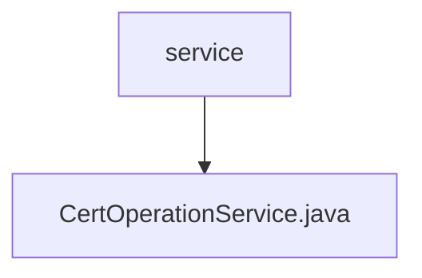

# 基础信息

|      |      |
|------|------|
| 名称 | service |
| 编码语言 | .java |
| 代码路径 | WeFe/manager/manager-service/src/main/java/com/webank/cert/mgr/service |
| 包名 | docs.manager.manager-service.src.main.java.com.webank.cert.mgr.service |
| 概述说明 | CertOperationService提供证书管理功能，包括更新证书状态、查询证书、导出证书、初始化根证书、签发证书等操作，支持RSA和ECDSA算法，使用BouncyCastle安全库。 |

# 说明

CertOperationService是一个证书操作服务类，提供证书管理和操作功能。主要功能包括更新证书状态、导出证书、查询证书信息、初始化根证书、创建签发机构证书和用户证书等。服务类依赖CertService和CertDao进行证书处理和数据库操作。初始化时检查并添加BouncyCastle安全提供者。核心方法包括根据序列号或用户ID更新证书状态、导出证书到文件、查询证书及私钥信息、分页查询证书请求和私钥列表。证书签发流程涉及生成密钥对、保存私钥、创建证书请求、签发证书并保存证书信息。支持根证书、CA证书和用户证书的签发，包含证书有效期、密钥用途等属性设置。异常处理涵盖证书不存在、密钥不存在、证书有效期校验失败等情况。

### 包内部结构视图

该流程图展示了manager-service项目中的服务层结构。根节点为service目录，包含一个具体的服务实现文件CertOperationService.java。这种结构符合典型的Java服务层设计模式，其中服务接口与实现在同一层级下组织。

# 文件列表

| 名称   | 类型  | 说明 |
|-------|------|-------------|
| [CertOperationService.java](CertOperationService.md) | file | CertOperationService提供证书管理功能，包括更新证书状态、查询证书、导出证书、初始化根证书、签发证书等操作，支持RSA和ECDSA算法，使用BouncyCastle安全库。 |

