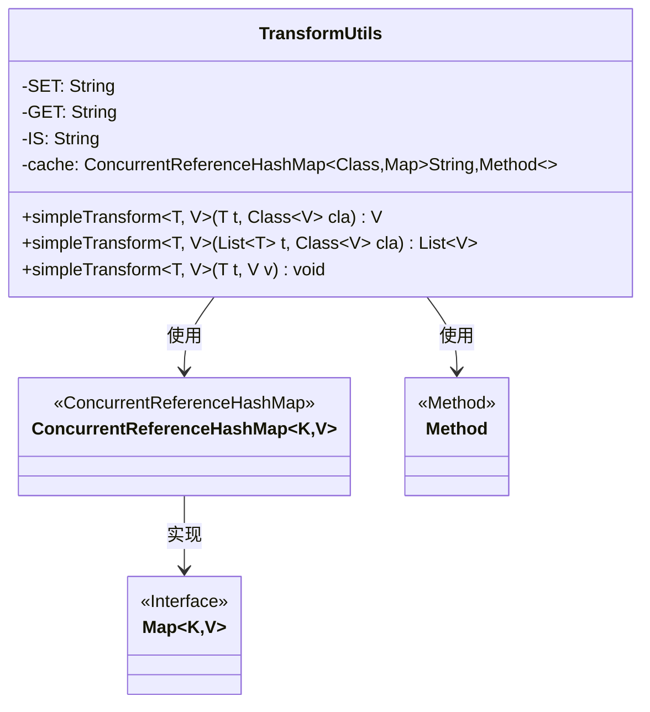
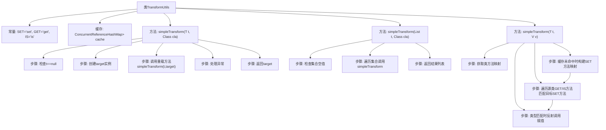

# 基础信息

|      |      |
|------|------|
| 名称 | TransformUtils |
| 编码语言 | .java |
| 代码路径 | WeFe/manager/manager-service/src/main/java/com/webank/cert/mgr/utils/TransformUtils.java |
| 包名 | com.webank.cert.mgr.utils |
| 依赖项 | ['org.springframework.util.CollectionUtils', 'org.springframework.util.ConcurrentReferenceHashMap', 'java.lang.reflect.InvocationTargetException', 'java.lang.reflect.Method', 'java.util.ArrayList', 'java.util.HashMap', 'java.util.List', 'java.util.Map'] |
| 概述说明 | TransformUtils类提供对象转换功能，支持单对象和列表转换，利用反射和缓存优化性能。 |

# 说明

TransformUtils是一个工具类，提供对象转换功能。它包含三个静态常量SET、GET、IS用于方法名匹配。使用ConcurrentReferenceHashMap缓存类方法信息以提高性能。主要提供三个方法：simpleTransform(T, Class)将单个对象转换为目标类型实例；simpleTransform(List, Class)批量转换列表对象；simpleTransform(T, V)将源对象属性值复制到目标对象。通过反射获取getter/setter方法，并检查参数类型匹配后执行属性复制。异常时统一抛出RuntimeException。

# 类列表 Class Summary

| 名称   | 类型  | 说明 |
|-------|------|-------------|
| TransformUtils | class | TransformUtils类提供对象转换功能，支持单个对象和列表转换，通过反射缓存方法提升性能。 |

## 类 TransformUtils

|      |      |
|------|------|
| 访问范围 | public |
| 类型 | class |
| 名称 | TransformUtils |
| 说明 | TransformUtils类提供对象转换功能，支持单个对象和列表转换，通过反射缓存方法提升性能。 |

### UML类图

这段代码展示了一个对象转换工具类TransformUtils，它通过反射机制实现对象属性值的复制。核心功能包括：单个对象转换(simpleTransform)、列表批量转换(simpleTransform)以及直接赋值转换(simpleTransform)。类中使用ConcurrentReferenceHashMap缓存目标类的setter方法，通过匹配源对象的getter/is方法与目标对象的setter方法来实现属性复制。该工具类支持泛型，线程安全，并处理了空值等边界情况，适用于不同类之间相同属性名的数据转换场景。

### 内部方法调用关系图

该流程图展示了TransformUtils工具类的核心逻辑结构。类通过反射实现对象属性转换，包含三个重载方法：单个对象转换、集合转换和直接赋值转换。核心流程包括缓存SET方法映射、匹配GET/IS方法、类型校验和反射调用，通过ConcurrentReferenceHashMap优化性能。异常处理贯穿整个过程，确保类型安全。

### 字段列表 Field List

| 名称  | 类型  | 说明 |
|-------|-------|------|
| IS = "is" | String | 定义私有静态常量字符串IS，值为"is"。 |
| GET = "get" | String | 定义私有静态常量GET，值为"get"。 |
| cache = new ConcurrentReferenceHashMap<>() | ConcurrentReferenceHashMap<Class,Map<String, Method>> | 私有静态并发引用哈希表，键为Class类型，值为Map<String, Method>，用于缓存方法信息。 |
| SET = "set" | String | 定义私有静态常量字符串SET，值为"set"。 |

### 方法列表

| 名称  | 类型  | 说明 |
|-------|-------|------|
| simpleTransform | V | 这是一个泛型方法，将对象t转换为目标类型V的实例。若t为空则返回空，否则创建V的新实例并调用simpleTransform转换数据，异常时抛出运行时异常。 |
| simpleTransform | List<V> | 这是一个Java泛型方法，将列表元素转换为指定类型的新列表。若输入为空则返回空列表，否则遍历元素逐个转换并收集结果。 |
| simpleTransform | void | 静态方法simpleTransform通过反射将对象t的属性值映射到对象v。缓存v的setter方法，匹配t的getter/is方法名和参数类型后调用。异常时抛出RuntimeException。 |

