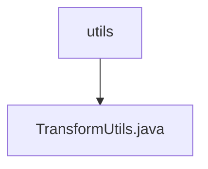

# 基础信息

|      |      |
|------|------|
| 名称 | utils |
| 编码语言 | .java |
| 代码路径 | WeFe/manager/manager-service/src/main/java/com/webank/cert/mgr/utils |
| 包名 | docs.manager.manager-service.src.main.java.com.webank.cert.mgr.utils |
| 概述说明 | TransformUtils类提供对象转换功能，支持单对象和列表转换，利用反射和缓存优化性能。 |

# 说明

TransformUtils是一个工具类，提供对象转换功能。它包含三个静态常量SET、GET、IS用于方法名匹配。使用ConcurrentReferenceHashMap缓存类方法信息以提高性能。主要提供三个方法：simpleTransform(T, Class)将单个对象转换为目标类型实例；simpleTransform(List, Class)批量转换列表对象；simpleTransform(T, V)将源对象属性值复制到目标对象。通过反射获取getter/setter方法，并检查参数类型匹配后执行属性复制。异常时统一抛出RuntimeException。

### 包内部结构视图

该流程图展示了WeFe项目中manager-service模块下的utils目录结构，其中包含一个工具类文件TransformUtils.java。utils作为父目录，TransformUtils.java作为其子节点，清晰地呈现了简单的单层文件包含关系。

# 文件列表

| 名称   | 类型  | 说明 |
|-------|------|-------------|
| [TransformUtils.java](TransformUtils.md) | file | TransformUtils类提供对象转换功能，支持单对象和列表转换，利用反射和缓存优化性能。 |

