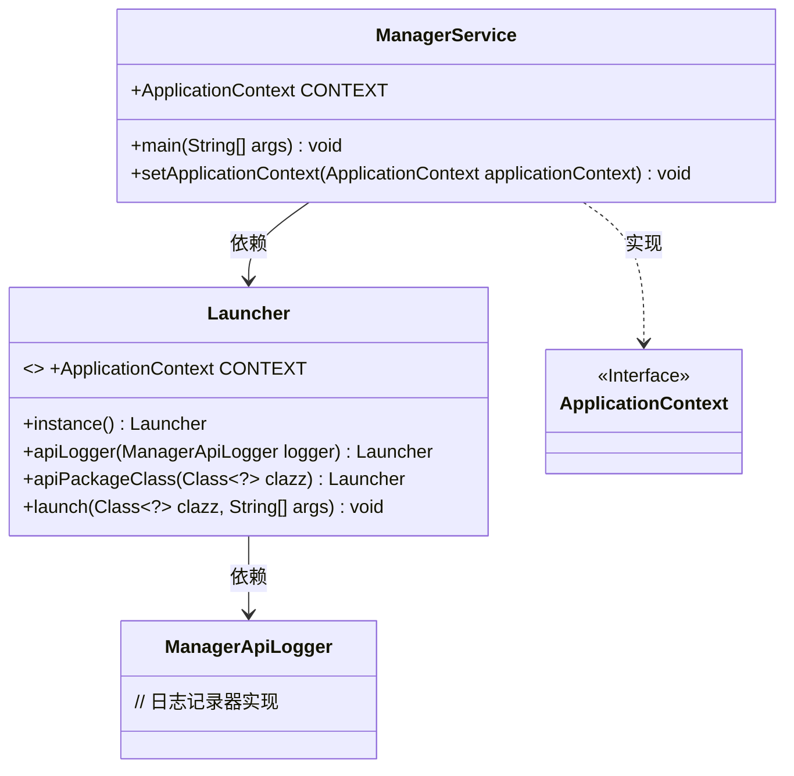
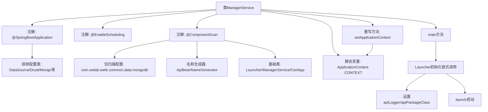

# 基础信息

|      |      |
|------|------|
| 名称 | ManagerService |
| 编码语言 | .java |
| 代码路径 | WeFe/manager/manager-service/src/main/java/com/welab/wefe/manager/service/ManagerService.java |
| 包名 | com.welab.wefe.manager.service |
| 依赖项 | ['com.alibaba.druid.spring.boot.autoconfigure.DruidDataSourceAutoConfigure', 'com.webank.cert.mgr.CertApp', 'com.welab.wefe.common.web.Launcher', 'com.welab.wefe.common.web.config.ApiBeanNameGenerator', 'com.welab.wefe.manager.service.operation.ManagerApiLogger', 'org.springframework.beans.BeansException', 'org.springframework.boot.autoconfigure.SpringBootApplication', 'org.springframework.boot.autoconfigure.data.mongo.MongoDataAutoConfiguration', 'org.springframework.boot.autoconfigure.jdbc.DataSourceAutoConfiguration', 'org.springframework.boot.autoconfigure.mongo.MongoAutoConfiguration', 'org.springframework.boot.autoconfigure.transaction.TransactionAutoConfiguration', 'org.springframework.context.ApplicationContext', 'org.springframework.context.ApplicationContextAware', 'org.springframework.context.annotation.ComponentScan', 'org.springframework.scheduling.annotation.EnableScheduling'] |
| 概述说明 | SpringBoot应用排除数据源和Mongo自动配置，启用定时任务，自定义组件扫描路径，实现ApplicationContextAware接口保存上下文。主方法通过Launcher启动应用。 |

# 说明

这是一个Spring Boot应用启动类ManagerService，使用@SpringBootApplication排除了数据源、MongoDB和事务的自动配置。通过@EnableScheduling启用定时任务，并通过@ComponentScan指定了基础扫描包和类。类实现了ApplicationContextAware接口以获取Spring上下文，并在main方法中通过Launcher启动应用，配置了API日志和包路径。注释掉的代码展示了会话令牌检查和权限控制逻辑的预留位置。

# 类列表 Class Summary

| 名称   | 类型  | 说明 |
|-------|------|-------------|
| ManagerService | class | SpringBoot应用排除数据源和Mongo自动配置，启用定时任务，自定义组件扫描路径，实现ApplicationContextAware接口保存上下文。主方法通过Launcher启动，设置API日志和包路径。 |

## 类 ManagerService

|      |      |
|------|------|
| 访问范围 | @SpringBootApplication(exclude = {;        DataSourceAutoConfiguration.class,;        DruidDataSourceAutoConfigure.class,;        MongoAutoConfiguration.class,;        MongoDataAutoConfiguration.class,;        TransactionAutoConfiguration.class;});@EnableScheduling;@ComponentScan(;        basePackages = {"com.welab.wefe.common.data.mongodb"},;        nameGenerator = ApiBeanNameGenerator.class,;        basePackageClasses = {;                Launcher.class,;                ManagerService.class,;                CertApp.class;        };);public |
| 类型 | class |
| 名称 | ManagerService |
| 说明 | SpringBoot应用排除数据源和Mongo自动配置，启用定时任务，自定义组件扫描路径，实现ApplicationContextAware接口保存上下文。主方法通过Launcher启动，设置API日志和包路径。 |

### UML类图

这段代码展示了一个Spring Boot应用的主服务类ManagerService，它通过@SpringBootApplication排除了多个自动配置类，并启用了定时任务和组件扫描。ManagerService实现了ApplicationContextAware接口来获取Spring上下文，并通过Launcher类启动应用。类图清晰地展示了ManagerService与Launcher、ApplicationContext及ManagerApiLogger之间的关系，其中Launcher负责应用的初始化和启动流程。

### 内部方法调用关系图

该流程图展示了ManagerService类的核心结构，重点突出SpringBoot应用的配置排除项、组件扫描规则以及启动流程。通过Launcher的链式调用完成API日志配置和上下文注入，最终通过setApplicationContext方法实现双重上下文存储。注解配置与运行时逻辑分离清晰，体现了SpringBoot应用的典型初始化模式。

### 字段列表 Field List

| 名称  | 类型  | 说明 |
|-------|-------|------|
| CONTEXT = null | ApplicationContext | 静态全局应用上下文变量，初始值为空。 |

### 方法列表

| 名称  | 类型  | 说明 |
|-------|-------|------|
| main | void | Java主方法初始化Launcher实例，配置日志和服务类，启动ManagerService。 |
| setApplicationContext | void | 该方法将传入的Spring应用上下文赋值给当前类和Launcher类的静态变量CONTEXT。 |

