# 基础信息

|      |      |
|------|------|
| 名称 | api |
| 编码语言 | .java |
| 代码路径 | WeFe/manager/manager-service/src/main/java/com/welab/wefe/manager/service/api |
| 包名 | docs.manager.manager-service.src.main.java.com.welab.wefe.manager.service.api |
| 概述说明 | 证书管理模块提供证书全生命周期管理功能，包括查询、下载、更新状态及信任库维护。支持初始化、查询、状态管理三大场景，依赖CertOperationService等组件。 |

# 说明

## 概述  
该模块群核心职责是提供联盟链生态下的多维度资源管理能力，包括证书、数据资源、节点、标签及成员认证等全生命周期管理。接口规范统一继承AbstractApi基类，采用RESTful风格设计，输入输出均为特定DTO（如CertVO、MemberQueryOutput），通过MongoDB和智能合约服务实现数据持久化与同步。关键数据结构涵盖视图对象（如UnionNodeQueryOutput）、输入参数（如RealnameAuthAgreementTemplateEnableInput）及枚举类型（如DataResourceType）。外部依赖主要包括MongoDB驱动、Spring Data、ContractService系列及各类MongoRepo组件，例如通过CertOperationService同步证书状态到区块链。实现案例丰富，如DownloadFileApi通过GridFS实现文件下载，RealNameAuthAuditApi调用审核服务处理实名认证。

## 主要业务场景  
模块群支持联盟管理的完整业务闭环，类似分布式配置中心模式。核心场景包括：证书管理（初始化/查询/信任库维护）、数据资源操作（分页查询/标签统计/状态切换）、节点管理（CRUD/启用控制）、实名认证流程（模板上传/版本控制）及成员服务（状态更新/认证审核）。交互模式均为"参数校验→服务调用→结果转换"三段式，例如UpdateApi类接口普遍需验证输入后调用合约服务。典型应用如：管理员通过UnionNode系列API维护节点列表，用户通过DataSetTagsApi生成标签云。API类型全面覆盖查询类（如QueryAllApi）、操作类（如DeleteApi）和文件类（如DownloadApi），集成案例展示多组件协同，如MongoDB查询与区块链状态更新联动。

### 包内部结构视图

```mermaid
graph TD
    api --> cert
    api --> account
    api --> authtype
    api --> dataresource
    api --> common
    api --> dataset
    api --> union
    api --> defaulttag
    api --> agreement
    api --> member
    
    cert --> QueryCertApi.java
    cert --> DetailCsrApi.java
    cert --> DownloadApi.java
    cert --> TrustCertsUpdateApi.java
    cert --> DetailKeyApi.java
    cert --> QueryCsrApi.java
    cert --> UpdateCertStatusApi.java
    cert --> InitApi.java
    cert --> QueryKeyApi.java
    cert --> DetailCertApi.java
    cert --> QueryTrustCertApi.java
    
    account --> SsoLoginApi.java
    
    authtype --> UpdateApi.java
    authtype --> DeleteApi.java
    authtype --> AddApi.java
    authtype --> QueryAllApi.java
    
    dataresource --> QueryApi.java
    dataresource --> DetailApi.java
    dataresource --> DataResourceTagsApi.java
    dataresource --> EnableApi.java
    
    common --> DownloadFileApi.java
    
    dataset --> UpdateExtJsonApi.java
    dataset --> QueryApi.java
    dataset --> DetailApi.java
    dataset --> DataSetTagsApi.java
    
    union --> UpdateApi.java
    union --> DeleteApi.java
    union --> QueryAllApi.java
    union --> EnableApi.java
    
    defaulttag --> QueryApi.java
    defaulttag --> UpdateApi.java
    defaulttag --> DeleteApi.java
    defaulttag --> AddApi.java
    
    agreement --> UploadRealnameAuthAgreementTemplateApi.java
    agreement --> QueryApi.java
    agreement --> EnableApi.java
    
    member --> QueryApi.java
    member --> UpdateApi.java
    member --> RealNameAuthAuditApi.java
    member --> RealNameAuthInfoQueryApi.java
```

该流程图展示了WeFe管理服务中API接口的层级结构，根节点为api目录，下分10个子模块（如cert、account等），每个子模块包含若干具体API实现类（如QueryCertApi.java、SsoLoginApi.java等）。完整呈现了45个路径节点间的从属关系，结构清晰体现了模块化设计思想。

# 文件列表

| 名称   | 类型  | 说明 |
|-------|------|-------------|
| [agreement](agreement/_module.md) | package | UploadApi类处理实名认证协议上传，包括文件验证、存储、版本管理和同步联盟链。QueryApi类查询协议模板数据并返回JSON列表。EnableApi类管理模板启用状态，支持禁用旧模板并启用新模板，含重试机制。 |
| [member](member/_module.md) | package | QueryApi处理会员分页查询，UpdateApi更新会员信息，RealNameAuthAuditApi处理实名认证审核，RealNameAuthInfoQueryApi查询实名认证信息。均继承AbstractApi，含数据库操作和异常处理。 |
| [defaulttag](defaulttag/_module.md) | package | QueryApi类用于查询默认标签数据，路径为data_resource/default_tag/query，继承AbstractApi，通过MongoDB查询并转换结果。UpdateApi类处理标签更新请求，路径为data_resource/default_tag/update，检查标签存在性后更新。DeleteApi类处理标签删除请求，调用服务删除指定标签。AddApi类处理标签添加请求，检查存在性后创建新标签。 |
| [union](union/_module.md) | package | UpdateApi类处理节点更新，验证baseUrl后调用update方法。DeleteApi类处理节点删除，调用deleteByUnionNodeId方法。QueryAllApi类查询节点数据并返回列表。EnableApi类处理节点启用，验证后调用enable方法。 |
| [dataset](dataset/_module.md) | package | 四个API类：UpdateExtJsonApi更新数据集JSON，QueryApi查询数据集，DetailApi获取详情，DataSetTagsApi处理标签查询。均继承AbstractApi，注入服务处理逻辑，指定路径并返回结果。 |
| [common](common/_module.md) | package | DownloadFileApi类用于从GridFS下载文件，根据输入ID查询文件，设置响应头并返回文件字节流。包含缓存控制、文件名编码和内容类型处理。 |
| [dataresource](dataresource/_module.md) | package | QueryApi处理数据查询，支持表、图像和布隆过滤器类型。DetailApi获取数据详情，处理不同类型资源。DataResourceTagsApi查询并按频率排序标签。EnableApi管理资源启用状态，进行参数校验。 |
| [authtype](authtype/_module.md) | package | UpdateApi处理认证类型更新，检查名称后调用服务更新。DeleteApi处理删除请求，调用服务删除类型。AddApi添加新认证类型，检查名称后创建对象。QueryAllApi查询所有认证类型，从MongoDB获取数据并返回。 |
| [account](account/_module.md) | package | SSO登录API类，路径为account/sso_login，无需登录，调用AccountService的ssoLogin方法返回用户ID、token、手机号和昵称。 |
| [cert](cert/_module.md) | package | QueryCertApi查询证书信息，DetailCsrApi处理证书请求详情，DownloadApi下载证书，TrustCertsUpdateApi更新信任库，DetailKeyApi查询密钥详情，QueryCsrApi查询证书请求，UpdateCertStatusApi更新证书状态，InitApi初始化根证书，QueryKeyApi查询密钥，DetailCertApi处理证书详情，QueryTrustCertApi查询信任证书。 |

