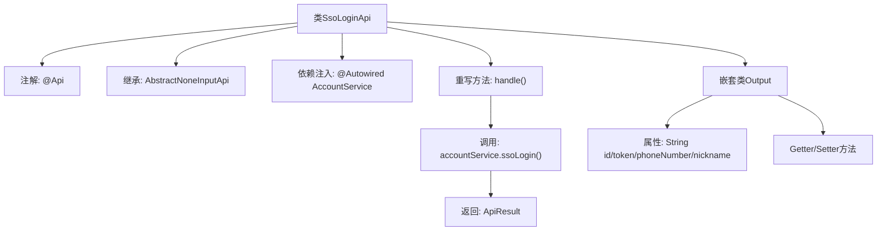

# 基础信息

|      |      |
|------|------|
| 名称 | SsoLoginApi |
| 编码语言 | .java |
| 代码路径 | WeFe/manager/manager-service/src/main/java/com/welab/wefe/manager/service/api/account/SsoLoginApi.java |
| 包名 | com.welab.wefe.manager.service.api.account |
| 依赖项 | ['com.welab.wefe.common.exception.StatusCodeWithException', 'com.welab.wefe.common.web.api.base.AbstractNoneInputApi', 'com.welab.wefe.common.web.api.base.Api', 'com.welab.wefe.common.web.dto.AbstractApiOutput', 'com.welab.wefe.common.web.dto.ApiResult', 'com.welab.wefe.manager.service.service.AccountService', 'org.springframework.beans.factory.annotation.Autowired'] |
| 概述说明 | SSO登录API类，路径为account/sso_login，无需登录，调用AccountService的ssoLogin方法返回用户ID、token、手机号和昵称。 |

# 说明

这是一个名为SsoLoginApi的Java类，用于处理单点登录（SSO）功能。该类继承自AbstractNoneInputApi，并定义了Output内部类作为输出数据结构。Api注解指定了路径为account/sso_login，且不需要登录验证。类中注入了AccountService，通过调用其ssoLogin方法完成登录逻辑，返回包含用户ID、令牌、电话号码和昵称的输出结果。Output类继承自AbstractApiOutput，包含四个字符串字段及其对应的getter和setter方法。

# 类列表 Class Summary

| 名称   | 类型  | 说明 |
|-------|------|-------------|
| SsoLoginApi | class | SSO登录API类，无需登录，调用AccountService进行SSO登录，返回用户ID、令牌、手机号和昵称。 |


## 类 SsoLoginApi

|      |      |
|------|------|
| 访问范围 | @Api(path = "account/sso_login", name = "sso_login", login = false);public |
| 类型 | class |
| 名称 | SsoLoginApi |
| 说明 | SSO登录API类，无需登录，调用AccountService进行SSO登录，返回用户ID、令牌、手机号和昵称。 |


### UML类图

```mermaid
classDiagram
    class AbstractNoneInputApi~T~ {
        <<Abstract>>
        +handle() ApiResult~T~
    }

    class SsoLoginApi {
        -AccountService accountService
        +handle() ApiResult~Output~
    }

    class AccountService {
        <<Interface>>
        +ssoLogin() SsoLoginApi$Output
    }

    class AbstractApiOutput {
        <<Abstract>>
    }

    class SsoLoginApi$Output {
        -String id
        -String token
        -String phoneNumber
        -String nickname
        +getId() String
        +setId(String id)
        +getToken() String
        +setToken(String token)
        +getPhoneNumber() String
        +setPhoneNumber(String phoneNumber)
        +getNickname() String
        +setNickname(String nickname)
    }

    SsoLoginApi --|> AbstractNoneInputApi~SsoLoginApi$Output~ : 继承
    SsoLoginApi --> AccountService : 依赖
    SsoLoginApi$Output --|> AbstractApiOutput : 继承
```

该代码展示了一个SSO登录API的实现结构。SsoLoginApi继承自泛型抽象类AbstractNoneInputApi，处理无输入的API请求，并返回包含用户信息的Output对象。Output类继承自AbstractApiOutput，包含ID、令牌、电话号码和昵称等字段。AccountService接口提供ssoLogin()方法实现具体登录逻辑。整体设计体现了清晰的层次结构和依赖关系。


### 内部方法调用关系图



这段代码展示了一个SSO登录API的实现结构。SsoLoginApi类通过@Api注解定义接口路径，继承抽象模板类处理无输入参数的请求。核心处理逻辑在handle()方法中，通过AccountService完成SSO登录认证，返回包含用户ID、令牌、手机号和昵称的输出对象。流程图清晰呈现了类继承关系、依赖注入、方法调用链和嵌套输出类的属性结构，体现了典型的API控制器设计模式。

### 字段列表 Field List

| 名称  | 类型  | 说明 |
|-------|-------|------|
| accountService | AccountService | 使用@Autowired自动注入AccountService实例。 |

### 方法列表

| 名称  | 类型  | 说明 |
|-------|-------|------|
| handle | ApiResult<Output> | 代码重写父类handle方法，调用accountService的ssoLogin进行单点登录，返回成功结果或异常。 |


