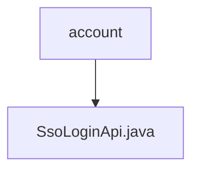

# 基础信息

|      |      |
|------|------|
| 名称 | account |
| 编码语言 | .java |
| 代码路径 | WeFe/manager/manager-service/src/main/java/com/welab/wefe/manager/service/api/account |
| 包名 | docs.manager.manager-service.src.main.java.com.welab.wefe.manager.service.api.account |
| 概述说明 | SSO登录API类，路径为account/sso_login，无需登录，调用AccountService的ssoLogin方法返回用户ID、token、手机号和昵称。 |

# 说明

这是一个名为SsoLoginApi的Java类，用于处理单点登录（SSO）功能。该类继承自AbstractNoneInputApi，并定义了Output内部类作为输出数据结构。Api注解指定了路径为account/sso_login，且不需要登录验证。类中注入了AccountService，通过调用其ssoLogin方法完成登录逻辑，返回包含用户ID、令牌、电话号码和昵称的输出结果。Output类继承自AbstractApiOutput，包含四个字符串字段及其对应的getter和setter方法。

### 包内部结构视图

该流程图展示了WeFe项目中manager-service模块的account包结构，其中account包包含一个SsoLoginApi.java文件。这是一个简单的单层结构，表示在account目录下仅存在一个API接口文件，用于处理SSO登录相关功能。

# 文件列表

| 名称   | 类型  | 说明 |
|-------|------|-------------|
| [SsoLoginApi.java](SsoLoginApi.md) | file | SSO登录API类，路径为account/sso_login，无需登录，调用AccountService的ssoLogin方法返回用户ID、token、手机号和昵称。 |

