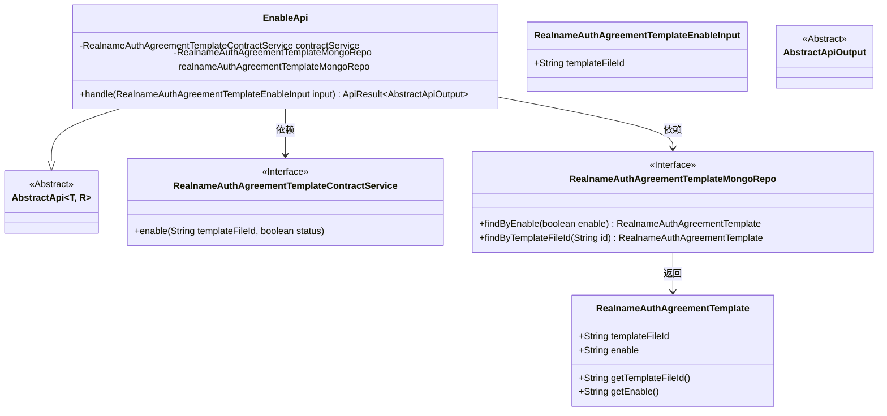
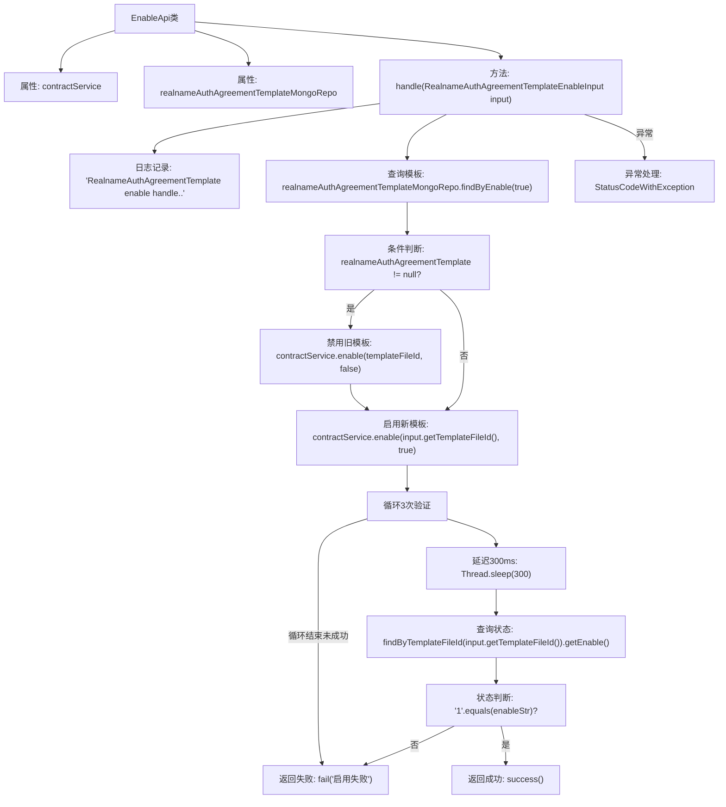

# 基础信息

|      |      |
|------|------|
| 名称 | EnableApi |
| 编码语言 | .java |
| 代码路径 | WeFe/manager/manager-service/src/main/java/com/welab/wefe/manager/service/api/agreement/EnableApi.java |
| 包名 | com.welab.wefe.manager.service.api.agreement |
| 依赖项 | ['com.welab.wefe.common.StatusCode', 'com.welab.wefe.common.data.mongodb.entity.union.RealnameAuthAgreementTemplate', 'com.welab.wefe.common.data.mongodb.repo.RealnameAuthAgreementTemplateMongoRepo', 'com.welab.wefe.common.exception.StatusCodeWithException', 'com.welab.wefe.common.web.api.base.AbstractApi', 'com.welab.wefe.common.web.api.base.Api', 'com.welab.wefe.common.web.dto.AbstractApiOutput', 'com.welab.wefe.common.web.dto.ApiResult', 'com.welab.wefe.manager.service.dto.agreement.RealnameAuthAgreementTemplateEnableInput', 'com.welab.wefe.manager.service.service.RealnameAuthAgreementTemplateContractService', 'org.springframework.beans.factory.annotation.Autowired'] |
| 概述说明 | 启用实名认证协议模板的API类，通过MongoDB查询和合约服务操作模板文件，支持启用新模板并验证状态，最多重试3次，失败返回错误。 |

# 说明

这是一个名为EnableApi的Java类，用于处理实名认证协议模板启用功能。它继承自AbstractApi，接受RealnameAuthAgreementTemplateEnableInput输入并返回AbstractApiOutput。类中注入了RealnameAuthAgreementTemplateContractService和RealnameAuthAgreementTemplateMongoRepo两个服务。主要逻辑是：先检查是否有已启用的模板并禁用，然后启用新指定的模板文件ID，通过三次重试机制验证是否启用成功，若失败则返回错误信息。整个过程包含异常处理和日志记录。

# 类列表 Class Summary

| 名称   | 类型  | 说明 |
|-------|------|-------------|
| EnableApi | class | 这是一个启用实名认证协议模板的API类，通过检查现有模板状态并调用服务更新启用状态，最多重试3次确保操作成功，失败返回错误信息。 |

## 类 EnableApi

|      |      |
|------|------|
| 访问范围 | @Api(path = "realname/auth/agreement/template/enable", name = "realname_auth_agreement_template_enable");public |
| 类型 | class |
| 名称 | EnableApi |
| 说明 | 这是一个启用实名认证协议模板的API类，通过检查现有模板状态并调用服务更新启用状态，最多重试3次确保操作成功，失败返回错误信息。 |

### UML类图

这段代码展示了一个实名认证协议模板启用API的实现类`EnableApi`，它继承自泛型抽象类`AbstractApi`，通过`RealnameAuthAgreementTemplateMongoRepo`进行数据访问，并调用`RealnameAuthAgreementTemplateContractService`服务来执行启用操作。类图清晰地呈现了核心类之间的继承和依赖关系，包括输入参数类、MongoDB仓库接口、合约服务接口以及模板实体类，完整反映了系统处理启用请求时的组件协作结构。

### 内部方法调用关系图

该流程图展示了EnableApi类处理实名认证协议模板启用的完整流程。首先通过MongoDB查询已启用的模板，若存在则先禁用旧模板，然后启用新模板文件。接着通过3次重试机制验证新模板是否启用成功（状态为'1'），期间每次间隔300毫秒。若最终未成功则返回失败，过程中任何异常都会被捕获并转换为系统错误返回。整个流程体现了模板启用的原子性操作和状态验证机制。

### 字段列表 Field List

| 名称  | 类型  | 说明 |
|-------|-------|------|
| realnameAuthAgreementTemplateMongoRepo | RealnameAuthAgreementTemplateMongoRepo | 自动注入实名认证协议模板的MongoDB存储库实例。 |
| contractService | RealnameAuthAgreementTemplateContractService | 使用@Autowired自动注入RealnameAuthAgreementTemplateContractService实例contractService。 |

### 方法列表

| 名称  | 类型  | 说明 |
|-------|-------|------|
| handle | ApiResult<AbstractApiOutput> | 处理实名认证协议模板启用，先禁用现有模板再启用新模板，最多重试3次检查状态，失败返回错误，成功返回成功。 |

