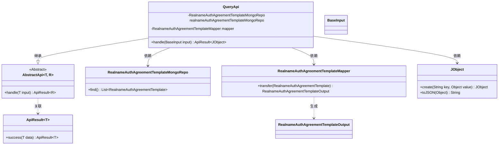
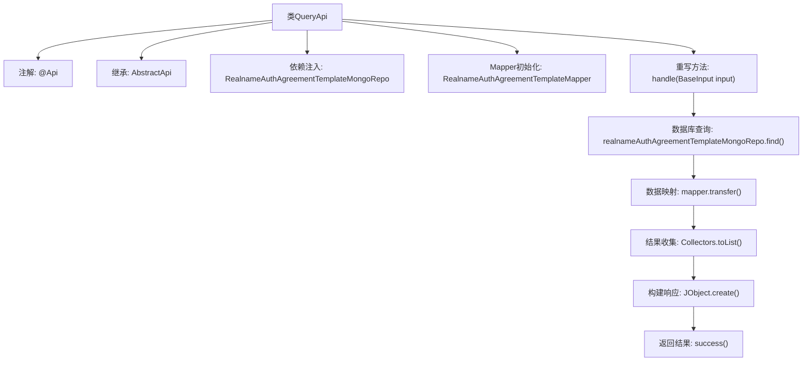

# 基础信息

|      |      |
|------|------|
| 名称 | QueryApi |
| 编码语言 | .java |
| 代码路径 | WeFe/manager/manager-service/src/main/java/com/welab/wefe/manager/service/api/agreement/QueryApi.java |
| 包名 | com.welab.wefe.manager.service.api.agreement |
| 依赖项 | ['com.welab.wefe.common.data.mongodb.repo.RealnameAuthAgreementTemplateMongoRepo', 'com.welab.wefe.common.util.JObject', 'com.welab.wefe.common.web.api.base.AbstractApi', 'com.welab.wefe.common.web.api.base.Api', 'com.welab.wefe.common.web.dto.ApiResult', 'com.welab.wefe.manager.service.dto.agreement.RealnameAuthAgreementTemplateOutput', 'com.welab.wefe.manager.service.dto.base.BaseInput', 'com.welab.wefe.manager.service.mapper.RealnameAuthAgreementTemplateMapper', 'org.mapstruct.factory.Mappers', 'org.springframework.beans.factory.annotation.Autowired', 'java.util.List', 'java.util.stream.Collectors'] |
| 概述说明 | 这是一个查询实名认证协议模板的API类，通过MongoDB获取数据并转换为JSON格式返回。 |

# 说明

这是一个名为QueryApi的Java类，用于处理实名认证协议模板查询请求。它继承自AbstractApi基类，使用BaseInput作为输入类型，JObject作为输出类型。类中注入了RealnameAuthAgreementTemplateMongoRepo用于数据库操作，并通过RealnameAuthAgreementTemplateMapper进行对象转换。handle方法实现了核心逻辑：从MongoDB查询所有实名认证协议模板数据，转换为输出对象列表，最后封装为包含JSON格式列表的成功响应返回。

# 类列表 Class Summary

| 名称   | 类型  | 说明 |
|-------|------|-------------|
| QueryApi | class | 这是一个查询实名认证协议模板的API类，通过MongoDB存储库获取数据，使用映射器转换后返回JSON格式的结果列表。 |

## 类 QueryApi

|      |      |
|------|------|
| 访问范围 | @Api(path = "realname/auth/agreement/template/query", name = "realname_auth_agreement_template_query");public |
| 类型 | class |
| 名称 | QueryApi |
| 说明 | 这是一个查询实名认证协议模板的API类，通过MongoDB存储库获取数据，使用映射器转换后返回JSON格式的结果列表。 |

### UML类图

这段代码展示了一个实名认证协议模板查询API的实现类QueryApi，它继承自泛型抽象类AbstractApi，处理BaseInput输入并返回包含JSON列表的ApiResult。主要依赖MongoDB仓库获取数据，通过Mapper转换实体为输出对象，最终使用JObject构建响应。类图清晰地反映了继承关系、依赖注入和工具类协作，体现了典型的Spring Boot分层架构设计模式。

### 内部方法调用关系图

这段代码是QueryApi类的实现，主要用于查询实名认证协议模板。流程从handle方法开始，首先通过MongoDB仓库查询数据，然后使用Mapper转换实体为输出对象，最后将结果列表封装成JSON格式返回。整个过程展示了从数据获取到响应的完整处理链，体现了清晰的职责分层和数据转换逻辑。

### 字段列表 Field List

| 名称  | 类型  | 说明 |
|-------|-------|------|
| mapper = Mappers.getMapper(RealnameAuthAgreementTemplateMapper.class) | RealnameAuthAgreementTemplateMapper | 声明一个受保护的RealnameAuthAgreementTemplateMapper对象mapper，通过Mappers.getMapper方法获取实例。 |
| realnameAuthAgreementTemplateMongoRepo | RealnameAuthAgreementTemplateMongoRepo | 使用@Autowired自动注入实名认证协议模板的MongoDB存储库。 |

### 方法列表

| 名称  | 类型  | 说明 |
|-------|-------|------|
| handle | ApiResult<JObject> | 该方法重写父类处理逻辑，查询实名认证协议模板列表并转换为输出对象，最后封装为包含JSON列表的成功响应。 |

