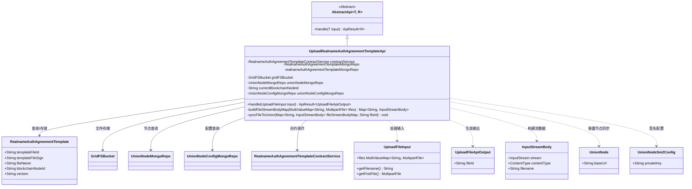

# 基础信息

|      |      |
|------|------|
| 名称 | UploadRealnameAuthAgreementTemplateApi |
| 编码语言 | .java |
| 代码路径 | WeFe/manager/manager-service/src/main/java/com/welab/wefe/manager/service/api/agreement/UploadRealnameAuthAgreementTemplateApi.java |
| 包名 | com.welab.wefe.manager.service.api.agreement |
| 依赖项 | ['com.mongodb.client.gridfs.GridFSBucket', 'com.mongodb.client.gridfs.model.GridFSUploadOptions', 'com.welab.wefe.common.StatusCode', 'com.welab.wefe.common.data.mongodb.entity.union.RealnameAuthAgreementTemplate', 'com.welab.wefe.common.data.mongodb.entity.union.UnionNode', 'com.welab.wefe.common.data.mongodb.entity.union.UnionNodeSm2Config', 'com.welab.wefe.common.data.mongodb.repo.RealnameAuthAgreementTemplateMongoRepo', 'com.welab.wefe.common.data.mongodb.repo.UnionNodeConfigMongoRepo', 'com.welab.wefe.common.data.mongodb.repo.UnionNodeMongoRepo', 'com.welab.wefe.common.exception.StatusCodeWithException', 'com.welab.wefe.common.util.JObject', 'com.welab.wefe.common.util.Md5', 'com.welab.wefe.common.util.SM2Util', 'com.welab.wefe.common.util.StringUtil', 'com.welab.wefe.common.web.api.base.AbstractApi', 'com.welab.wefe.common.web.api.base.Api', 'com.welab.wefe.common.web.dto.ApiResult', 'com.welab.wefe.common.web.dto.UploadFileApiOutput', 'com.welab.wefe.manager.service.dto.common.UploadFileInput', 'com.welab.wefe.manager.service.service.RealnameAuthAgreementTemplateContractService', 'com.welab.wefe.manager.service.task.UploadFileSyncToUnionTask', 'com.welab.wefe.manager.service.util.FileCheckerUtil', 'com.welab.wefe.manager.service.util.VersionUtil', 'org.apache.http.entity.ContentType', 'org.apache.http.entity.mime.content.InputStreamBody', 'org.bson.Document', 'org.springframework.beans.factory.annotation.Autowired', 'org.springframework.util.MultiValueMap', 'org.springframework.web.multipart.MultipartFile', 'java.io.IOException', 'java.util.HashMap', 'java.util.List', 'java.util.Map'] |
| 概述说明 | 上传实名认证协议模板的API类，检查文件类型，生成签名，存储到GridFS，同步到联盟节点，避免重复上传。 |

# 说明

该代码定义了一个用于上传实名认证协议模板的API类。主要功能包括：检查上传文件类型有效性，生成文件签名，将文件存储到GridFS数据库，创建协议模板记录并同步到联盟链节点。处理流程包含文件类型验证、MD5签名生成、GridFS存储、版本号生成、重复文件检测等步骤。同时实现了将文件同步到其他联盟节点的功能，包括数据签名验证和异步任务触发。异常处理涵盖文件类型不匹配、重复上传和IO读写错误等情况。

# 类列表 Class Summary

| 名称   | 类型  | 说明 |
|-------|------|-------------|
| UploadRealnameAuthAgreementTemplateApi | class | 上传实名认证协议模板API，检查文件类型和签名，存储到GridFS并同步至联盟节点，避免重复上传。 |

## 类 UploadRealnameAuthAgreementTemplateApi

|      |      |
|------|------|
| 访问范围 | @Api(path = "realname/auth/agreement/template/upload", name = "realname_auth_agreement_template_upload");public |
| 类型 | class |
| 名称 | UploadRealnameAuthAgreementTemplateApi |
| 说明 | 上传实名认证协议模板API，检查文件类型和签名，存储到GridFS并同步至联盟节点，避免重复上传。 |

### UML类图

这段类图描述了实名认证协议模板上传API的核心结构。UploadRealnameAuthAgreementTemplateApi继承自泛型抽象类AbstractApi，通过多个仓储服务（MongoRepo）和文件存储组件（GridFSBucket）实现文件上传、版本管理和联盟节点同步功能。主要处理流程包括：文件类型校验、MD5签名检查、GridFS存储、版本号生成、智能合约注册以及通过SM2签名同步到其他联盟节点。类图中清晰展示了7个核心数据模型和5个外部依赖组件的交互关系。

### 内部方法调用关系图

流程图描述了实名认证协议模板上传API的核心处理流程，从文件类型检查、签名计算、模板查询到GridFS存储和联盟节点同步的完整过程，包含异常处理分支。时序图展示了客户端调用到各组件交互的详细时序关系，重点突出了模板存在性判断的分支逻辑和跨服务协作过程。

### 字段列表 Field List

| 名称  | 类型  | 说明 |
|-------|-------|------|
| unionNodeMongoRepo | UnionNodeMongoRepo | 使用@Autowired自动注入UnionNodeMongoRepo实例。 |
| realnameAuthAgreementTemplateMongoRepo | RealnameAuthAgreementTemplateMongoRepo | 自动注入实名认证协议模板的MongoDB存储库实例。 |
| unionNodeConfigMongoRepo | UnionNodeConfigMongoRepo | 自动注入UnionNodeConfigMongoRepo实例。 |
| currentBlockchainNodeId | String | 代码片段声明了一个私有字符串变量currentBlockchainNodeId，并使用@Autowired注解进行自动依赖注入。 |
| gridFSBucket | GridFSBucket | 使用@Autowired自动注入GridFSBucket实例。 |
| contractService | RealnameAuthAgreementTemplateContractService | 自动注入实名认证协议模板合约服务实例。 |

### 方法列表

| 名称  | 类型  | 说明 |
|-------|-------|------|
| handle | ApiResult<UploadFileApiOutput> | 处理文件上传，检查文件类型，生成签名，存储到GridFS，避免重复上传。 |
| buildFileStreamBodyMap | Map<String, InputStreamBody> | 该方法将MultiValueMap中的MultipartFile转换为InputStreamBody的Map，处理文件流和内容类型，异常时抛出文件IO错误。 |
| syncFileToUnion | void | 方法syncFileToUnion将文件同步到联盟节点，使用SM2签名验证，遍历节点列表并发起上传任务，异常时记录日志。 |

