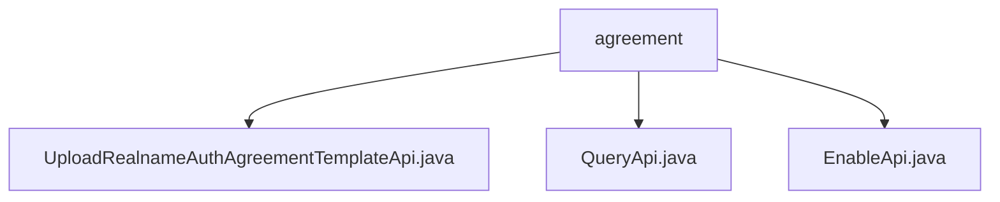

# 基础信息

|      |      |
|------|------|
| 名称 | agreement |
| 编码语言 | .java |
| 代码路径 | WeFe/manager/manager-service/src/main/java/com/welab/wefe/manager/service/api/agreement |
| 包名 | docs.manager.manager-service.src.main.java.com.welab.wefe.manager.service.api.agreement |
| 概述说明 | UploadApi类处理实名认证协议上传，包括文件验证、存储、版本管理和同步联盟链。QueryApi类查询协议模板数据并返回JSON列表。EnableApi类管理模板启用状态，支持禁用旧模板并启用新模板，含重试机制。 |

# 说明

## 概述  
该模块核心职责是管理实名认证协议模板的全生命周期，包括上传、查询和启用操作，支持文件存储、版本控制和联盟链同步。接口规范涵盖文件类型校验（如PDF/PNG）、MD5签名生成、GridFS存储、版本号自增及联盟节点数据同步，采用JObject作为通用输出格式。  

关键数据结构包含RealnameAuthAgreementTemplate（模板记录）、BaseInput（基础请求参数）和RealnameAuthAgreementTemplateEnableInput（启用专用参数）。外部依赖涉及MongoDB（GridFS存储）、联盟链节点（数据同步）和MD5签名服务。例如上传API通过三次重试确保联盟链同步成功。  

## 主要业务场景  
完整业务流程为：用户上传文件→系统校验并存储→查询可用模板→启用指定版本，类似配置管理中心模式。交互采用标准RESTful风格，例如上传接口触发异步联盟链同步，查询接口返回JSON列表。  

典型场景包括：新协议版本发布（自动禁用旧版）、多节点数据一致性维护（通过签名验证）。API类型分为数据操作类（如EnableApi）和查询类（如QueryApi），例如启用API会先检查现有活跃模板并强制降级。

### 包内部结构视图

该流程图展示了agreement目录下的三个Java文件：UploadRealnameAuthAgreementTemplateApi、QueryApi和EnableApi。这三个文件都直接隶属于agreement目录，没有更深层级的子目录结构。图中清晰地呈现了agreement作为父节点与三个API实现文件之间的直接包含关系。

# 文件列表

| 名称   | 类型  | 说明 |
|-------|------|-------------|
| [UploadRealnameAuthAgreementTemplateApi.java](UploadRealnameAuthAgreementTemplateApi.md) | file | 上传实名认证协议模板的API类，检查文件类型，生成签名，存储到GridFS，同步到联盟节点，避免重复上传。 |
| [QueryApi.java](QueryApi.md) | file | 这是一个查询实名认证协议模板的API类，通过MongoDB获取数据并转换为JSON格式返回。 |
| [EnableApi.java](EnableApi.md) | file | 启用实名认证协议模板的API类，通过MongoDB查询和合约服务操作模板文件，支持启用新模板并验证状态，最多重试3次，失败返回错误。 |

