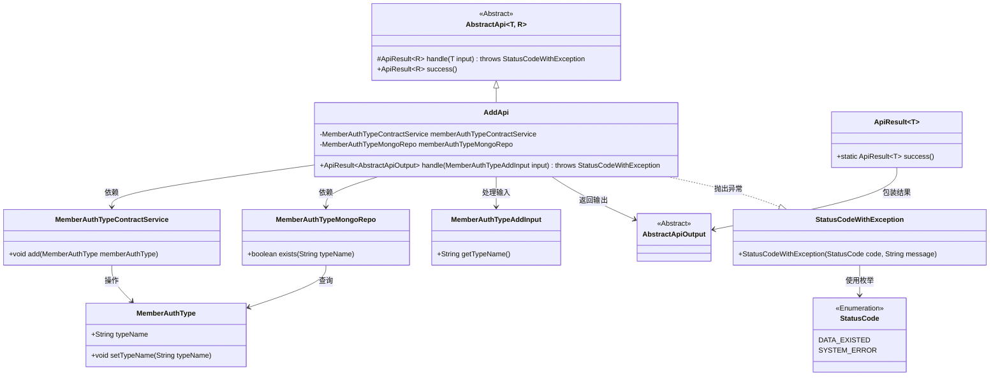
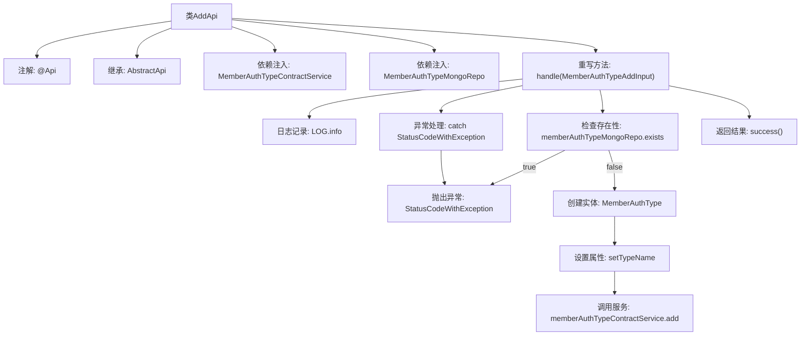

# 基础信息

|      |      |
|------|------|
| 名称 | AddApi |
| 编码语言 | .java |
| 代码路径 | WeFe/manager/manager-service/src/main/java/com/welab/wefe/manager/service/api/authtype/AddApi.java |
| 包名 | com.welab.wefe.manager.service.api.authtype |
| 依赖项 | ['com.welab.wefe.common.StatusCode', 'com.welab.wefe.common.data.mongodb.entity.union.MemberAuthType', 'com.welab.wefe.common.data.mongodb.repo.MemberAuthTypeMongoRepo', 'com.welab.wefe.common.exception.StatusCodeWithException', 'com.welab.wefe.common.web.api.base.AbstractApi', 'com.welab.wefe.common.web.api.base.Api', 'com.welab.wefe.common.web.dto.AbstractApiOutput', 'com.welab.wefe.common.web.dto.ApiResult', 'com.welab.wefe.manager.service.dto.authtype.MemberAuthTypeAddInput', 'com.welab.wefe.manager.service.service.MemberAuthTypeContractService', 'org.springframework.beans.factory.annotation.Autowired'] |
| 概述说明 | 这是一个名为AddApi的类，用于添加成员认证类型。它检查类型是否已存在，不存在则通过memberAuthTypeContractService添加新类型。若存在或出错，抛出相应异常。 |

# 说明

这是一个名为AddApi的Java类，用于处理会员认证类型添加的API请求。该类继承自AbstractApi，接受MemberAuthTypeAddInput作为输入参数，返回AbstractApiOutput。主要功能包括检查认证类型名称是否已存在，若存在则抛出异常，否则创建新的MemberAuthType对象并通过memberAuthTypeContractService进行添加。过程中使用了memberAuthTypeMongoRepo进行数据查询，并捕获处理可能出现的StatusCodeWithException异常。

# 类列表 Class Summary

| 名称   | 类型  | 说明 |
|-------|------|-------------|
| AddApi | class | 这是一个添加成员认证类型的API类，检查类型名是否存在，不存在则创建并保存。 |

## 类 AddApi

|      |      |
|------|------|
| 访问范围 | @Api(path = "member/authtype/add", name = "member_authtype_add");public |
| 类型 | class |
| 名称 | AddApi |
| 说明 | 这是一个添加成员认证类型的API类，检查类型名是否存在，不存在则创建并保存。 |

### UML类图

这段代码展示了一个会员认证类型添加API的实现类AddApi，它继承自泛型抽象类AbstractApi。主要功能是处理会员认证类型的添加请求，通过MemberAuthTypeMongoRepo检查类型是否已存在，若不存在则通过MemberAuthTypeContractService添加新类型。整个过程包含输入验证、业务逻辑处理和异常管理，使用了自定义状态码枚举和异常类StatusCodeWithException来统一错误处理。类图清晰地展示了各组件间的依赖关系和继承层次。

### 内部方法调用关系图

该流程图描述了AddApi类的核心处理流程。首先通过注解定义API路径，继承抽象类并注入两个服务依赖。主要逻辑在handle方法中：先检查类型名称是否存在，存在则抛异常；不存在则创建MemberAuthType对象并调用服务层写入数据。整个过程包含异常捕获和日志记录，最终返回成功结果。箭头清晰展示了条件分支和异常处理路径。

### 字段列表 Field List

| 名称  | 类型  | 说明 |
|-------|-------|------|
| memberAuthTypeMongoRepo | MemberAuthTypeMongoRepo | 使用@Autowired自动注入MemberAuthTypeMongoRepo实例。 |
| memberAuthTypeContractService | MemberAuthTypeContractService | 自动注入MemberAuthTypeContractService服务实例。 |

### 方法列表

| 名称  | 类型  | 说明 |
|-------|-------|------|
| handle | ApiResult<AbstractApiOutput> | 处理添加成员认证类型请求，检查类型名称是否存在，存在则抛出异常，否则创建并保存新类型，捕获异常后返回系统错误。 |

