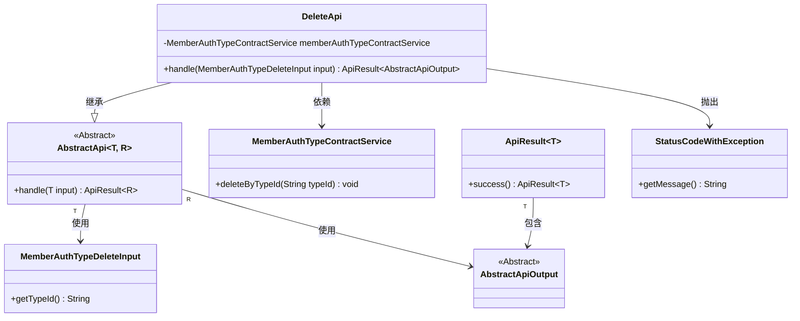
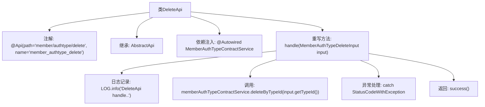

# 基础信息

|      |      |
|------|------|
| 名称 | DeleteApi |
| 编码语言 | .java |
| 代码路径 | WeFe/manager/manager-service/src/main/java/com/welab/wefe/manager/service/api/authtype/DeleteApi.java |
| 包名 | com.welab.wefe.manager.service.api.authtype |
| 依赖项 | ['com.welab.wefe.common.StatusCode', 'com.welab.wefe.common.exception.StatusCodeWithException', 'com.welab.wefe.common.web.api.base.AbstractApi', 'com.welab.wefe.common.web.api.base.Api', 'com.welab.wefe.common.web.dto.AbstractApiOutput', 'com.welab.wefe.common.web.dto.ApiResult', 'com.welab.wefe.manager.service.dto.authtype.MemberAuthTypeDeleteInput', 'com.welab.wefe.manager.service.service.MemberAuthTypeContractService', 'org.springframework.beans.factory.annotation.Autowired'] |
| 概述说明 | 删除成员认证类型的API类，处理输入参数MemberAuthTypeDeleteInput，调用memberAuthTypeContractService删除指定typeId的记录，成功返回AbstractApiOutput，异常抛出StatusCodeWithException。 |

# 说明

该代码定义了一个名为DeleteApi的类，用于处理成员认证类型删除请求。类注解指定了API路径和名称。它继承自AbstractApi，接受MemberAuthTypeDeleteInput输入并返回AbstractApiOutput。通过自动注入的MemberAuthTypeContractService调用deleteByTypeId方法执行删除操作。处理过程中捕获异常并抛出系统错误状态码。成功时返回成功结果。

# 类列表 Class Summary

| 名称   | 类型  | 说明 |
|-------|------|-------------|
| DeleteApi | class | 删除成员认证类型的API，接收类型ID并调用服务删除，异常时返回系统错误。 |

## 类 DeleteApi

|      |      |
|------|------|
| 访问范围 | @Api(path = "member/authtype/delete", name = "member_authtype_delete");public |
| 类型 | class |
| 名称 | DeleteApi |
| 说明 | 删除成员认证类型的API，接收类型ID并调用服务删除，异常时返回系统错误。 |

### UML类图

这段代码展示了一个删除API的实现类`DeleteApi`，它继承自泛型抽象类`AbstractApi`，处理`MemberAuthTypeDeleteInput`输入并返回`AbstractApiOutput`结果。类图清晰地呈现了继承关系、依赖服务和异常处理机制，其中`MemberAuthTypeContractService`提供核心删除功能，`StatusCodeWithException`用于错误处理，整体结构符合Spring的依赖注入模式。

### 内部方法调用关系图

这段代码是一个基于Spring框架的API类，主要用于处理成员认证类型的删除操作。流程图展示了从类声明开始，经过依赖注入、核心业务逻辑处理（包括日志记录和服务调用）、异常捕获，最终返回成功结果的全过程。类继承自泛型抽象类AbstractApi，通过handle方法实现具体业务逻辑，并使用了自定义异常StatusCodeWithException进行错误处理。

### 字段列表 Field List

| 名称  | 类型  | 说明 |
|-------|-------|------|
| memberAuthTypeContractService | MemberAuthTypeContractService | 使用@Autowired自动注入MemberAuthTypeContractService服务实例。 |

### 方法列表

| 名称  | 类型  | 说明 |
|-------|-------|------|
| handle | ApiResult<AbstractApiOutput> | 处理删除成员认证类型的API请求，调用服务删除指定类型ID的记录，捕获异常并返回成功或错误状态。 |

