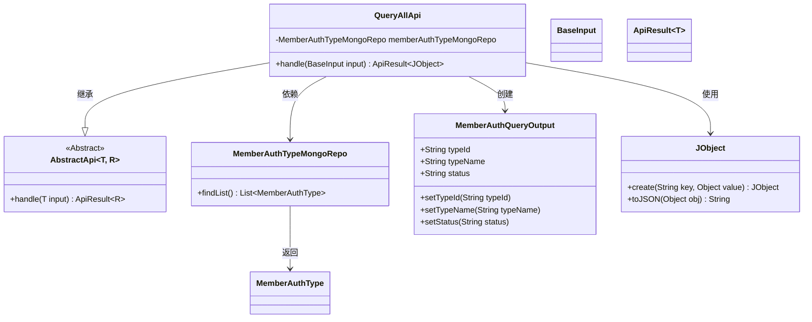
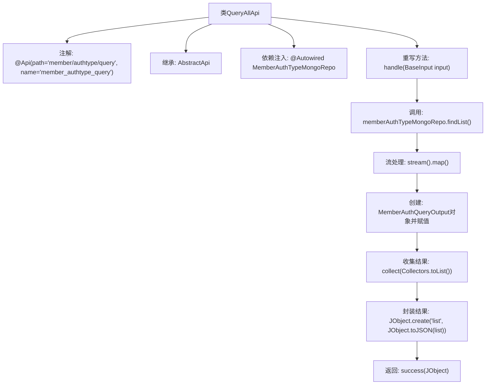

# 基础信息

|      |      |
|------|------|
| 名称 | QueryAllApi |
| 编码语言 | .java |
| 代码路径 | WeFe/manager/manager-service/src/main/java/com/welab/wefe/manager/service/api/authtype/QueryAllApi.java |
| 包名 | com.welab.wefe.manager.service.api.authtype |
| 依赖项 | ['com.welab.wefe.common.data.mongodb.dto.member.MemberAuthQueryOutput', 'com.welab.wefe.common.data.mongodb.repo.MemberAuthTypeMongoRepo', 'com.welab.wefe.common.util.JObject', 'com.welab.wefe.common.web.api.base.AbstractApi', 'com.welab.wefe.common.web.api.base.Api', 'com.welab.wefe.common.web.dto.ApiResult', 'com.welab.wefe.manager.service.dto.base.BaseInput', 'org.springframework.beans.factory.annotation.Autowired', 'java.util.List', 'java.util.stream.Collectors'] |
| 概述说明 | QueryAllApi类通过memberAuthTypeMongoRepo查询会员认证类型列表，返回包含typeId、typeName和status的JSON数据。路径为member/authtype/query。 |

# 说明

这是一个名为QueryAllApi的Java类，继承自AbstractApi，用于处理成员认证类型查询请求。类注解指定了API路径为member/authtype/query。通过注入MemberAuthTypeMongoRepo从MongoDB获取数据，将查询结果转换为MemberAuthQueryOutput对象列表，并封装为JSON格式返回。主要操作包括查询数据、映射字段和构建响应。

# 类列表 Class Summary

| 名称   | 类型  | 说明 |
|-------|------|-------------|
| QueryAllApi | class | 查询会员认证类型的API，通过MongoDB获取数据并返回类型ID、名称和状态列表。 |

## 类 QueryAllApi

|      |      |
|------|------|
| 访问范围 | @Api(path = "member/authtype/query", name = "member_authtype_query");public |
| 类型 | class |
| 名称 | QueryAllApi |
| 说明 | 查询会员认证类型的API，通过MongoDB获取数据并返回类型ID、名称和状态列表。 |

### UML类图

这段代码展示了一个查询会员认证类型的API实现类QueryAllApi，它继承自泛型抽象类AbstractApi，处理BaseInput输入并返回包含JObject的ApiResult。主要功能是通过MemberAuthTypeMongoRepo从数据库获取会员认证类型列表，转换为MemberAuthQueryOutput对象后封装成JSON格式返回。类图中清晰地展示了类之间的继承、依赖和创建关系，以及核心的数据流转过程。

### 内部方法调用关系图

这段代码定义了一个名为`QueryAllApi`的类，用于处理成员认证类型的查询请求。它通过`MemberAuthTypeMongoRepo`从数据库获取数据，将结果转换为`MemberAuthQueryOutput`对象列表，并最终封装成JSON格式返回。流程图展示了从数据查询到结果返回的完整处理流程，包括数据转换和封装步骤。

### 字段列表 Field List

| 名称  | 类型  | 说明 |
|-------|-------|------|
| memberAuthTypeMongoRepo | MemberAuthTypeMongoRepo | 使用@Autowired自动注入MemberAuthTypeMongoRepo成员变量。 |

### 方法列表

| 名称  | 类型  | 说明 |
|-------|-------|------|
| handle | ApiResult<JObject> | 处理成员认证类型查询，将MongoDB数据转换为输出列表并返回成功结果。 |

