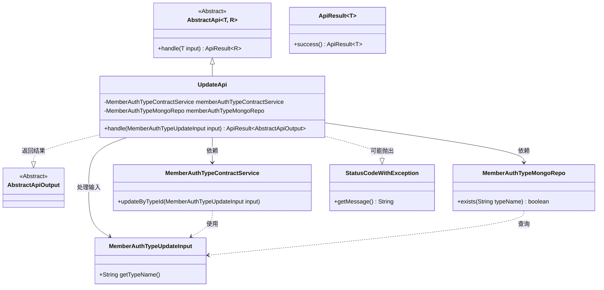
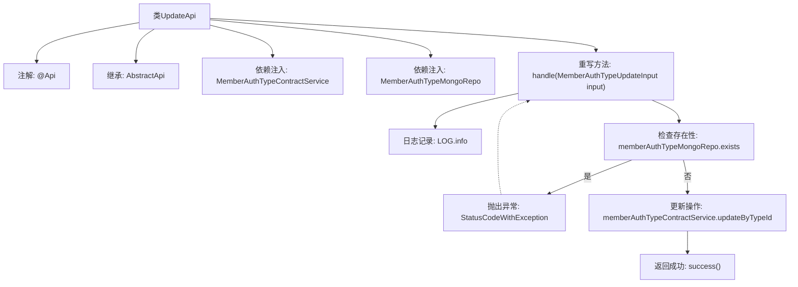

# 基础信息

|      |      |
|------|------|
| 名称 | UpdateApi |
| 编码语言 | .java |
| 代码路径 | WeFe/manager/manager-service/src/main/java/com/welab/wefe/manager/service/api/authtype/UpdateApi.java |
| 包名 | com.welab.wefe.manager.service.api.authtype |
| 依赖项 | ['com.welab.wefe.common.StatusCode', 'com.welab.wefe.common.data.mongodb.repo.MemberAuthTypeMongoRepo', 'com.welab.wefe.common.exception.StatusCodeWithException', 'com.welab.wefe.common.web.api.base.AbstractApi', 'com.welab.wefe.common.web.api.base.Api', 'com.welab.wefe.common.web.dto.AbstractApiOutput', 'com.welab.wefe.common.web.dto.ApiResult', 'com.welab.wefe.manager.service.dto.authtype.MemberAuthTypeUpdateInput', 'com.welab.wefe.manager.service.service.MemberAuthTypeContractService', 'org.springframework.beans.factory.annotation.Autowired'] |
| 概述说明 | 更新会员认证类型的API类，检查类型是否存在后调用服务更新，异常时返回系统错误。 |

# 说明

这是一个名为UpdateApi的Java类，用于处理成员认证类型更新的API请求。它继承自AbstractApi基类，接受MemberAuthTypeUpdateInput作为输入参数，返回AbstractApiOutput。类中注入了MemberAuthTypeContractService和MemberAuthTypeMongoRepo两个依赖服务。主要逻辑在handle方法中实现：首先检查输入的类型名称是否已存在，若存在则抛出异常；否则调用memberAuthTypeContractService的updateByTypeId方法进行更新。处理过程中捕获异常并重新抛出系统错误。成功时返回success()。API路径为"member/authtype/update"。

# 类列表 Class Summary

| 名称   | 类型  | 说明 |
|-------|------|-------------|
| UpdateApi | class | 更新会员认证类型的API类，检查类型是否存在后调用服务更新数据，处理异常并返回结果。 |

## 类 UpdateApi

|      |      |
|------|------|
| 访问范围 | @Api(path = "member/authtype/update", name = "member_authtype_update");public |
| 类型 | class |
| 名称 | UpdateApi |
| 说明 | 更新会员认证类型的API类，检查类型是否存在后调用服务更新数据，处理异常并返回结果。 |

### UML类图

该代码展示了一个会员认证类型更新的API实现类UpdateApi，继承自泛型抽象类AbstractApi。主要依赖MemberAuthTypeContractService进行业务处理，使用MemberAuthTypeMongoRepo检查数据是否存在。当类型已存在时抛出StatusCodeWithException异常，成功时返回AbstractApiOutput。类图清晰地展示了继承关系、依赖关系和异常处理机制，体现了Spring框架中典型的服务层调用模式。

### 内部方法调用关系图

流程图描述了UpdateApi类的核心处理流程。该API首先检查输入参数中的类型名称是否已存在，若存在则抛出"DATA_EXISTED"异常，否则调用合约服务执行更新操作。整个过程包含日志记录、数据校验、业务操作和异常处理环节，最终返回成功状态或封装系统错误。

### 字段列表 Field List

| 名称  | 类型  | 说明 |
|-------|-------|------|
| memberAuthTypeMongoRepo | MemberAuthTypeMongoRepo | 使用@Autowired自动注入MemberAuthTypeMongoRepo成员变量。 |
| memberAuthTypeContractService | MemberAuthTypeContractService | 自动注入会员认证类型合约服务实例。 |

### 方法列表

| 名称  | 类型  | 说明 |
|-------|-------|------|
| handle | ApiResult<AbstractApiOutput> | 处理成员认证类型更新请求，检查类型是否存在，存在则报错，否则更新并返回成功。 |

