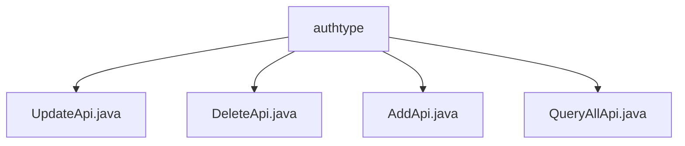

# 基础信息

|      |      |
|------|------|
| 名称 | authtype |
| 编码语言 | .java |
| 代码路径 | WeFe/manager/manager-service/src/main/java/com/welab/wefe/manager/service/api/authtype |
| 包名 | docs.manager.manager-service.src.main.java.com.welab.wefe.manager.service.api.authtype |
| 概述说明 | UpdateApi处理认证类型更新，检查名称后调用服务更新。DeleteApi处理删除请求，调用服务删除类型。AddApi添加新认证类型，检查名称后创建对象。QueryAllApi查询所有认证类型，从MongoDB获取数据并返回。 |

# 说明

## 概述  
该模块为成员认证类型管理API组，提供增删改查全生命周期管理能力。核心职责包括认证类型创建（AddApi）、更新（UpdateApi）、删除（DeleteApi）及查询（QueryAllApi），通过统一继承AbstractApi实现标准化响应。接口规范遵循RESTful风格，例如"member/authtype/update"路径对应更新操作。关键数据结构包含MemberAuthTypeAddInput等输入DTO及MemberAuthQueryOutput响应体。外部依赖涉及MemberAuthTypeContractService智能合约服务与MemberAuthTypeMongoRepo持久层组件，类似CRUD操作中枢模式。

## 主要业务场景  
典型流程为：添加时校验类型名称唯一性（例如AddApi查重逻辑），更新/删除时通过typeId定位数据（如DeleteApi调用deleteByTypeId）。查询场景直接访问MongoDB获取全量数据并转换输出。交互模式均采用"参数校验→业务操作→异常捕获"三段式处理，类似网关过滤链。完整功能覆盖认证类型配置管理需求，例如联盟成员权限体系维护。所有API均返回AbstractApiOutput标准化响应，集成案例包括前端控制台调用或跨服务权限同步。

### 包内部结构视图

该流程图展示了authtype目录下的四个API文件结构关系。authtype作为父节点，包含四个子节点文件：UpdateApi、DeleteApi、AddApi和QueryAllApi，这些文件都属于同一层级，共同构成了authtype模块的API接口实现部分。

# 文件列表

| 名称   | 类型  | 说明 |
|-------|------|-------------|
| [UpdateApi.java](UpdateApi.md) | file | 更新会员认证类型的API类，检查类型是否存在后调用服务更新，异常时返回系统错误。 |
| [DeleteApi.java](DeleteApi.md) | file | 删除成员认证类型的API类，处理输入参数MemberAuthTypeDeleteInput，调用memberAuthTypeContractService删除指定typeId的记录，成功返回AbstractApiOutput，异常抛出StatusCodeWithException。 |
| [AddApi.java](AddApi.md) | file | 这是一个名为AddApi的类，用于添加成员认证类型。它检查类型是否已存在，不存在则通过memberAuthTypeContractService添加新类型。若存在或出错，抛出相应异常。 |
| [QueryAllApi.java](QueryAllApi.md) | file | QueryAllApi类通过memberAuthTypeMongoRepo查询会员认证类型列表，返回包含typeId、typeName和status的JSON数据。路径为member/authtype/query。 |

