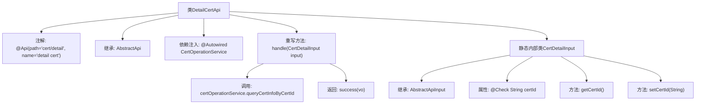

# 基础信息

|      |      |
|------|------|
| 名称 | DetailCertApi |
| 编码语言 | .java |
| 代码路径 | WeFe/manager/manager-service/src/main/java/com/welab/wefe/manager/service/api/cert/DetailCertApi.java |
| 包名 | com.welab.wefe.manager.service.api.cert |
| 依赖项 | ['org.springframework.beans.factory.annotation.Autowired', 'com.webank.cert.mgr.model.vo.CertVO', 'com.webank.cert.mgr.service.CertOperationService', 'com.welab.wefe.common.fieldvalidate.annotation.Check', 'com.welab.wefe.common.web.api.base.AbstractApi', 'com.welab.wefe.common.web.api.base.Api', 'com.welab.wefe.common.web.dto.AbstractApiInput', 'com.welab.wefe.common.web.dto.ApiResult', 'com.welab.wefe.manager.service.api.cert.DetailCertApi.CertDetailInput'] |
| 概述说明 | DetailCertApi类处理证书详情查询，接收certId参数，调用certOperationService查询并返回CertVO结果。 |

# 说明

DetailCertApi是一个处理证书详情的API类，路径为cert/detail，继承自AbstractApi，接收CertDetailInput输入并返回CertVO结果。通过注入的CertOperationService调用queryCertInfoByCertId方法查询证书信息。CertDetailInput内部类包含必填字段certId及其getter和setter方法。API处理逻辑封装在handle方法中，成功时返回包含查询结果的ApiResult。

# 类列表 Class Summary

| 名称   | 类型  | 说明 |
|-------|------|-------------|
| DetailCertApi | class | DetailCertApi类处理证书详情查询，接收certId参数，调用certOperationService查询并返回CertVO结果。 |


## 类 DetailCertApi

|      |      |
|------|------|
| 访问范围 | @Api(path = "cert/detail", name = "detail cert");public |
| 类型 | class |
| 名称 | DetailCertApi |
| 说明 | DetailCertApi类处理证书详情查询，接收certId参数，调用certOperationService查询并返回CertVO结果。 |


### UML类图

```mermaid
classDiagram
    class DetailCertApi {
        -CertOperationService certOperationService
        +handle(CertDetailInput input) ApiResult~CertVO~
    }
    <<interface>> AbstractApi~T, R~ {
        <<abstract>>
        +handle(T input) ApiResult~R~
    }
    class CertDetailInput {
        -String certId
        +String getCertId()
        +void setCertId(String certId)
    }
    class AbstractApiInput {
        <<abstract>>
    }
    class CertVO {
    }
    class ApiResult~T~ {
    }
    class CertOperationService {
        +queryCertInfoByCertId(String certId) CertVO
    }

    DetailCertApi --> AbstractApi~CertDetailInput, CertVO~ : 继承
    DetailCertApi --> CertOperationService : 依赖
    CertDetailInput --> AbstractApiInput : 继承
    CertOperationService --> CertVO : 返回
    DetailCertApi ..> CertDetailInput : 使用
    AbstractApi~T, R~ <|-- DetailCertApi : 实现
```

该类图展示了DetailCertApi继承自泛型抽象类AbstractApi，并实现了其handle方法。DetailCertApi依赖CertOperationService来查询证书信息，使用内部类CertDetailInput作为输入参数。CertDetailInput继承自AbstractApiInput，包含证书ID字段及getter/setter方法。CertOperationService返回CertVO对象，最终由ApiResult包装返回。整体结构体现了API处理请求的典型分层设计模式。


### 内部方法调用关系图



这段代码描述了一个处理证书详情的API类DetailCertApi，它继承自AbstractApi并指定了输入类型CertDetailInput和输出类型CertVO。主要流程是通过注入的CertOperationService查询证书信息并返回成功结果。CertDetailInput作为静态内部类，包含必须的certId字段及其getter/setter方法，并继承自AbstractApiInput。整个流程展示了从API入口到业务处理的完整调用链。

### 字段列表 Field List

| 名称  | 类型  | 说明 |
|-------|-------|------|
| certOperationService | CertOperationService | 代码片段使用@Autowired自动注入CertOperationService实例。 |

### 方法列表

| 名称  | 类型  | 说明 |
|-------|-------|------|
| handle | ApiResult<CertVO> | 该方法重写父类逻辑，通过证书ID查询证书信息并返回结果。调用certOperationService的queryCertInfoByCertId方法获取CertVO对象，最后封装为成功的ApiResult返回。 |


