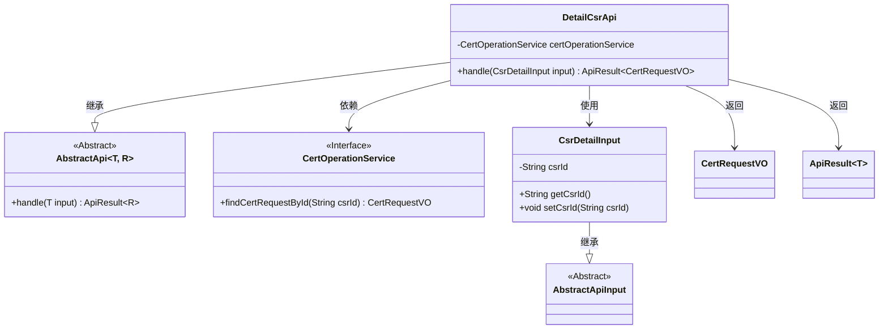
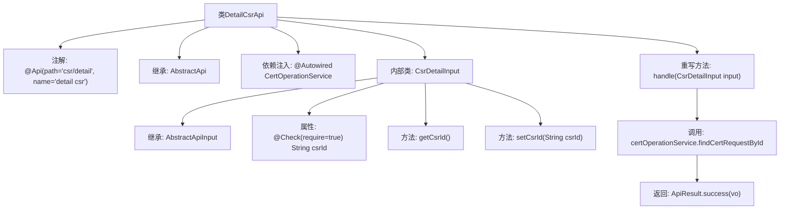

# 基础信息

|      |      |
|------|------|
| 名称 | DetailCsrApi |
| 编码语言 | .java |
| 代码路径 | WeFe/manager/manager-service/src/main/java/com/welab/wefe/manager/service/api/cert/DetailCsrApi.java |
| 包名 | com.welab.wefe.manager.service.api.cert |
| 依赖项 | ['org.springframework.beans.factory.annotation.Autowired', 'com.webank.cert.mgr.model.vo.CertRequestVO', 'com.webank.cert.mgr.service.CertOperationService', 'com.welab.wefe.common.fieldvalidate.annotation.Check', 'com.welab.wefe.common.web.api.base.AbstractApi', 'com.welab.wefe.common.web.api.base.Api', 'com.welab.wefe.common.web.dto.AbstractApiInput', 'com.welab.wefe.common.web.dto.ApiResult', 'com.welab.wefe.manager.service.api.cert.DetailCsrApi.CsrDetailInput'] |
| 概述说明 | DetailCsrApi类处理CSR详情查询，通过csrId调用certOperationService获取证书请求信息，返回CertRequestVO。输入参数CsrDetailInput需包含csrId。 |

# 说明

DetailCsrApi是一个处理证书请求详情的API类，路径为csr/detail。它继承自AbstractApi，泛型参数为CsrDetailInput和CertRequestVO。通过注入的CertOperationService，根据输入的csrId查询并返回证书请求信息。CsrDetailInput是内部静态类，继承自AbstractApiInput，包含必须的csrId字段及其getter和setter方法。API处理逻辑在handle方法中实现，成功时返回包含查询结果的ApiResult对象。

# 类列表 Class Summary

| 名称   | 类型  | 说明 |
|-------|------|-------------|
| DetailCsrApi | class | DetailCsrApi类处理CSR详情请求，通过csrId查询证书请求信息并返回结果。输入需包含csrId字段。 |

## 类 DetailCsrApi

|      |      |
|------|------|
| 访问范围 | @Api(path = "csr/detail", name = "detail csr");public |
| 类型 | class |
| 名称 | DetailCsrApi |
| 说明 | DetailCsrApi类处理CSR详情请求，通过csrId查询证书请求信息并返回结果。输入需包含csrId字段。 |

### UML类图

这段代码展示了一个处理CSR（证书签名请求）详情的API实现。DetailCsrApi继承自泛型抽象类AbstractApi，指定输入类型为CsrDetailInput（包含必须的csrId字段），输出类型为CertRequestVO。通过依赖注入的CertOperationService接口获取证书请求数据，返回封装在ApiResult中的结果。类图清晰地展示了继承关系、依赖关系以及泛型参数的具体化，体现了Spring风格的API层实现方式。

### 内部方法调用关系图

该流程图展示了DetailCsrApi类的结构及其关键组件。类通过@Api注解定义API路径，继承AbstractApi模板类并实现handle方法处理请求。内部类CsrDetailInput用于封装输入参数，包含必填字段csrId及其getter/setter。核心逻辑通过certOperationService查询证书请求数据并返回成功结果，体现了清晰的层级关系和调用流程。

### 字段列表 Field List

| 名称  | 类型  | 说明 |
|-------|-------|------|
| certOperationService | CertOperationService | 代码片段使用@Autowired注解自动注入CertOperationService实例。 |

### 方法列表

| 名称  | 类型  | 说明 |
|-------|-------|------|
| handle | ApiResult<CertRequestVO> | 该方法重写父类逻辑，根据输入参数中的csrId查询证书请求信息，返回包含查询结果的ApiResult对象。 |

