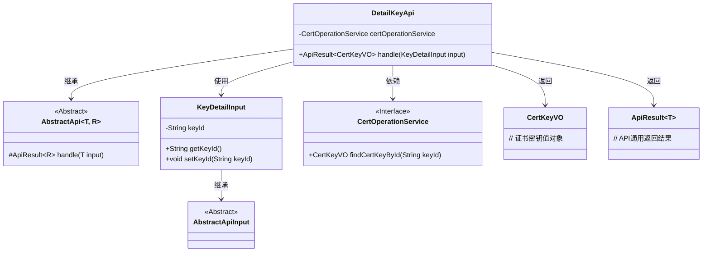
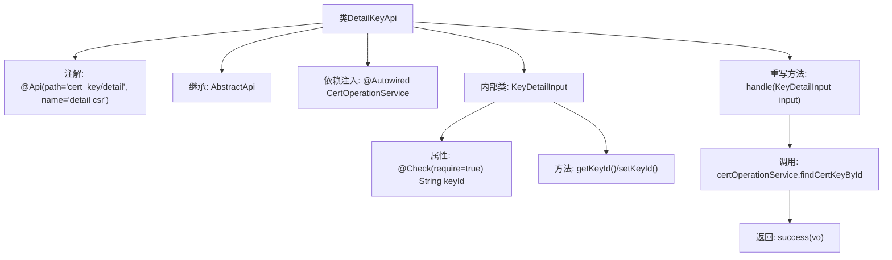
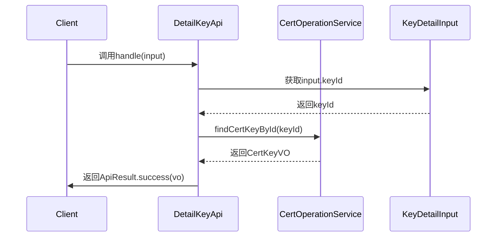

# 基础信息

|      |      |
|------|------|
| 名称 | DetailKeyApi |
| 编码语言 | .java |
| 代码路径 | WeFe/manager/manager-service/src/main/java/com/welab/wefe/manager/service/api/cert/DetailKeyApi.java |
| 包名 | com.welab.wefe.manager.service.api.cert |
| 依赖项 | ['org.springframework.beans.factory.annotation.Autowired', 'com.webank.cert.mgr.model.vo.CertKeyVO', 'com.webank.cert.mgr.service.CertOperationService', 'com.welab.wefe.common.fieldvalidate.annotation.Check', 'com.welab.wefe.common.web.api.base.AbstractApi', 'com.welab.wefe.common.web.api.base.Api', 'com.welab.wefe.common.web.dto.AbstractApiInput', 'com.welab.wefe.common.web.dto.ApiResult', 'com.welab.wefe.manager.service.api.cert.DetailKeyApi.KeyDetailInput'] |
| 概述说明 | DetailKeyApi类处理证书密钥详情查询，通过keyId调用certOperationService获取CertKeyVO数据，输入参数KeyDetailInput需包含非空keyId。 |

# 说明

该代码定义了一个名为DetailKeyApi的API类，用于处理证书密钥详情查询请求。类路径为cert_key/detail，名称为detail csr。它继承自AbstractApi，接受KeyDetailInput作为输入参数，返回CertKeyVO类型结果。内部通过CertOperationService的findCertKeyById方法根据keyId查询密钥详情。KeyDetailInput是嵌套类，继承AbstractApiInput，包含必填字段keyId及其getter/setter方法。处理逻辑封装在handle方法中，成功时返回查询结果。

# 类列表 Class Summary

| 名称   | 类型  | 说明 |
|-------|------|-------------|
| DetailKeyApi | class | DetailKeyApi类处理证书密钥详情查询，通过keyId调用certOperationService获取CertKeyVO数据。输入参数KeyDetailInput需包含非空keyId。 |

## 类 DetailKeyApi

|      |      |
|------|------|
| 访问范围 | @Api(path = "cert_key/detail", name = "detail csr");public |
| 类型 | class |
| 名称 | DetailKeyApi |
| 说明 | DetailKeyApi类处理证书密钥详情查询，通过keyId调用certOperationService获取CertKeyVO数据。输入参数KeyDetailInput需包含非空keyId。 |

### UML类图

该代码展示了一个处理证书密钥详情的API类结构。DetailKeyApi继承自泛型抽象类AbstractApi，通过CertOperationService服务查询证书密钥信息。输入参数KeyDetailInput继承自AbstractApiInput，包含必填字段keyId。类图清晰地展示了继承关系、依赖关系以及泛型参数的使用，体现了Spring框架中典型的API层设计模式。

### 内部方法调用关系图

这段代码定义了一个处理证书密钥详情的API类DetailKeyApi，继承自抽象模板类AbstractApi，通过依赖注入调用CertOperationService服务查询密钥信息。内部类KeyDetailInput封装了必填参数keyId的校验逻辑。流程图展示了类结构和调用关系，时序图描述了从客户端请求到返回结果的完整交互流程。

### 字段列表 Field List

| 名称  | 类型  | 说明 |
|-------|-------|------|
| certOperationService | CertOperationService | 使用@Autowired自动注入CertOperationService实例。 |

### 方法列表

| 名称  | 类型  | 说明 |
|-------|-------|------|
| handle | ApiResult<CertKeyVO> | 方法重写，根据输入ID查询证书密钥并返回结果。 |

