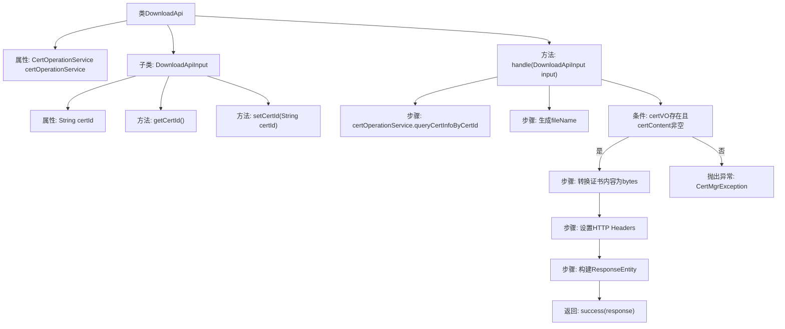

# 基础信息

|      |      |
|------|------|
| 名称 | DownloadApi |
| 编码语言 | .java |
| 代码路径 | WeFe/manager/manager-service/src/main/java/com/welab/wefe/manager/service/api/cert/DownloadApi.java |
| 包名 | com.welab.wefe.manager.service.api.cert |
| 依赖项 | ['java.net.URLEncoder', 'org.apache.commons.lang3.StringUtils', 'org.springframework.beans.factory.annotation.Autowired', 'org.springframework.http.HttpHeaders', 'org.springframework.http.MediaType', 'org.springframework.http.ResponseEntity', 'com.webank.cert.mgr.enums.MgrExceptionCodeEnums', 'com.webank.cert.mgr.exception.CertMgrException', 'com.webank.cert.mgr.model.vo.CertVO', 'com.webank.cert.mgr.service.CertOperationService', 'com.webank.cert.toolkit.utils.CertUtils', 'com.welab.wefe.common.fieldvalidate.annotation.Check', 'com.welab.wefe.common.web.api.base.AbstractApi', 'com.welab.wefe.common.web.api.base.Api', 'com.welab.wefe.common.web.dto.AbstractApiInput', 'com.welab.wefe.common.web.dto.ApiResult', 'com.welab.wefe.manager.service.api.cert.DownloadApi.DownloadApiInput'] |
| 概述说明 | DownloadApi类处理证书下载请求，通过certId查询证书内容并返回字节流响应，设置HTTP头控制缓存和文件名，若证书不存在则抛出异常。 |

# 说明

DownloadApi类是一个用于下载证书的API，继承自AbstractApi，处理DownloadApiInput输入并返回ResponseEntity<byte[]>。通过certOperationService查询证书信息，生成文件名和证书内容字节数组。设置HTTP响应头，包括缓存控制、内容处置和文件名编码。若证书不存在则抛出异常。DownloadApiInput包含必填的certId字段及其getter和setter方法。

# 类列表 Class Summary

| 名称   | 类型  | 说明 |
|-------|------|-------------|
| DownloadApi | class | DownloadApi类处理证书下载请求，通过certId查询证书内容并返回字节流响应，包含文件名和缓存控制头信息。若证书不存在则抛出异常。 |


## 类 DownloadApi

|      |      |
|------|------|
| 访问范围 | @Api(path = "cert/download", name = "download cert");public |
| 类型 | class |
| 名称 | DownloadApi |
| 说明 | DownloadApi类处理证书下载请求，通过certId查询证书内容并返回字节流响应，包含文件名和缓存控制头信息。若证书不存在则抛出异常。 |


### UML类图

```mermaid
classDiagram
    class DownloadApi {
        -CertOperationService certOperationService
        +handle(DownloadApiInput input) ApiResult~ResponseEntity~byte[]~~
    }

    class DownloadApiInput {
        -String certId
        +String getCertId()
        +void setCertId(String certId)
    }

    class AbstractApi~T, R~ {
        <<Abstract>>
    }

    class CertOperationService {
        <<Interface>>
        +queryCertInfoByCertId(String certId) CertVO
    }

    class CertVO {
        +String issuerCN
        +String certContent
    }

    class ResponseEntity~T~ {
        +ok() ResponseEntity~T~
        +headers(HttpHeaders headers) ResponseEntity~T~
        +contentType(MediaType contentType) ResponseEntity~T~
        +body(T body) ResponseEntity~T~
    }

    class HttpHeaders {
        +add(String headerName, String headerValue) void
    }

    class CertUtils {
        <<Utility>>
        +convertStrToCert(String certStr) Certificate
        +toBytes(Certificate cert) byte[]
    }

    DownloadApi --> CertOperationService : 依赖
    DownloadApi --> DownloadApiInput : 使用
    DownloadApi --|> AbstractApi~DownloadApiInput, ResponseEntity~byte[]~~ : 继承
    DownloadApiInput --|> AbstractApiInput : 继承
    CertOperationService ..> CertVO : 返回
    DownloadApi ..> CertUtils : 调用
    DownloadApi ..> ResponseEntity~byte[]~ : 构造
    ResponseEntity~byte[]~ ..> HttpHeaders : 使用
```

类图描述：该图展示了证书下载API的核心结构。DownloadApi继承自泛型抽象类AbstractApi，处理DownloadApiInput输入并返回ResponseEntity<byte[]>。通过CertOperationService查询证书信息，使用CertUtils进行格式转换，最终构建包含HTTP头信息的响应实体。DownloadApiInput作为输入参数类继承自AbstractApiInput，包含证书ID字段及访问方法。


### 内部方法调用关系图



该流程图展示了DownloadApi类的核心处理逻辑。流程从handle方法开始，首先通过certId查询证书信息，然后验证数据有效性。若数据有效则转换证书格式并设置HTTP响应头，最终返回文件下载响应；若数据无效则抛出证书不存在的异常。DownloadApiInput作为内部类用于封装证书ID参数，包含标准的getter/setter方法。整个流程清晰展现了证书下载API的完整处理链和异常分支。

### 字段列表 Field List

| 名称  | 类型  | 说明 |
|-------|-------|------|
| certOperationService | CertOperationService | 自动注入CertOperationService服务实例。 |

### 方法列表

| 名称  | 类型  | 说明 |
|-------|-------|------|
| handle | ApiResult<ResponseEntity<byte[]>> | 该方法根据证书ID查询证书信息，生成证书文件并设置HTTP响应头返回下载。若证书不存在则抛出异常。 |


