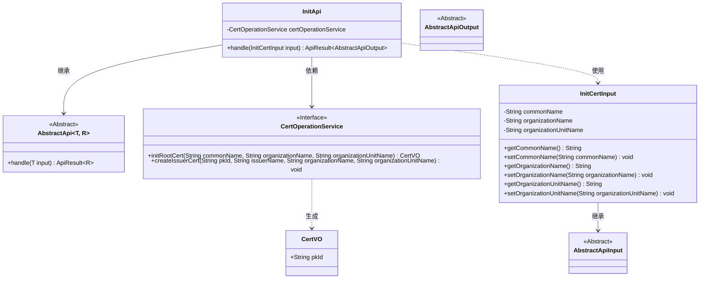
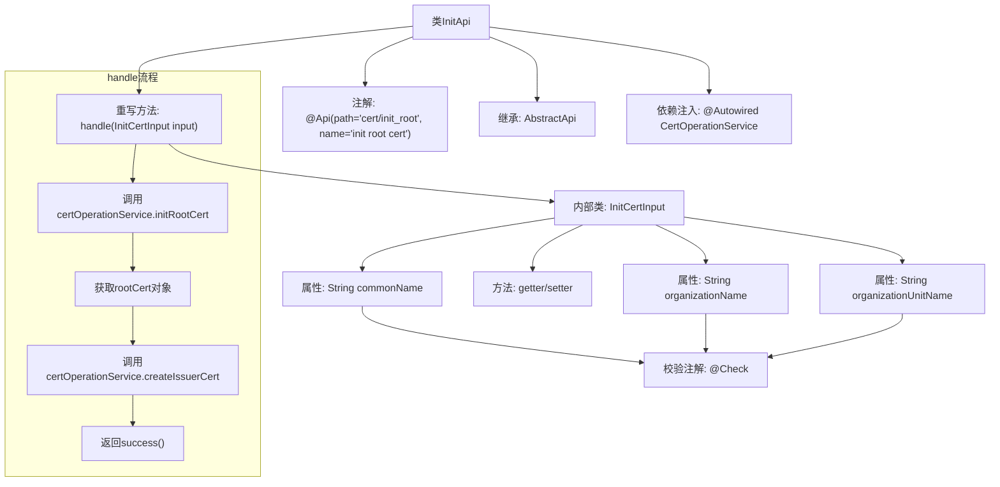

# 基础信息

|      |      |
|------|------|
| 名称 | InitApi |
| 编码语言 | .java |
| 代码路径 | WeFe/manager/manager-service/src/main/java/com/welab/wefe/manager/service/api/cert/InitApi.java |
| 包名 | com.welab.wefe.manager.service.api.cert |
| 依赖项 | ['org.springframework.beans.factory.annotation.Autowired', 'com.webank.cert.mgr.model.vo.CertVO', 'com.webank.cert.mgr.service.CertOperationService', 'com.welab.wefe.common.fieldvalidate.annotation.Check', 'com.welab.wefe.common.web.api.base.AbstractApi', 'com.welab.wefe.common.web.api.base.Api', 'com.welab.wefe.common.web.dto.AbstractApiInput', 'com.welab.wefe.common.web.dto.AbstractApiOutput', 'com.welab.wefe.common.web.dto.ApiResult', 'com.welab.wefe.manager.service.api.cert.InitApi.InitCertInput'] |
| 概述说明 | InitApi类用于初始化根证书和签发证书，接收常用名、组织名称和组织单位名称作为必填输入参数。 |

# 说明

该代码定义了一个名为InitApi的API类，用于初始化根证书和签发者证书。API路径为cert/init_root，接收包含常用名、组织名称和组织单位名称的输入参数。处理逻辑包括调用CertOperationService初始化根证书，然后创建签发者证书。输入类InitCertInput继承自AbstractApiInput，包含三个必填字段，并提供了相应的getter和setter方法。成功执行后返回成功结果。

# 类列表 Class Summary

| 名称   | 类型  | 说明 |
|-------|------|-------------|
| InitApi | class | 初始化根证书API，接收常用名、组织名和组织单位名，生成根证书并签发issuer证书。 |

## 类 InitApi

|      |      |
|------|------|
| 访问范围 | @Api(path = "cert/init_root", name = "init root cert");public |
| 类型 | class |
| 名称 | InitApi |
| 说明 | 初始化根证书API，接收常用名、组织名和组织单位名，生成根证书并签发issuer证书。 |

### UML类图

该类图展示了一个证书初始化系统的核心结构。InitApi继承自泛型抽象类AbstractApi，处理InitCertInput输入并返回AbstractApiOutput结果。系统通过CertOperationService接口实现根证书初始化(initRootCert)和签发者证书创建(createIssuerCert)功能。InitCertInput作为嵌套类继承AbstractApiInput，包含三个必填字段并通过getter/setter暴露属性。CertVO作为数据传输对象携带证书主键信息，整个流程体现了清晰的层次结构和职责分离。

### 内部方法调用关系图

这段代码描述了一个用于初始化根证书的API类InitApi，通过继承抽象模板类实现具体业务逻辑。流程图展示了类结构关系和核心方法handle的执行流程，其中包含两个关键操作：初始化根证书和创建签发者证书，最后返回成功结果。内部类InitCertInput封装了输入参数并带有校验注解，体现了清晰的职责划分。

### 字段列表 Field List

| 名称  | 类型  | 说明 |
|-------|-------|------|
| certOperationService | CertOperationService | 自动注入CertOperationService实例。 |

### 方法列表

| 名称  | 类型  | 说明 |
|-------|-------|------|
| handle | ApiResult<AbstractApiOutput> | 该方法处理初始化证书请求，先创建根证书，再签发Issuer证书，最后返回成功结果。 |

