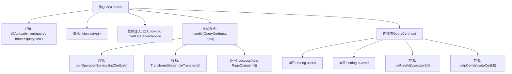

# 基础信息

|      |      |
|------|------|
| 名称 | QueryCertApi |
| 编码语言 | .java |
| 代码路径 | WeFe/manager/manager-service/src/main/java/com/welab/wefe/manager/service/api/cert/QueryCertApi.java |
| 包名 | com.welab.wefe.manager.service.api.cert |
| 依赖项 | ['java.util.List', 'org.springframework.beans.factory.annotation.Autowired', 'com.webank.cert.mgr.model.vo.CertVO', 'com.webank.cert.mgr.service.CertOperationService', 'com.webank.cert.mgr.utils.TransformUtils', 'com.welab.wefe.common.data.mongodb.dto.PageOutput', 'com.welab.wefe.common.data.mongodb.entity.manager.CertInfo', 'com.welab.wefe.common.web.api.base.AbstractApi', 'com.welab.wefe.common.web.api.base.Api', 'com.welab.wefe.common.web.dto.ApiResult', 'com.welab.wefe.manager.service.api.cert.QueryCertApi.QueryCertInput', 'com.welab.wefe.manager.service.dto.base.PageInput'] |
| 概述说明 | QueryCertApi类是一个查询证书的API，通过CertOperationService获取证书列表并转换为CertVO格式返回。输入参数包括用户ID和签发机构证书ID，输出为分页的证书数据。 |

# 说明

这是一个名为QueryCertApi的API类，用于查询证书信息。它继承自AbstractApi，接收QueryCertInput作为输入参数，返回包含CertVO列表的分页结果PageOutput。QueryCertInput包含用户ID和签发机构证书ID两个字段。API内部通过CertOperationService的findCertList方法获取证书列表，并使用TransformUtils将结果转换为CertVO类型。最后返回包含分页信息和转换后数据的结果。

# 类列表 Class Summary

| 名称   | 类型  | 说明 |
|-------|------|-------------|
| QueryCertApi | class | QueryCertApi类用于查询证书列表，接收用户ID和签发机构证书ID作为输入，返回分页的证书信息。通过CertOperationService处理查询，结果转换为CertVO格式后返回。 |


## 类 QueryCertApi

|      |      |
|------|------|
| 访问范围 | @Api(path = "cert/query", name = "query cert");public |
| 类型 | class |
| 名称 | QueryCertApi |
| 说明 | QueryCertApi类用于查询证书列表，接收用户ID和签发机构证书ID作为输入，返回分页的证书信息。通过CertOperationService处理查询，结果转换为CertVO格式后返回。 |


### UML类图

```mermaid
classDiagram
    class AbstractApi~T, R~ {
        <<Abstract>>
        +handle(T input) ApiResult~R~
    }

    class QueryCertApi {
        -CertOperationService certOperationService
        +handle(QueryCertInput input) ApiResult~PageOutput~CertVO~~
    }
    QueryCertApi --|> AbstractApi~QueryCertInput, PageOutput~CertVO~~ : 继承

    class QueryCertInput {
        -String userId
        -String pCertId
        +String getUserId()
        +void setUserId(String userId)
        +String getpCertId()
        +void setpCertId(String pCertId)
    }
    QueryCertInput --|> PageInput : 继承

    class PageInput {
        <<Abstract>>
    }

    class CertOperationService {
        <<Interface>>
        +findCertList(String userId, String pCertId, ...) PageOutput~CertInfo~
    }
    QueryCertApi --> CertOperationService : 依赖

    class PageOutput~T~ {
        +int pageIndex
        +int total
        +int pageSize
        +int totalPage
        +List~T~ list
    }

    class CertVO {
    }

    class CertInfo {
    }

    class ApiResult~T~ {
    }

    class TransformUtils {
        <<Utility>>
        +simpleTransform(List~S~, Class~T~) List~T~
    }
    QueryCertApi --> TransformUtils : 依赖
```

这段代码展示了一个证书查询API的实现，QueryCertApi继承自AbstractApi，处理QueryCertInput输入并返回分页的CertVO结果。主要涉及证书操作服务CertOperationService的调用，以及使用TransformUtils进行对象转换。类图清晰地展示了各组件间的继承、依赖关系，包括泛型类PageOutput、ApiResult的使用，以及工具类TransformUtils的辅助作用。整个设计遵循了分层架构原则，实现了业务逻辑与数据转换的分离。


### 内部方法调用关系图



这段代码是QueryCertApi类的实现，主要用于查询证书信息。流程从handle方法开始，首先通过certOperationService查询证书列表，然后使用TransformUtils转换数据格式，最后返回分页结果。内部类QueryCertInput封装了查询参数，包含用户ID和签发机构证书ID。整个过程展示了从参数处理到数据查询再到结果转换的完整业务逻辑链。

### 字段列表 Field List

| 名称  | 类型  | 说明 |
|-------|-------|------|
| certOperationService | CertOperationService | 代码片段使用@Autowired自动注入CertOperationService实例。 |

### 方法列表

| 名称  | 类型  | 说明 |
|-------|-------|------|
| handle | ApiResult<PageOutput<CertVO>> | 该方法处理查询证书列表请求，调用服务获取分页结果并转换为VO对象，最后返回成功响应。 |


