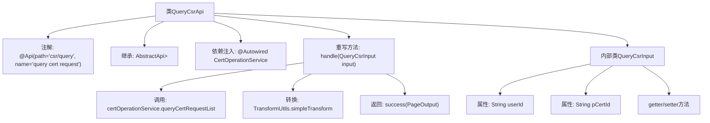

# 基础信息

|      |      |
|------|------|
| 名称 | QueryCsrApi |
| 编码语言 | .java |
| 代码路径 | WeFe/manager/manager-service/src/main/java/com/welab/wefe/manager/service/api/cert/QueryCsrApi.java |
| 包名 | com.welab.wefe.manager.service.api.cert |
| 依赖项 | ['java.util.List', 'org.springframework.beans.factory.annotation.Autowired', 'com.webank.cert.mgr.model.vo.CertRequestVO', 'com.webank.cert.mgr.service.CertOperationService', 'com.webank.cert.mgr.utils.TransformUtils', 'com.welab.wefe.common.data.mongodb.dto.PageOutput', 'com.welab.wefe.common.data.mongodb.entity.manager.CertRequestInfo', 'com.welab.wefe.common.web.api.base.AbstractApi', 'com.welab.wefe.common.web.api.base.Api', 'com.welab.wefe.common.web.dto.ApiResult', 'com.welab.wefe.manager.service.api.cert.QueryCsrApi.QueryCsrInput', 'com.welab.wefe.manager.service.dto.base.PageInput'] |
| 概述说明 | 查询证书请求的API类，处理分页查询，输入包含用户ID和签发机构证书ID，输出证书请求列表的分页结果。 |

# 说明

QueryCsrApi是一个用于查询证书请求的API类，路径为csr/query。它继承自AbstractApi，接受QueryCsrInput作为输入参数，返回包含CertRequestVO的分页结果PageOutput。内部通过CertOperationService的queryCertRequestList方法获取证书请求列表，并使用TransformUtils转换为VO对象。QueryCsrInput包含userId和pCertId两个字段，用于指定查询条件。处理成功后返回分页数据，包括页码、总数、每页大小、总页数和转换后的列表。

# 类列表 Class Summary

| 名称   | 类型  | 说明 |
|-------|------|-------------|
| QueryCsrApi | class | QueryCsrApi类处理证书请求查询，通过CertOperationService获取分页结果并转换为VO返回。输入包含用户ID和签发机构证书ID。 |


## 类 QueryCsrApi

|      |      |
|------|------|
| 访问范围 | @Api(path = "csr/query", name = "query cert request");public |
| 类型 | class |
| 名称 | QueryCsrApi |
| 说明 | QueryCsrApi类处理证书请求查询，通过CertOperationService获取分页结果并转换为VO返回。输入包含用户ID和签发机构证书ID。 |


### UML类图

```mermaid
classDiagram
    class QueryCsrApi {
        -CertOperationService certOperationService
        +handle(QueryCsrInput input) ApiResult~PageOutput~CertRequestVO~~
    }

    class AbstractApi~T, R~ {
        <<Abstract>>
        +handle(T input) ApiResult~R~
    }

    class QueryCsrInput {
        -String userId
        -String pCertId
        +String getUserId()
        +void setUserId(String userId)
        +String getpCertId()
        +void setpCertId(String pCertId)
    }

    class PageInput {
        <<Abstract>>
    }

    class CertOperationService {
        <<Interface>>
        +queryCertRequestList(String userId, String pCertId, int pageIndex, int pageSize) PageOutput~CertRequestInfo~
    }

    class PageOutput~T~ {
        +int pageIndex
        +int total
        +int pageSize
        +int totalPage
        +List~T~ list
    }

    class CertRequestVO {
    }

    class CertRequestInfo {
    }

    class TransformUtils {
        <<Utility>>
        +simpleTransform(List~S~ source, Class~T~ targetClass) List~T~
    }

    class ApiResult~T~ {
        +T data
        +boolean success
    }

    QueryCsrApi --> AbstractApi~QueryCsrInput, PageOutput~CertRequestVO~~ : 继承
    QueryCsrApi --> CertOperationService : 依赖
    QueryCsrInput --> PageInput : 继承
    QueryCsrApi ..> QueryCsrInput : 使用
    QueryCsrApi ..> PageOutput~CertRequestVO~~ : 使用
    QueryCsrApi ..> CertRequestVO : 使用
    CertOperationService ..> PageOutput~CertRequestInfo~ : 返回
    QueryCsrApi ..> TransformUtils : 使用
    TransformUtils ..> CertRequestVO : 转换
    TransformUtils ..> CertRequestInfo : 转换
    PageOutput~CertRequestInfo~ ..> CertRequestInfo : 包含
    PageOutput~CertRequestVO~~ ..> CertRequestVO : 包含
    ApiResult~PageOutput~CertRequestVO~~ ..> PageOutput~CertRequestVO~~ : 包装
```

这段代码展示了一个证书查询API的实现，QueryCsrApi继承自AbstractApi，处理QueryCsrInput输入并返回分页的证书请求数据。主要涉及CertOperationService服务调用、PageOutput分页结果封装、CertRequestVO值对象转换等组件。类图清晰地展示了各组件间的继承、依赖和使用关系，包括泛型类的参数传递、接口实现和工具类调用等关键交互。


### 内部方法调用关系图



这段代码展示了一个处理证书查询请求的API类QueryCsrApi，它继承自AbstractApi并实现了handle方法。流程包括：通过certOperationService查询证书请求列表，使用TransformUtils转换结果类型，最后返回分页数据。内部类QueryCsrInput封装了查询参数，包含用户ID和签发机构证书ID两个字段及其访问方法。整个流程体现了典型的API请求处理模式，包含服务调用、数据转换和结果封装。

### 字段列表 Field List

| 名称  | 类型  | 说明 |
|-------|-------|------|
| certOperationService | CertOperationService | 代码片段使用@Autowired注解自动注入CertOperationService实例。 |

### 方法列表

| 名称  | 类型  | 说明 |
|-------|-------|------|
| handle | ApiResult<PageOutput<CertRequestVO>> | 该方法处理查询证书请求列表，调用服务获取分页数据，转换结果后返回分页响应。 |


