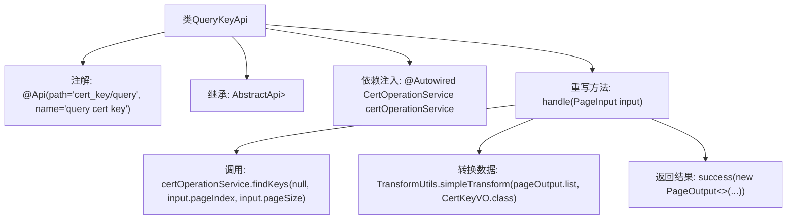

# 基础信息

|      |      |
|------|------|
| 名称 | QueryKeyApi |
| 编码语言 | .java |
| 代码路径 | WeFe/manager/manager-service/src/main/java/com/welab/wefe/manager/service/api/cert/QueryKeyApi.java |
| 包名 | com.welab.wefe.manager.service.api.cert |
| 依赖项 | ['java.util.List', 'org.springframework.beans.factory.annotation.Autowired', 'com.webank.cert.mgr.model.vo.CertKeyVO', 'com.webank.cert.mgr.service.CertOperationService', 'com.webank.cert.mgr.utils.TransformUtils', 'com.welab.wefe.common.data.mongodb.dto.PageOutput', 'com.welab.wefe.common.data.mongodb.entity.manager.CertKeyInfo', 'com.welab.wefe.common.web.api.base.AbstractApi', 'com.welab.wefe.common.web.api.base.Api', 'com.welab.wefe.common.web.dto.ApiResult', 'com.welab.wefe.manager.service.dto.base.PageInput'] |
| 概述说明 | 查询证书密钥的API类，继承自AbstractApi，使用CertOperationService分页查询密钥信息，转换为CertKeyVO后返回分页结果。 |

# 说明

这是一个名为QueryKeyApi的API类，用于查询证书密钥。它继承自AbstractApi，处理PageInput输入并返回PageOutput<CertKeyVO>。类中注入了CertOperationService服务，通过findKeys方法获取分页数据，并使用TransformUtils将CertKeyInfo转换为CertKeyVO。最后返回包含分页信息和转换后数据的结果。API路径为cert_key/query，功能描述为query cert key。

# 类列表 Class Summary

| 名称   | 类型  | 说明 |
|-------|------|-------------|
| QueryKeyApi | class | 查询证书密钥API，接收分页参数，调用CertOperationService查询密钥列表，转换为CertKeyVO后返回分页结果。 |


## 类 QueryKeyApi

|      |      |
|------|------|
| 访问范围 | @Api(path = "cert_key/query", name = "query cert key");public |
| 类型 | class |
| 名称 | QueryKeyApi |
| 说明 | 查询证书密钥API，接收分页参数，调用CertOperationService查询密钥列表，转换为CertKeyVO后返回分页结果。 |


### UML类图

```mermaid
classDiagram
    class QueryKeyApi {
        -CertOperationService certOperationService
        +handle(PageInput input) ApiResult~PageOutput~CertKeyVO~~
    }
    class AbstractApi~T, R~ {
        <<Abstract>>
        +handle(T input) ApiResult~R~
    }
    class CertOperationService {
        <<Interface>>
        +findKeys(Object param, int pageIndex, int pageSize) PageOutput~CertKeyInfo~
    }
    class PageInput {
        +int pageIndex
        +int pageSize
        +int getPageIndex()
        +int getPageSize()
    }
    class PageOutput~T~ {
        +int pageIndex
        +int total
        +int pageSize
        +int totalPage
        +List~T~ list
        +getPageIndex()
        +getTotal()
        +getPageSize()
        +getTotalPage()
        +getList()
    }
    class CertKeyVO {
        // 证书密钥视图对象
    }
    class CertKeyInfo {
        // 证书密钥信息实体
    }
    class TransformUtils {
        <<Utility>>
        +simpleTransform(List~S~ source, Class~T~ targetClass) List~T~
    }
    class ApiResult~T~ {
        +T data
        +boolean success
        +String message
        +success(T data)
    }

    QueryKeyApi --|> AbstractApi~PageInput, PageOutput~CertKeyVO~~ : 继承
    QueryKeyApi --> CertOperationService : 依赖
    QueryKeyApi --> PageInput : 使用
    QueryKeyApi --> PageOutput~CertKeyVO~ : 返回
    QueryKeyApi --> TransformUtils : 调用
    PageOutput~CertKeyInfo~ --> CertKeyInfo : 包含
    PageOutput~CertKeyVO~ --> CertKeyVO : 包含
    CertOperationService ..> PageOutput~CertKeyInfo~ : 返回
    TransformUtils ..> CertKeyVO : 转换目标
```

这段代码描述了一个查询证书密钥的API接口`QueryKeyApi`，它继承自泛型抽象类`AbstractApi`，通过`CertOperationService`服务获取分页数据，并使用`TransformUtils`工具类将`CertKeyInfo`实体转换为`CertKeyVO`视图对象。类图展示了核心类之间的继承、依赖和关联关系，包括分页输入输出结构、服务接口调用以及数据转换过程，体现了清晰的层级结构和职责划分。


### 内部方法调用关系图



这段代码是QueryKeyApi类的实现，主要用于查询证书密钥信息。通过继承AbstractApi并重写handle方法，处理分页查询请求。流程包括：调用certOperationService获取密钥分页数据，使用TransformUtils转换数据类型，最后返回封装好的分页结果。整个流程清晰展示了从数据获取到结果返回的处理链路。

### 字段列表 Field List

| 名称  | 类型  | 说明 |
|-------|-------|------|
| certOperationService | CertOperationService | 自动注入CertOperationService实例。 |

### 方法列表

| 名称  | 类型  | 说明 |
|-------|-------|------|
| handle | ApiResult<PageOutput<CertKeyVO>> | 该方法处理分页查询证书密钥，调用服务获取数据后转换为VO对象，返回分页结果。 |


