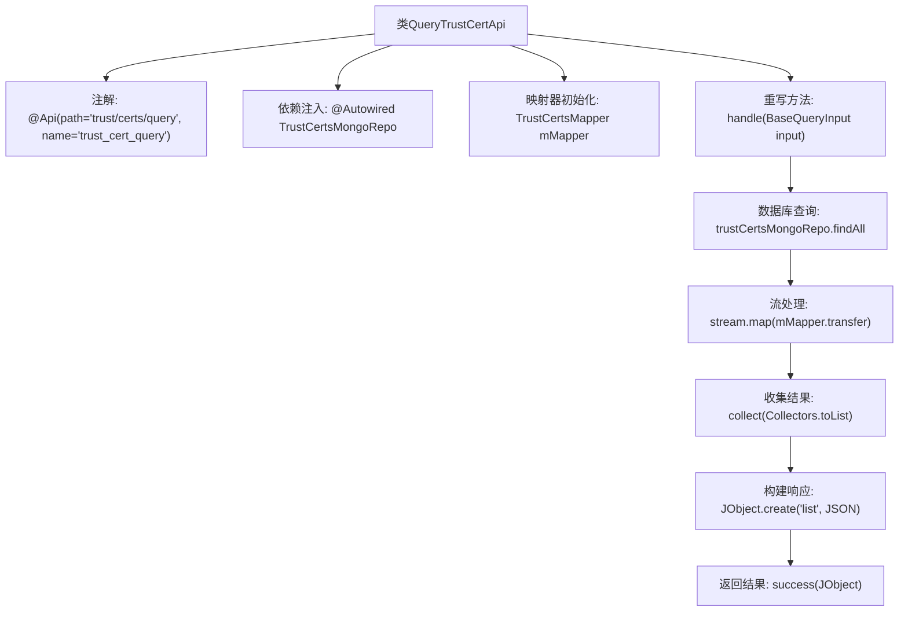

# 基础信息

|      |      |
|------|------|
| 名称 | QueryTrustCertApi |
| 编码语言 | .java |
| 代码路径 | WeFe/manager/manager-service/src/main/java/com/welab/wefe/manager/service/api/cert/QueryTrustCertApi.java |
| 包名 | com.welab.wefe.manager.service.api.cert |
| 依赖项 | ['com.welab.wefe.common.data.mongodb.repo.TrustCertsMongoRepo', 'com.welab.wefe.common.util.JObject', 'com.welab.wefe.common.web.api.base.AbstractApi', 'com.welab.wefe.common.web.api.base.Api', 'com.welab.wefe.common.web.dto.ApiResult', 'com.welab.wefe.manager.service.dto.base.BaseQueryInput', 'com.welab.wefe.manager.service.dto.cert.TrustCertsQueryOutput', 'com.welab.wefe.manager.service.mapper.TrustCertsMapper', 'org.mapstruct.factory.Mappers', 'org.springframework.beans.factory.annotation.Autowired', 'java.util.List', 'java.util.stream.Collectors'] |
| 概述说明 | 查询信任证书API，通过MongoDB获取证书列表并转换为JSON格式返回。 |

# 说明

这是一个名为QueryTrustCertApi的Java类，用于查询信任证书数据。它继承自AbstractApi基类，使用BaseQueryInput作为输入类型，JObject作为输出类型。类上标注了Api注解，指定API路径为trust/certs/query。类中注入了TrustCertsMongoRepo用于数据库操作，并通过TrustCertsMapper进行对象转换。handle方法实现了核心逻辑：根据输入状态查询所有证书数据，转换为TrustCertsQueryOutput对象列表，最后封装为包含JSON列表的成功响应返回。

# 类列表 Class Summary

| 名称   | 类型  | 说明 |
|-------|------|-------------|
| QueryTrustCertApi | class | QueryTrustCertApi类处理信任证书查询，通过MongoDB获取数据并映射为JSON输出。输入为BaseQueryInput，返回包含证书列表的ApiResult。 |


## 类 QueryTrustCertApi

|      |      |
|------|------|
| 访问范围 | @Api(path = "trust/certs/query", name = "trust_cert_query");public |
| 类型 | class |
| 名称 | QueryTrustCertApi |
| 说明 | QueryTrustCertApi类处理信任证书查询，通过MongoDB获取数据并映射为JSON输出。输入为BaseQueryInput，返回包含证书列表的ApiResult。 |


### UML类图

```mermaid
classDiagram
    class QueryTrustCertApi {
        -TrustCertsMongoRepo trustCertsMongoRepo
        -TrustCertsMapper mMapper
        +handle(BaseQueryInput input) ApiResult~JObject~
    }
    <<Interface>> {
        interface JObject {
            +toJSON(Object obj) String
            +create(String key, String value) JObject
        }
    }
    class BaseQueryInput {
        +String getStatus()
    }
    class TrustCertsMongoRepo {
        +findAll(String status) List~TrustCerts~
    }
    class TrustCertsMapper {
        +transfer(TrustCerts source) TrustCertsQueryOutput
    }
    class TrustCertsQueryOutput
    class TrustCerts
    class ApiResult~T~ {
        +success(T data) ApiResult~T~
    }
    class AbstractApi~I,O~ {
        <<Abstract>>
        +handle(I input) ApiResult~O~
    }

    QueryTrustCertApi --> AbstractApi~BaseQueryInput,JObject~ : 继承
    QueryTrustCertApi --> TrustCertsMongoRepo : 依赖
    QueryTrustCertApi --> TrustCertsMapper : 依赖
    TrustCertsMapper --> TrustCerts : 转换
    TrustCertsMapper --> TrustCertsQueryOutput : 生成
    TrustCertsMongoRepo --> TrustCerts : 查询
    JObject ..> TrustCertsQueryOutput : 序列化
    AbstractApi~BaseQueryInput,JObject~ <|-- QueryTrustCertApi : 实现
```

这段代码展示了一个查询可信证书的API实现，继承自泛型抽象类AbstractApi，通过MongoDB仓库获取数据并使用Mapper转换结果。类图清晰地呈现了核心类QueryTrustCertApi与周边组件（如数据访问层TrustCertsMongoRepo、对象映射器TrustCertsMapper）的协作关系，以及泛型基类AbstractApi的继承结构，体现了从数据查询到JSON输出的完整处理流程。


### 内部方法调用关系图



该流程图描述了QueryTrustCertApi类的核心处理流程。首先通过注解定义API路径，注入MongoDB仓库和映射器。处理请求时，从数据库查询数据，通过流处理进行对象转换，最终将结果封装为JSON格式返回。整个过程展示了从数据获取到响应的完整链路，重点突出了Spring依赖注入和函数式流处理的结合使用。

### 字段列表 Field List

| 名称  | 类型  | 说明 |
|-------|-------|------|
| mMapper = Mappers.getMapper(TrustCertsMapper.class) | TrustCertsMapper | 声明一个受保护的TrustCertsMapper实例，通过Mappers工具类获取映射器。 |
| trustCertsMongoRepo | TrustCertsMongoRepo | 使用@Autowired自动注入TrustCertsMongoRepo仓库实例。 |

### 方法列表

| 名称  | 类型  | 说明 |
|-------|-------|------|
| handle | ApiResult<JObject> | 该方法查询指定状态的信任证书列表，转换为JSON格式后返回成功结果。 |


