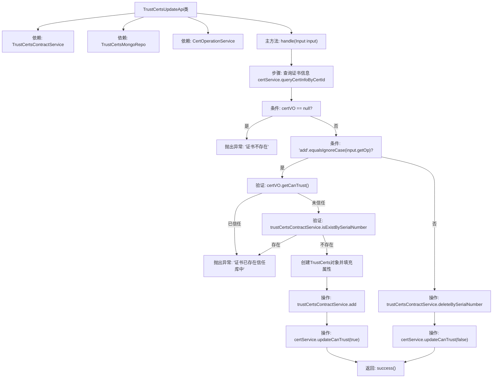

# 基础信息

|      |      |
|------|------|
| 名称 | TrustCertsUpdateApi |
| 编码语言 | .java |
| 代码路径 | WeFe/manager/manager-service/src/main/java/com/welab/wefe/manager/service/api/cert/TrustCertsUpdateApi.java |
| 包名 | com.welab.wefe.manager.service.api.cert |
| 依赖项 | ['cn.hutool.core.bean.BeanUtil', 'com.webank.cert.mgr.model.vo.CertVO', 'com.webank.cert.mgr.service.CertOperationService', 'com.welab.wefe.common.StatusCode', 'com.welab.wefe.common.data.mongodb.entity.union.TrustCerts', 'com.welab.wefe.common.data.mongodb.repo.TrustCertsMongoRepo', 'com.welab.wefe.common.exception.StatusCodeWithException', 'com.welab.wefe.common.fieldvalidate.annotation.Check', 'com.welab.wefe.common.web.api.base.AbstractApi', 'com.welab.wefe.common.web.api.base.Api', 'com.welab.wefe.common.web.dto.AbstractApiInput', 'com.welab.wefe.common.web.dto.AbstractApiOutput', 'com.welab.wefe.common.web.dto.ApiResult', 'com.welab.wefe.manager.service.service.TrustCertsContractService', 'org.springframework.beans.factory.annotation.Autowired'] |
| 概述说明 | TrustCertsUpdateApi处理证书信任库更新，支持添加或删除操作。检查证书存在性后，根据操作类型调用相应服务完成更新，返回操作结果。 |

# 说明

TrustCertsUpdateApi是一个处理证书信任库更新的API类，路径为trust/certs/update。它继承自AbstractApi，接受Input参数并返回AbstractApiOutput。主要功能包括根据操作类型（add或delete）更新证书信任状态。添加操作会检查证书是否存在，若不存在则创建TrustCerts对象并设置属性后存入信任库，同时更新证书信任状态；删除操作则从信任库移除证书并更新状态。输入参数certId和op为必填项，分别表示证书ID和操作类型。处理过程中会捕获异常并返回相应状态码。

# 类列表 Class Summary

| 名称   | 类型  | 说明 |
|-------|------|-------------|
| TrustCertsUpdateApi | class | 信任证书更新API，处理证书添加或删除操作，验证证书存在性并更新信任库状态。 |


## 类 TrustCertsUpdateApi

|      |      |
|------|------|
| 访问范围 | @Api(path = "trust/certs/update", name = "trust_certs_add");public |
| 类型 | class |
| 名称 | TrustCertsUpdateApi |
| 说明 | 信任证书更新API，处理证书添加或删除操作，验证证书存在性并更新信任库状态。 |


### UML类图

```mermaid
classDiagram
    class TrustCertsUpdateApi {
        -TrustCertsContractService trustCertsContractService
        -TrustCertsMongoRepo trustCertsMongoRepo
        -CertOperationService certService
        +handle(Input input) ApiResult~AbstractApiOutput~
    }
    <<Interface>> TrustCertsUpdateApi {
        <<Interface>>
    }

    class AbstractApi~T, R~ {
        <<Abstract>>
    }

    class TrustCertsContractService {
        +isExistBySerialNumber(String serialNumber) boolean
        +add(TrustCerts trustCerts) void
        +deleteBySerialNumber(String serialNumber) void
    }

    class TrustCertsMongoRepo {
    }

    class CertOperationService {
        +queryCertInfoByCertId(String certId) CertVO
        +updateCanTrust(String serialNumber, boolean canTrust) void
    }

    class CertVO {
        -String pkId
        -String serialNumber
        -Boolean canTrust
        -Boolean isCACert
        -Boolean isRootCert
        -String issuerCN
        -String subjectCN
        -String pCertId
        // getters/setters
    }

    class TrustCerts {
        -String certId
        -String serialNumber
        -String isCaCert
        -String isRootCert
        -String issuerCn
        -String subjectCn
        -String pCertId
        // getters/setters
    }

    class StatusCodeWithException {
        -StatusCode statusCode
        -String message
    }

    class Input {
        -String certId
        -String op
        +getCertId() String
        +setCertId(String certId) void
        +getOp() String
        +setOp(String op) void
    }

    class AbstractApiInput {
        <<Abstract>>
    }

    class AbstractApiOutput {
        <<Abstract>>
    }

    TrustCertsUpdateApi --> TrustCertsContractService : 依赖
    TrustCertsUpdateApi --> TrustCertsMongoRepo : 依赖
    TrustCertsUpdateApi --> CertOperationService : 依赖
    TrustCertsUpdateApi --> Input : 使用
    TrustCertsUpdateApi ..|> AbstractApi : 继承
    Input --|> AbstractApiInput : 继承
    AbstractApiOutput <|-- AbstractApi : 泛型参数
```

类图描述：该图展示了TrustCertsUpdateApi类及其相关依赖关系。TrustCertsUpdateApi继承自AbstractApi，处理证书更新操作，依赖TrustCertsContractService、TrustCertsMongoRepo和CertOperationService三个服务类。Input类作为内部类继承AbstractApiInput，包含证书ID和操作类型字段。类图清晰地呈现了各组件间的层次结构和协作关系。


### 内部方法调用关系图



这段代码是用于管理信任证书更新的API类，主要处理证书的添加和删除操作。流程图展示了完整的处理逻辑：首先查询证书信息，若不存在则报错；对于添加操作会检查证书是否已存在，未存在则创建新记录并更新状态；删除操作则直接移除记录并更新状态。整个过程包含多个验证步骤和异常处理，最终返回操作结果。

### 字段列表 Field List

| 名称  | 类型  | 说明 |
|-------|-------|------|
| trustCertsContractService | TrustCertsContractService | 自动注入TrustCertsContractService服务实例。 |
| trustCertsMongoRepo | TrustCertsMongoRepo | 使用@Autowired自动注入TrustCertsMongoRepo仓库实例。 |
| certService | CertOperationService | 使用@Autowired自动注入CertOperationService实例certService。 |

### 方法列表

| 名称  | 类型  | 说明 |
|-------|-------|------|
| handle | ApiResult<AbstractApiOutput> | 处理证书信任更新操作：查询证书信息，若操作为"add"则检查并添加至信任库，否则删除。操作成功返回成功结果，失败抛出异常。 |


