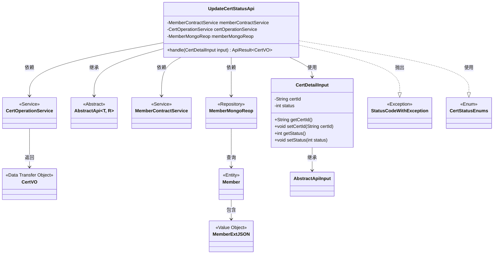
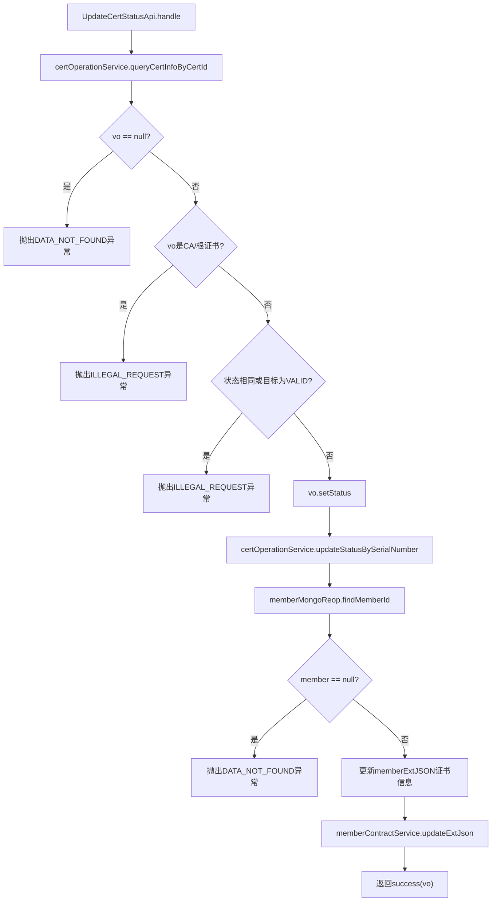

# 基础信息

|      |      |
|------|------|
| 名称 | UpdateCertStatusApi |
| 编码语言 | .java |
| 代码路径 | WeFe/manager/manager-service/src/main/java/com/welab/wefe/manager/service/api/cert/UpdateCertStatusApi.java |
| 包名 | com.welab.wefe.manager.service.api.cert |
| 依赖项 | ['com.webank.cert.mgr.model.vo.CertVO', 'com.webank.cert.mgr.service.CertOperationService', 'com.webank.cert.toolkit.enums.CertStatusEnums', 'com.welab.wefe.common.StatusCode', 'com.welab.wefe.common.data.mongodb.entity.union.Member', 'com.welab.wefe.common.data.mongodb.entity.union.ext.MemberExtJSON', 'com.welab.wefe.common.data.mongodb.repo.MemberMongoReop', 'com.welab.wefe.common.exception.StatusCodeWithException', 'com.welab.wefe.common.fieldvalidate.annotation.Check', 'com.welab.wefe.common.web.api.base.AbstractApi', 'com.welab.wefe.common.web.api.base.Api', 'com.welab.wefe.common.web.dto.AbstractApiInput', 'com.welab.wefe.common.web.dto.ApiResult', 'com.welab.wefe.manager.service.api.cert.UpdateCertStatusApi.CertDetailInput', 'com.welab.wefe.manager.service.service.MemberContractService', 'org.springframework.beans.factory.annotation.Autowired'] |
| 概述说明 | 更新证书状态的API，检查证书有效性后更新状态并同步至区块链，包含输入参数校验。 |

# 说明

该代码定义了一个名为UpdateCertStatusApi的API类，用于更新证书状态。API路径为cert/update_status，接收CertDetailInput输入参数并返回CertVO结果。主要逻辑包括：查询证书信息，验证证书非CA或根证书，禁止将状态置为有效，更新证书状态并同步到区块链。输入参数包含必填字段certId和status。处理过程中会检查数据是否存在及操作合法性，最终更新成员扩展信息中的证书状态、内容和序列号。

# 类列表 Class Summary

| 名称   | 类型  | 说明 |
|-------|------|-------------|
| UpdateCertStatusApi | class | UpdateCertStatusApi用于更新证书状态，验证输入后更新数据库和区块链数据。禁止操作CA/根证书及置为有效状态。输入需包含证书ID和状态码。 |

## 类 UpdateCertStatusApi

|      |      |
|------|------|
| 访问范围 | @Api(path = "cert/update_status", name = "update cert status");public |
| 类型 | class |
| 名称 | UpdateCertStatusApi |
| 说明 | UpdateCertStatusApi用于更新证书状态，验证输入后更新数据库和区块链数据。禁止操作CA/根证书及置为有效状态。输入需包含证书ID和状态码。 |

### UML类图

这段代码描述了一个证书状态更新API的实现，主要类包括UpdateCertStatusApi及其内部输入类CertDetailInput。该API通过依赖MemberContractService、CertOperationService和MemberMongoReop三个服务类，处理证书状态更新请求，包括数据验证、状态更新和区块链同步等操作。类图展示了这些类之间的继承、依赖和使用关系，以及涉及的异常和枚举类型。整个设计遵循了分层架构原则，将业务逻辑、数据访问和外部服务调用分离。

### 内部方法调用关系图

该流程图展示了证书状态更新的完整流程：首先查询证书信息并进行多重验证（存在性检查、证书类型检查、状态合法性检查），通过后更新数据库状态，最后同步到区块链。流程包含5个验证节点和3个外部服务调用，严格遵循"失败优先"原则，任何检查不通过都会立即终止流程并抛出对应异常。

### 字段列表 Field List

| 名称  | 类型  | 说明 |
|-------|-------|------|
| certOperationService | CertOperationService | 使用@Autowired自动注入CertOperationService实例。 |
| memberContractService | MemberContractService | 自动注入会员合同服务实例。 |
| memberMongoReop | MemberMongoReop | 使用@Autowired自动注入MemberMongoReop仓库实例。 |

### 方法列表

| 名称  | 类型  | 说明 |
|-------|-------|------|
| handle | ApiResult<CertVO> | 该方法根据证书ID查询证书信息，检查合法性后更新状态并同步到区块链。若数据不存在、操作非法或状态无效则抛出异常。 |

