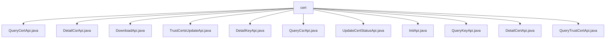

# 基础信息

|      |      |
|------|------|
| 名称 | cert |
| 编码语言 | .java |
| 代码路径 | WeFe/manager/manager-service/src/main/java/com/welab/wefe/manager/service/api/cert |
| 包名 | docs.manager.manager-service.src.main.java.com.welab.wefe.manager.service.api.cert |
| 概述说明 | QueryCertApi查询证书信息，DetailCsrApi处理证书请求详情，DownloadApi下载证书，TrustCertsUpdateApi更新信任库，DetailKeyApi查询密钥详情，QueryCsrApi查询证书请求，UpdateCertStatusApi更新证书状态，InitApi初始化根证书，QueryKeyApi查询密钥，DetailCertApi处理证书详情，QueryTrustCertApi查询信任证书。 |

# 说明

## 概述  
该模块核心职责是提供证书全生命周期管理功能，包括查询、下载、更新状态及信任库维护等。接口规范统一继承AbstractApi，采用分页查询返回PageOutput或直接返回VO对象，例如QueryCertApi返回CertVO列表，DownloadApi返回字节流响应。关键数据结构包括CertVO、CertRequestVO和CertKeyVO等证书视图对象，以及各类Input参数如QueryCertInput和CertDetailInput。外部依赖主要为CertOperationService和TrustCertsMongoRepo等数据服务组件，例如通过CertOperationService实现证书状态更新和信任库同步。

## 主要业务场景  
模块支持证书初始化、查询、状态管理和信任库维护三大场景。类似证书管理中心模式，InitApi初始化根证书，QueryCsrApi分页查询证书请求，TrustCertsUpdateApi动态维护信任库。交互模式包含标准CRUD操作和文件下载，例如DownloadApi处理证书下载，UpdateCertStatusApi同步状态到区块链。典型应用如：用户通过DetailCertApi查看证书详情，管理员通过QueryTrustCertApi审核信任证书。API类型涵盖查询类（如QueryKeyApi）、详情类（如DetailKeyApi）和操作类（如InitApi），集成案例包括分页查询与状态更新联动。

### 包内部结构视图

该流程图展示了WeFe管理服务中证书相关API的层级结构。所有API文件都位于cert目录下，包括查询证书、详情查看、下载、状态更新等11个具体功能接口，清晰地呈现了证书管理模块的完整功能集合。

# 文件列表

| 名称   | 类型  | 说明 |
|-------|------|-------------|
| [QueryCertApi.java](QueryCertApi.md) | file | QueryCertApi类是一个查询证书的API，通过CertOperationService获取证书列表并转换为CertVO格式返回。输入参数包括用户ID和签发机构证书ID，输出为分页的证书数据。 |
| [DetailCsrApi.java](DetailCsrApi.md) | file | DetailCsrApi类处理CSR详情查询，通过csrId调用certOperationService获取证书请求信息，返回CertRequestVO。输入参数CsrDetailInput需包含csrId。 |
| [DownloadApi.java](DownloadApi.md) | file | DownloadApi类处理证书下载请求，通过certId查询证书内容并返回字节流响应，设置HTTP头控制缓存和文件名，若证书不存在则抛出异常。 |
| [TrustCertsUpdateApi.java](TrustCertsUpdateApi.md) | file | TrustCertsUpdateApi处理证书信任库更新，支持添加或删除操作。检查证书存在性后，根据操作类型调用相应服务完成更新，返回操作结果。 |
| [DetailKeyApi.java](DetailKeyApi.md) | file | DetailKeyApi类处理证书密钥详情查询，通过keyId调用certOperationService获取CertKeyVO数据，输入参数KeyDetailInput需包含非空keyId。 |
| [QueryCsrApi.java](QueryCsrApi.md) | file | 查询证书请求的API类，处理分页查询，输入包含用户ID和签发机构证书ID，输出证书请求列表的分页结果。 |
| [UpdateCertStatusApi.java](UpdateCertStatusApi.md) | file | 更新证书状态的API，检查证书有效性后更新状态并同步至区块链，包含输入参数校验。 |
| [InitApi.java](InitApi.md) | file | InitApi类用于初始化根证书和签发证书，接收常用名、组织名称和组织单位名称作为必填输入参数。 |
| [QueryKeyApi.java](QueryKeyApi.md) | file | 查询证书密钥的API类，继承自AbstractApi，使用CertOperationService分页查询密钥信息，转换为CertKeyVO后返回分页结果。 |
| [DetailCertApi.java](DetailCertApi.md) | file | DetailCertApi类处理证书详情查询，接收certId参数，调用certOperationService查询并返回CertVO结果。 |
| [QueryTrustCertApi.java](QueryTrustCertApi.md) | file | 查询信任证书API，通过MongoDB获取证书列表并转换为JSON格式返回。 |

