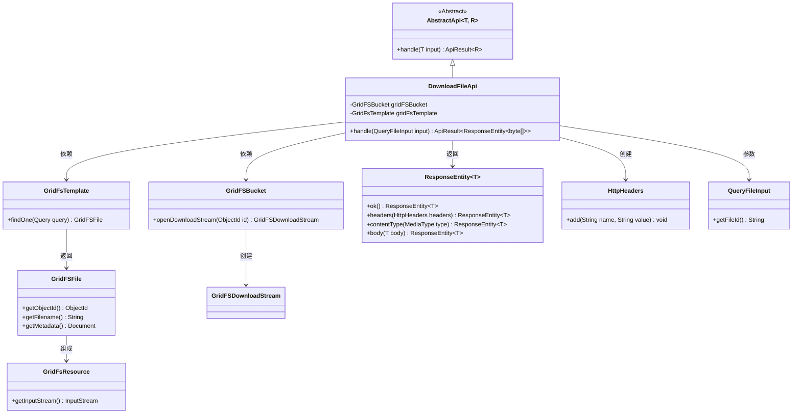
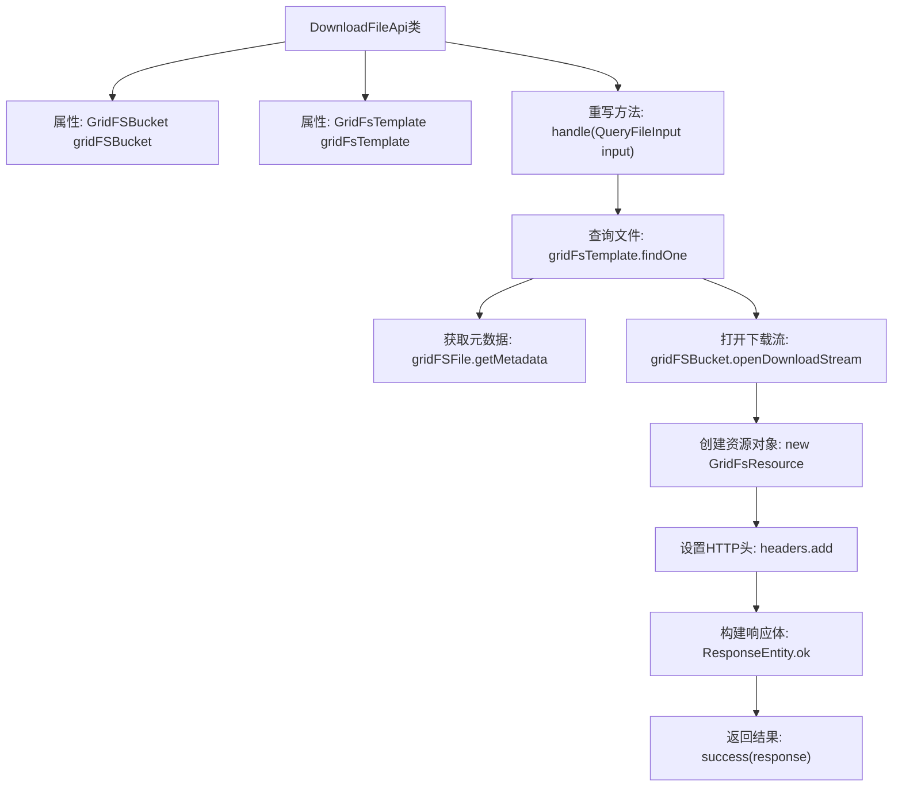

# 基础信息

|      |      |
|------|------|
| 名称 | DownloadFileApi |
| 编码语言 | .java |
| 代码路径 | WeFe/manager/manager-service/src/main/java/com/welab/wefe/manager/service/api/common/DownloadFileApi.java |
| 包名 | com.welab.wefe.manager.service.api.common |
| 依赖项 | ['com.mongodb.client.gridfs.GridFSBucket', 'com.mongodb.client.gridfs.GridFSDownloadStream', 'com.mongodb.client.gridfs.model.GridFSFile', 'com.welab.wefe.common.data.mongodb.util.QueryBuilder', 'com.welab.wefe.common.web.api.base.AbstractApi', 'com.welab.wefe.common.web.api.base.Api', 'com.welab.wefe.common.web.dto.ApiResult', 'com.welab.wefe.manager.service.dto.common.QueryFileInput', 'org.apache.commons.io.IOUtils', 'org.springframework.beans.factory.annotation.Autowired', 'org.springframework.data.mongodb.gridfs.GridFsResource', 'org.springframework.data.mongodb.gridfs.GridFsTemplate', 'org.springframework.http.HttpHeaders', 'org.springframework.http.MediaType', 'org.springframework.http.ResponseEntity', 'java.io.IOException', 'java.net.URLEncoder'] |
| 概述说明 | DownloadFileApi类用于从GridFS下载文件，根据输入ID查询文件，设置响应头并返回文件字节流。包含缓存控制、文件名编码和内容类型处理。 |

# 说明

该代码定义了一个名为DownloadFileApi的API类，用于处理文件下载请求。它继承自AbstractApi，接收QueryFileInput输入并返回ResponseEntity<byte[]>响应。通过GridFS从MongoDB中查询指定ID的文件，设置HTTP响应头包括缓存控制、内容类型、文件名等，并将文件内容以字节数组形式返回。整个流程包括文件查询、流处理、响应头配置和响应体构建。

# 类列表 Class Summary

| 名称   | 类型  | 说明 |
|-------|------|-------------|
| DownloadFileApi | class | DownloadFileApi类用于从GridFS下载文件，根据文件ID查询并返回文件内容，设置HTTP头信息如缓存控制和文件名编码。 |

## 类 DownloadFileApi

|      |      |
|------|------|
| 访问范围 | @Api(path = "download/file", name = "download_file");public |
| 类型 | class |
| 名称 | DownloadFileApi |
| 说明 | DownloadFileApi类用于从GridFS下载文件，根据文件ID查询并返回文件内容，设置HTTP头信息如缓存控制和文件名编码。 |

### UML类图

这段代码定义了一个文件下载API，继承自泛型抽象类AbstractApi，通过GridFS实现文件查询和流式下载。类图展示了DownloadFileApi与MongoDB的GridFS组件（GridFSBucket、GridFsTemplate）的交互，以及构建HTTP响应（ResponseEntity、HttpHeaders）的过程。核心流程包括：根据文件ID查询GridFS文件、设置下载流、构建包含缓存控制和文件名的响应头，最终返回字节数组格式的文件内容。各组件间通过明确的依赖关系协作完成文件下载功能。

### 内部方法调用关系图

该流程图展示了DownloadFileApi类处理文件下载请求的完整流程。从查询指定ID的GridFS文件开始，获取文件元数据后创建下载流和资源对象，接着设置HTTP响应头（包括缓存控制和文件名编码），最后构建包含文件二进制数据的响应实体并返回。整个过程严格遵循MongoDB GridFS的文件操作规范，并确保响应头符合文件下载的最佳实践。

### 字段列表 Field List

| 名称  | 类型  | 说明 |
|-------|-------|------|
| gridFsTemplate | GridFsTemplate | 使用@Autowired自动注入GridFsTemplate对象。 |
| gridFSBucket | GridFSBucket | 代码片段声明了一个私有GridFSBucket变量，并使用@Autowired注解进行自动装配。 |

### 方法列表

| 名称  | 类型  | 说明 |
|-------|-------|------|
| handle | ApiResult<ResponseEntity<byte[]>> | 该方法处理文件查询请求，从GridFS获取文件并设置响应头，返回文件字节流。包含缓存控制、文件名编码和内容类型处理。 |

