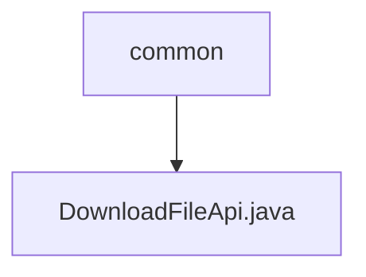

# 基础信息

|      |      |
|------|------|
| 名称 | common |
| 编码语言 | .java |
| 代码路径 | WeFe/manager/manager-service/src/main/java/com/welab/wefe/manager/service/api/common |
| 包名 | docs.manager.manager-service.src.main.java.com.welab.wefe.manager.service.api.common |
| 概述说明 | DownloadFileApi类用于从GridFS下载文件，根据输入ID查询文件，设置响应头并返回文件字节流。包含缓存控制、文件名编码和内容类型处理。 |

# 说明

该代码定义了一个名为DownloadFileApi的API类，用于处理文件下载请求。它继承自AbstractApi，接收QueryFileInput输入并返回ResponseEntity<byte[]>响应。通过GridFS从MongoDB中查询指定ID的文件，设置HTTP响应头包括缓存控制、内容类型、文件名等，并将文件内容以字节数组形式返回。整个流程包括文件查询、流处理、响应头配置和响应体构建。

### 包内部结构视图

该流程图展示了WeFe项目中manager-service模块的API目录结构。根节点"common"表示公共API目录，其下包含一个具体的API实现文件"DownloadFileApi.java"。这种结构体现了典型的Java项目分层设计，将不同功能的API按模块组织，其中下载文件功能被归类到公共API目录下。

# 文件列表

| 名称   | 类型  | 说明 |
|-------|------|-------------|
| [DownloadFileApi.java](DownloadFileApi.md) | file | DownloadFileApi类用于从GridFS下载文件，根据输入ID查询文件，设置响应头并返回文件字节流。包含缓存控制、文件名编码和内容类型处理。 |

