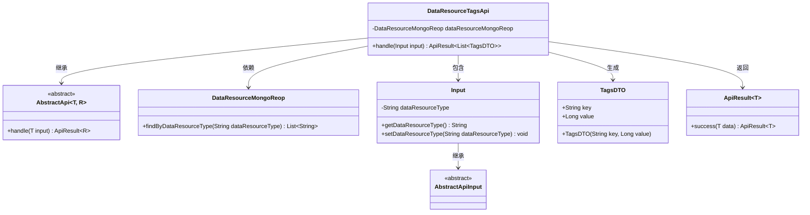
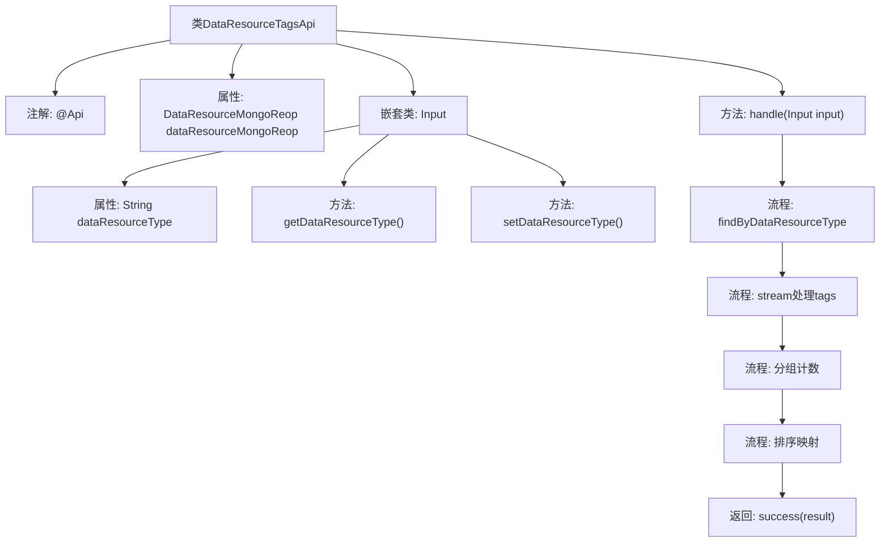

# 基础信息

|      |      |
|------|------|
| 名称 | DataResourceTagsApi |
| 编码语言 | .java |
| 代码路径 | WeFe/manager/manager-service/src/main/java/com/welab/wefe/manager/service/api/dataresource/DataResourceTagsApi.java |
| 包名 | com.welab.wefe.manager.service.api.dataresource |
| 依赖项 | ['com.welab.wefe.common.data.mongodb.repo.DataResourceMongoReop', 'com.welab.wefe.common.exception.StatusCodeWithException', 'com.welab.wefe.common.web.api.base.AbstractApi', 'com.welab.wefe.common.web.api.base.Api', 'com.welab.wefe.common.web.dto.AbstractApiInput', 'com.welab.wefe.common.web.dto.ApiResult', 'com.welab.wefe.manager.service.dto.tag.TagsDTO', 'org.springframework.beans.factory.annotation.Autowired', 'java.io.IOException', 'java.util.Arrays', 'java.util.Comparator', 'java.util.List', 'java.util.Map', 'java.util.stream.Collectors'] |
| 概述说明 | 这是一个查询数据资源标签的API类，通过输入资源类型从MongoDB获取标签列表，处理后返回按标签出现次数排序的DTO列表。 |

# 说明

该代码定义了一个名为DataResourceTagsApi的API类，用于查询数据资源标签。它继承自AbstractApi，接受Input参数并返回TagsDTO列表。通过注入的DataResourceMongoReop从数据库获取指定类型的标签数据，处理后按标签出现频率排序返回。Input类包含dataResourceType属性用于指定资源类型。处理流程包括查询、分组、排序和结果封装。

# 类列表 Class Summary

| 名称   | 类型  | 说明 |
|-------|------|-------------|
| DataResourceTagsApi | class | 这是一个Java类，用于查询数据资源标签。它通过MongoDB获取指定类型的标签，统计并排序后返回标签列表。输入参数为dataResourceType，输出为包含标签名和数量的列表。 |

## 类 DataResourceTagsApi

|      |      |
|------|------|
| 访问范围 | @Api(path = "data_resource/tags/query", name = "data_resource_tags_query");public |
| 类型 | class |
| 名称 | DataResourceTagsApi |
| 说明 | 这是一个Java类，用于查询数据资源标签。它通过MongoDB获取指定类型的标签，统计并排序后返回标签列表。输入参数为dataResourceType，输出为包含标签名和数量的列表。 |

### UML类图

这段代码展示了一个数据资源标签查询API的实现，继承自泛型抽象类AbstractApi。DataResourceTagsApi通过注入的DataResourceMongoReop从MongoDB获取数据，处理输入参数Input后，将标签分组统计并排序，最终返回TagsDTO列表。类图清晰地展现了继承关系、依赖注入和数据流转过程，体现了从数据获取到结果封装的全流程。

### 内部方法调用关系图

这段代码是一个基于Spring框架的API实现类，主要功能是通过MongoDB查询数据资源标签并进行统计处理。流程图展示了类结构和方法调用链：从@Api注解定义开始，通过注入的MongoDB仓库查询数据，对标签进行分割、过滤、分组计数，然后排序并映射为DTO对象列表，最后返回成功结果。嵌套的Input类用于接收请求参数，包含数据类型字段及其getter/setter方法。整个流程体现了数据查询→处理→返回的标准API实现模式。

### 字段列表 Field List

| 名称  | 类型  | 说明 |
|-------|-------|------|
| dataResourceMongoReop | DataResourceMongoReop | 使用@Autowired自动注入DataResourceMongoReop数据资源MongoDB仓库。 |

### 方法列表

| 名称  | 类型  | 说明 |
|-------|-------|------|
| handle | ApiResult<List<TagsDTO>> | 该方法处理输入参数，从MongoDB获取标签列表，按逗号分割并统计各标签出现次数，排序后返回标签DTO列表。 |

