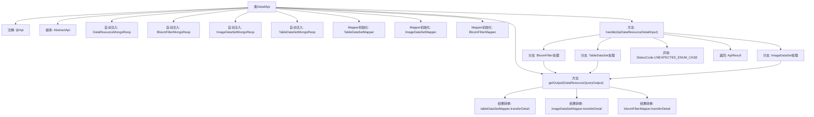

# 基础信息

|      |      |
|------|------|
| 名称 | DetailApi |
| 编码语言 | .java |
| 代码路径 | WeFe/manager/manager-service/src/main/java/com/welab/wefe/manager/service/api/dataresource/DetailApi.java |
| 包名 | com.welab.wefe.manager.service.api.dataresource |
| 依赖项 | ['com.welab.wefe.common.StatusCode', 'com.welab.wefe.common.data.mongodb.constant.MongodbTable', 'com.welab.wefe.common.data.mongodb.dto.dataresource.DataResourceQueryOutput', 'com.welab.wefe.common.data.mongodb.repo.BloomFilterMongoReop', 'com.welab.wefe.common.data.mongodb.repo.DataResourceMongoReop', 'com.welab.wefe.common.data.mongodb.repo.ImageDataSetMongoReop', 'com.welab.wefe.common.data.mongodb.repo.TableDataSetMongoReop', 'com.welab.wefe.common.exception.StatusCodeWithException', 'com.welab.wefe.common.web.api.base.AbstractApi', 'com.welab.wefe.common.web.api.base.Api', 'com.welab.wefe.common.web.dto.ApiResult', 'com.welab.wefe.common.wefe.enums.DataResourceType', 'com.welab.wefe.manager.service.dto.dataresource.ApiDataResourceDetailInput', 'com.welab.wefe.manager.service.dto.dataresource.ApiDataResourceQueryOutput', 'com.welab.wefe.manager.service.mapper.BloomFilterMapper', 'com.welab.wefe.manager.service.mapper.ImageDataSetMapper', 'com.welab.wefe.manager.service.mapper.TableDataSetMapper', 'org.mapstruct.factory.Mappers', 'org.springframework.beans.factory.annotation.Autowired'] |
| 概述说明 | DetailApi类处理数据资源详情查询，根据输入类型调用不同MongoDB存储库获取数据，并通过映射器转换为输出结果。 |

# 说明

DetailApi类是一个处理数据资源详情的API，继承自AbstractApi，接收ApiDataResourceDetailInput输入并返回ApiDataResourceQueryOutput结果。它通过注入的MongoDB仓库和映射器处理不同类型的数据资源查询，包括BloomFilter、TableDataSet和ImageDataSet。根据输入的数据资源类型，从相应MongoDB表中查询数据，并通过对应的映射器转换输出结果。若类型不匹配或查询失败，会抛出异常或返回空值。

# 类列表 Class Summary

| 名称   | 类型  | 说明 |
|-------|------|-------------|
| DetailApi | class | DetailApi类处理数据资源详情查询，根据输入类型（BloomFilter、TableDataSet、ImageDataSet）从不同MongoDB集合获取数据，并通过对应Mapper转换为输出格式。 |


## 类 DetailApi

|      |      |
|------|------|
| 访问范围 | @Api(path = "data_resource/detail", name = "data_resource_detail");public |
| 类型 | class |
| 名称 | DetailApi |
| 说明 | DetailApi类处理数据资源详情查询，根据输入类型（BloomFilter、TableDataSet、ImageDataSet）从不同MongoDB集合获取数据，并通过对应Mapper转换为输出格式。 |


### UML类图

```mermaid
classDiagram
    class AbstractApi~T, R~ {
        <<Abstract>>
        +handle(T input) R
    }

    class DetailApi {
        -DataResourceMongoReop dataResourceMongoReop
        -BloomFilterMongoReop bloomFilterMongoReop
        -ImageDataSetMongoReop imageDataSetMongoReop
        -TableDataSetMongoReop tableDataSetMongoReop
        -TableDataSetMapper tableDataSetMapper
        -ImageDataSetMapper imageDataSetMapper
        -BloomFilterMapper bloomFilterMapper
        +handle(ApiDataResourceDetailInput input) ApiResult~ApiDataResourceQueryOutput~
        -getOutput(DataResourceQueryOutput dataResourceQueryOutput) ApiDataResourceQueryOutput
    }

    class DataResourceMongoReop {
        +findOneByDataResourceId(String dataResourceId, MongodbTable.Union type) DataResourceQueryOutput
    }

    class BloomFilterMongoReop
    class ImageDataSetMongoReop
    class TableDataSetMongoReop

    class TableDataSetMapper {
        +transferDetail(DataResourceQueryOutput output) ApiDataResourceQueryOutput
    }

    class ImageDataSetMapper {
        +transferDetail(DataResourceQueryOutput output) ApiDataResourceQueryOutput
    }

    class BloomFilterMapper {
        +transferDetail(DataResourceQueryOutput output) ApiDataResourceQueryOutput
    }

    class ApiDataResourceDetailInput {
        +String dataResourceId
        +DataResourceType dataResourceType
    }

    class ApiDataResourceQueryOutput
    class DataResourceQueryOutput {
        +DataResourceType dataResourceType
    }

    class ApiResult~T~
    class MongodbTable {
        <<Enumeration>>
        Union
    }

    class DataResourceType {
        <<Enumeration>>
        BloomFilter
        TableDataSet
        ImageDataSet
    }

    DetailApi --|> AbstractApi~ApiDataResourceDetailInput, ApiResult~ApiDataResourceQueryOutput~~ : 继承
    DetailApi --> DataResourceMongoReop : 依赖
    DetailApi --> BloomFilterMongoReop : 依赖
    DetailApi --> ImageDataSetMongoReop : 依赖
    DetailApi --> TableDataSetMongoReop : 依赖
    DetailApi --> TableDataSetMapper : 依赖
    DetailApi --> ImageDataSetMapper : 依赖
    DetailApi --> BloomFilterMapper : 依赖
    DataResourceMongoReop --> DataResourceQueryOutput : 返回
    TableDataSetMapper --> ApiDataResourceQueryOutput : 返回
    ImageDataSetMapper --> ApiDataResourceQueryOutput : 返回
    BloomFilterMapper --> ApiDataResourceQueryOutput : 返回
    ApiDataResourceDetailInput --> DataResourceType : 包含
    DataResourceQueryOutput --> DataResourceType : 包含
```

该类图展示了DetailApi及其相关组件的结构关系。DetailApi继承自泛型抽象类AbstractApi，实现了对三种不同类型数据资源（布隆过滤器、表格数据集、图像数据集）的查询处理。它依赖四个MongoDB仓库类获取数据，并通过三个Mapper类将查询结果转换为统一输出格式。枚举类DataResourceType和MongodbTable.Union定义了数据类型标识。整个设计体现了策略模式的思想，通过类型判断选择不同的数据处理路径。


### 内部方法调用关系图



这段代码流程图展示了DetailApi类的结构和主要处理流程。该类通过继承AbstractApi实现了一个数据资源详情查询接口，根据不同的数据资源类型（BloomFilter/TableDataSet/ImageDataSet）调用对应的MongoDB存储库查询数据，然后通过Mapper将查询结果转换为输出对象。流程包含类型判断分支、异常处理和结果转换三个关键阶段，最终返回统一格式的API响应结果。

### 字段列表 Field List

| 名称  | 类型  | 说明 |
|-------|-------|------|
| bloomFilterMongoReop | BloomFilterMongoReop | 使用@Autowired自动注入BloomFilterMongoReop仓库实例。 |
| imageDataSetMapper = Mappers.getMapper(ImageDataSetMapper.class) | ImageDataSetMapper | 声明一个受保护的ImageDataSetMapper实例，通过Mappers.getMapper方法获取映射器对象。 |
| bloomFilterMapper = Mappers.getMapper(BloomFilterMapper.class) | BloomFilterMapper | 代码定义了一个受保护的BloomFilterMapper实例，通过Mappers.getMapper方法获取其实现类。 |
| dataResourceMongoReop | DataResourceMongoReop | 使用@Autowired自动注入DataResourceMongoReop数据资源Mongo仓库。 |
| tableDataSetMongoReop | TableDataSetMongoReop | 使用@Autowired自动注入TableDataSetMongoReop仓库实例。 |
| tableDataSetMapper = Mappers.getMapper(TableDataSetMapper.class) | TableDataSetMapper | 声明一个受保护的TableDataSetMapper实例，通过Mappers.getMapper方法初始化。 |
| imageDataSetMongoReop | ImageDataSetMongoReop | 自动注入ImageDataSetMongoReop数据库操作对象。 |

### 方法列表

| 名称  | 类型  | 说明 |
|-------|-------|------|
| getOutput | ApiDataResourceQueryOutput | 该方法根据输入数据类型返回对应的转换结果：若输入为空则返回空；若为表格数据则调用表格转换器；若为图像数据则调用图像转换器；否则调用布隆过滤器转换器。 |
| handle | ApiResult<ApiDataResourceQueryOutput> | 方法根据输入类型查询MongoDB数据资源，支持布隆过滤器、表格和图像数据集，异常时抛出错误。 |


