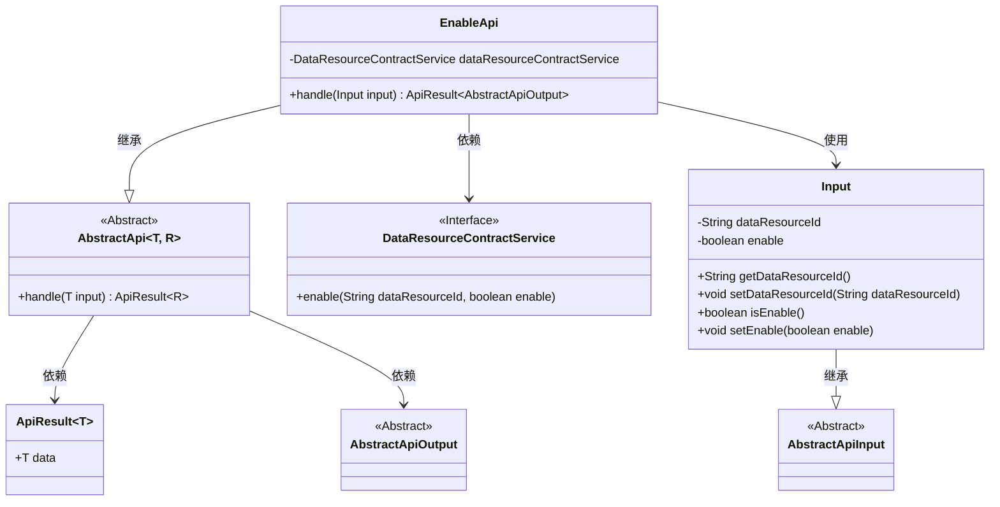

# 基础信息

|      |      |
|------|------|
| 名称 | EnableApi |
| 编码语言 | .java |
| 代码路径 | WeFe/manager/manager-service/src/main/java/com/welab/wefe/manager/service/api/dataresource/EnableApi.java |
| 包名 | com.welab.wefe.manager.service.api.dataresource |
| 依赖项 | ['com.welab.wefe.common.StatusCode', 'com.welab.wefe.common.exception.StatusCodeWithException', 'com.welab.wefe.common.fieldvalidate.annotation.Check', 'com.welab.wefe.common.web.api.base.AbstractApi', 'com.welab.wefe.common.web.api.base.Api', 'com.welab.wefe.common.web.dto.AbstractApiInput', 'com.welab.wefe.common.web.dto.AbstractApiOutput', 'com.welab.wefe.common.web.dto.ApiResult', 'com.welab.wefe.manager.service.service.DataResourceContractService', 'org.springframework.beans.factory.annotation.Autowired'] |
| 概述说明 | EnableApi类处理数据资源启用/禁用请求，调用DataResourceContractService服务，需传入dataResourceId和enable参数，异常时返回系统错误。 |

# 说明

这是一个名为EnableApi的Java类，用于处理数据资源启用/禁用请求。它继承自AbstractApi，定义了输入参数Input类，包含必填字段dataResourceId和enable。类通过dataResourceContractService调用enable方法处理请求，成功返回空结果，异常时抛出系统错误。输入参数进行了非空校验，并提供了getter/setter方法。

# 类列表 Class Summary

| 名称   | 类型  | 说明 |
|-------|------|-------------|
| EnableApi | class | EnableApi类用于启用或禁用数据资源，接收dataResourceId和enable参数，调用dataResourceContractService处理，异常时返回系统错误。 |

## 类 EnableApi

|      |      |
|------|------|
| 访问范围 | @Api(path = "data_resource/enable", name = "data_resource_enable");public |
| 类型 | class |
| 名称 | EnableApi |
| 说明 | EnableApi类用于启用或禁用数据资源，接收dataResourceId和enable参数，调用dataResourceContractService处理，异常时返回系统错误。 |

### UML类图

这段代码展示了一个启用数据资源的API实现。EnableApi继承自泛型抽象类AbstractApi，处理包含dataResourceId和enable标志的输入参数，通过DataResourceContractService接口执行实际启用操作。类图清晰地呈现了继承关系（EnableApi→AbstractApi、Input→AbstractApiInput）、依赖关系（EnableApi→DataResourceContractService）以及核心数据结构（Input类封装请求参数）。异常处理通过StatusCodeWithException实现，符合企业级API的规范设计。

### 内部方法调用关系图

```mermaid
graph TD
    A["类EnableApi"]
    B["注解: @Api(path='data_resource/enable', name='data_resource_enable')"]
    C["继承: AbstractApi<Input, AbstractApiOutput>"]
    D["依赖注入: @Autowired DataResourceContractService"]
    E["重写方法: handle(Input input)"]
    F["日志记录: LOG.info('data resource enable handle..')"]
    G["try-catch块"]
    H["调用: dataResourceContractService.enable()"]
    I["异常处理: throw StatusCodeWithException"]
    J["返回: success()"]
    K["嵌套类Input"]
    L["继承: AbstractApiInput"]
    M["字段: @Check String dataResourceId"]
    N["字段: @Check boolean enable"]
    O["Getter/Setter方法"]

    A --> B
    A --> C
    A --> D
    A --> E
    E --> F
    E --> G
    G --> H
    G --> I
    E --> J
    A --> K
    K --> L
    K --> M
    K --> N
    K --> O
```

这段代码展示了一个名为EnableApi的REST API类，用于处理数据资源启用/禁用操作。流程图清晰呈现了类结构，包括注解声明、父类继承、服务注入和核心handle方法实现。handle方法包含日志记录、服务调用和异常处理流程，嵌套类Input定义了必需的请求参数及校验规则。整体设计遵循了标准的API开发模式，通过分层处理实现了业务逻辑与异常处理的分离。

### 字段列表 Field List

| 名称  | 类型  | 说明 |
|-------|-------|------|
| dataResourceContractService | DataResourceContractService | 自动注入DataResourceContractService服务实例。 |

### 方法列表

| 名称  | 类型  | 说明 |
|-------|-------|------|
| handle | ApiResult<AbstractApiOutput> | 该方法处理数据资源启用操作，调用服务启用指定资源，捕获异常并返回成功或系统错误。 |

