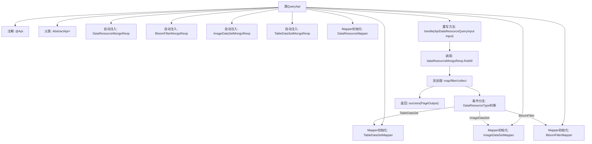

# 基础信息

|      |      |
|------|------|
| 名称 | QueryApi |
| 编码语言 | .java |
| 代码路径 | WeFe/manager/manager-service/src/main/java/com/welab/wefe/manager/service/api/dataresource/QueryApi.java |
| 包名 | com.welab.wefe.manager.service.api.dataresource |
| 依赖项 | ['com.welab.wefe.common.data.mongodb.dto.PageOutput', 'com.welab.wefe.common.data.mongodb.dto.dataresource.DataResourceQueryOutput', 'com.welab.wefe.common.data.mongodb.repo.BloomFilterMongoReop', 'com.welab.wefe.common.data.mongodb.repo.DataResourceMongoReop', 'com.welab.wefe.common.data.mongodb.repo.ImageDataSetMongoReop', 'com.welab.wefe.common.data.mongodb.repo.TableDataSetMongoReop', 'com.welab.wefe.common.web.api.base.AbstractApi', 'com.welab.wefe.common.web.api.base.Api', 'com.welab.wefe.common.web.dto.ApiResult', 'com.welab.wefe.common.wefe.enums.DataResourceType', 'com.welab.wefe.manager.service.dto.dataresource.ApiDataResourceQueryInput', 'com.welab.wefe.manager.service.dto.dataresource.ApiDataResourceQueryOutput', 'com.welab.wefe.manager.service.mapper.BloomFilterMapper', 'com.welab.wefe.manager.service.mapper.DataResourceMapper', 'com.welab.wefe.manager.service.mapper.ImageDataSetMapper', 'com.welab.wefe.manager.service.mapper.TableDataSetMapper', 'org.mapstruct.factory.Mappers', 'org.springframework.beans.factory.annotation.Autowired', 'java.util.List', 'java.util.Objects', 'java.util.stream.Collectors'] |
| 概述说明 | QueryApi类处理数据资源查询，通过MongoDB存储库获取不同类型数据，使用映射器转换输出，返回分页结果。 |

# 说明

这是一个名为QueryApi的Java类，继承自AbstractApi，用于处理数据资源查询请求。类中注入了四个MongoDB仓库接口和四个Mapper接口。主要方法handle接收输入参数，通过dataResourceMongoReop查询数据，并根据数据类型使用不同的Mapper转换结果，最终返回分页格式的查询结果。支持表数据集、图像数据集和布隆过滤器三种数据类型。

# 类列表 Class Summary

| 名称   | 类型  | 说明 |
|-------|------|-------------|
| QueryApi | class | QueryApi类处理数据资源查询，继承AbstractApi，使用多个MongoDB仓库和Mapper转换输入输出，根据资源类型返回不同结果。 |


## 类 QueryApi

|      |      |
|------|------|
| 访问范围 | @Api(path = "data_resource/query", name = "data_resource_query");public |
| 类型 | class |
| 名称 | QueryApi |
| 说明 | QueryApi类处理数据资源查询，继承AbstractApi，使用多个MongoDB仓库和Mapper转换输入输出，根据资源类型返回不同结果。 |


### UML类图

```mermaid
classDiagram
    class QueryApi {
        -DataResourceMongoReop dataResourceMongoReop
        -BloomFilterMongoReop bloomFilterMongoReop
        -ImageDataSetMongoReop imageDataSetMongoReop
        -TableDataSetMongoReop tableDataSetMongoReop
        -TableDataSetMapper tableDataSetMapper
        -ImageDataSetMapper imageDataSetMapper
        -BloomFilterMapper bloomFilterMapper
        -DataResourceMapper dataResourceMapper
        +handle(ApiDataResourceQueryInput input) ApiResult~PageOutput~ApiDataResourceQueryOutput~~
    }

    class AbstractApi~T, R~ {
        <<Abstract>>
    }

    class ApiDataResourceQueryInput {
    }

    class PageOutput~T~ {
        +int pageIndex
        +long total
        +int pageSize
        +int totalPage
        +List~T~ list
    }

    class ApiDataResourceQueryOutput {
    }

    class DataResourceQueryOutput {
        +DataResourceType dataResourceType
    }

    enum DataResourceType {
        TableDataSet
        ImageDataSet
        BloomFilter
    }

    class DataResourceMongoReop {
        +findAll(DataResourceQueryInput input) PageOutput~DataResourceQueryOutput~
    }

    class BloomFilterMongoReop {
    }

    class ImageDataSetMongoReop {
    }

    class TableDataSetMongoReop {
    }

    class TableDataSetMapper {
        +transferDetail(DataResourceQueryOutput output) ApiDataResourceQueryOutput
    }

    class ImageDataSetMapper {
        +transferDetail(DataResourceQueryOutput output) ApiDataResourceQueryOutput
    }

    class BloomFilterMapper {
        +transferDetail(DataResourceQueryOutput output) ApiDataResourceQueryOutput
    }

    class DataResourceMapper {
        +transferInput(ApiDataResourceQueryInput input) DataResourceQueryInput
    }

    QueryApi --|> AbstractApi~ApiDataResourceQueryInput, PageOutput~ApiDataResourceQueryOutput~~ : 继承
    QueryApi --> DataResourceMongoReop : 依赖
    QueryApi --> BloomFilterMongoReop : 依赖
    QueryApi --> ImageDataSetMongoReop : 依赖
    QueryApi --> TableDataSetMongoReop : 依赖
    QueryApi --> TableDataSetMapper : 依赖
    QueryApi --> ImageDataSetMapper : 依赖
    QueryApi --> BloomFilterMapper : 依赖
    QueryApi --> DataResourceMapper : 依赖
    DataResourceMongoReop --> DataResourceQueryOutput : 返回
    DataResourceMongoReop --> DataResourceMapper : 转换输入
    DataResourceQueryOutput --> DataResourceType : 包含
    TableDataSetMapper --> ApiDataResourceQueryOutput : 转换
    ImageDataSetMapper --> ApiDataResourceQueryOutput : 转换
    BloomFilterMapper --> ApiDataResourceQueryOutput : 转换
```

这段代码展示了一个查询API的实现，QueryApi继承自AbstractApi，处理数据资源查询请求。它依赖多个MongoDB仓库和映射器，根据不同的数据资源类型（表格数据集、图像数据集或布隆过滤器）将查询结果转换为统一的输出格式。类图清晰地展示了各个类之间的关系和依赖，包括抽象基类、输入输出类型、枚举类型以及各种映射器和仓库类。整个设计体现了分层和职责分离的原则，便于维护和扩展。


### 内部方法调用关系图



该流程图展示了QueryApi类的完整结构，从类注解、依赖注入到核心业务逻辑处理流程。重点描述了handle方法的数据处理链：通过MongoDB查询原始数据后，根据数据类型选择不同Mapper转换，过滤空值后封装分页结果返回。流程清晰展现了条件分支和对象转换的关键路径，体现了数据查询和类型分发的核心逻辑。

### 字段列表 Field List

| 名称  | 类型  | 说明 |
|-------|-------|------|
| imageDataSetMongoReop | ImageDataSetMongoReop | 使用@Autowired自动注入ImageDataSetMongoReop实例。 |
| dataResourceMapper = Mappers.getMapper(DataResourceMapper.class) | DataResourceMapper | 声明一个受保护的DataResourceMapper实例，通过Mappers.getMapper方法初始化。 |
| dataResourceMongoReop | DataResourceMongoReop | 自动注入DataResourceMongoReop数据资源MongoDB仓库实例。 |
| bloomFilterMapper = Mappers.getMapper(BloomFilterMapper.class) | BloomFilterMapper | BloomFilterMapper实例通过Mappers.getMapper方法获取。 |
| bloomFilterMongoReop | BloomFilterMongoReop | 使用@Autowired自动注入BloomFilterMongoReop仓库实例。 |
| tableDataSetMapper = Mappers.getMapper(TableDataSetMapper.class) | TableDataSetMapper | 声明一个受保护的TableDataSetMapper实例，通过Mappers.getMapper方法初始化。 |
| tableDataSetMongoReop | TableDataSetMongoReop | 使用@Autowired自动注入TableDataSetMongoReop仓库实例。 |
| imageDataSetMapper = Mappers.getMapper(ImageDataSetMapper.class) | ImageDataSetMapper | 声明一个受保护的ImageDataSetMapper实例，通过Mappers.getMapper方法初始化。 |

### 方法列表

| 名称  | 类型  | 说明 |
|-------|-------|------|
| handle | ApiResult<PageOutput<ApiDataResourceQueryOutput>> | 该方法处理数据资源查询请求，根据输入条件从MongoDB获取分页结果，并按资源类型映射为不同输出对象（表数据集、图像数据集、布隆过滤器），过滤空值后返回分页响应。 |


