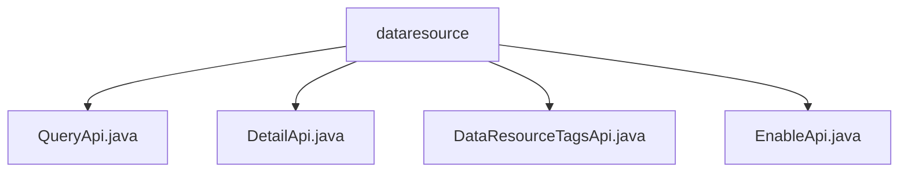

# 基础信息

|      |      |
|------|------|
| 名称 | dataresource |
| 编码语言 | .java |
| 代码路径 | WeFe/manager/manager-service/src/main/java/com/welab/wefe/manager/service/api/dataresource |
| 包名 | docs.manager.manager-service.src.main.java.com.welab.wefe.manager.service.api.dataresource |
| 概述说明 | QueryApi处理数据查询，支持表、图像和布隆过滤器类型。DetailApi获取数据详情，处理不同类型资源。DataResourceTagsApi查询并按频率排序标签。EnableApi管理资源启用状态，进行参数校验。 |

# 说明

## 概述  
该模块核心职责是提供数据资源的统一查询与管理能力，包括基础查询、详情获取、标签检索和启用控制。接口规范遵循RESTful风格，输入输出均继承自AbstractApi基类，通过注入的MongoDB仓库和Mapper实现数据转换。关键数据结构包含ApiDataResourceDetailInput、TagsDTO等，支持表数据集、图像数据集和布隆过滤器三种类型。外部依赖包括MongoDB驱动、Spring Data和内部ContractService。例如QueryApi通过dataResourceMongoReop分页查询，DetailApi按类型映射不同结果。

## 主要业务场景  
模块完整覆盖数据资源生命周期管理，采用"查询-详情-标签"分层交互模式。典型流程包括：用户发起分页查询后，通过DetailApi查看具体内容，或通过DataResourceTagsApi检索高频标签。例如EnableApi可动态切换资源状态，类似开关模式。所有API共享类型路由机制，如BloomFilter类型自动路由至对应Mapper。集成案例展示多类型混合处理能力，如表数据集与图像数据集共用查询接口但分流处理。

### 包内部结构视图

该流程图展示了dataresource目录下的四个Java文件：QueryApi.java、DetailApi.java、DataResourceTagsApi.java和EnableApi.java。这些文件都直接隶属于dataresource节点，没有更深层的子目录结构，呈现了清晰的扁平化层级关系。

# 文件列表

| 名称   | 类型  | 说明 |
|-------|------|-------------|
| [QueryApi.java](QueryApi.md) | file | QueryApi类处理数据资源查询，通过MongoDB存储库获取不同类型数据，使用映射器转换输出，返回分页结果。 |
| [DetailApi.java](DetailApi.md) | file | DetailApi类处理数据资源详情查询，根据输入类型调用不同MongoDB存储库获取数据，并通过映射器转换为输出结果。 |
| [DataResourceTagsApi.java](DataResourceTagsApi.md) | file | 这是一个查询数据资源标签的API类，通过输入资源类型从MongoDB获取标签列表，处理后返回按标签出现次数排序的DTO列表。 |
| [EnableApi.java](EnableApi.md) | file | EnableApi类处理数据资源启用/禁用请求，调用DataResourceContractService服务，需传入dataResourceId和enable参数，异常时返回系统错误。 |

