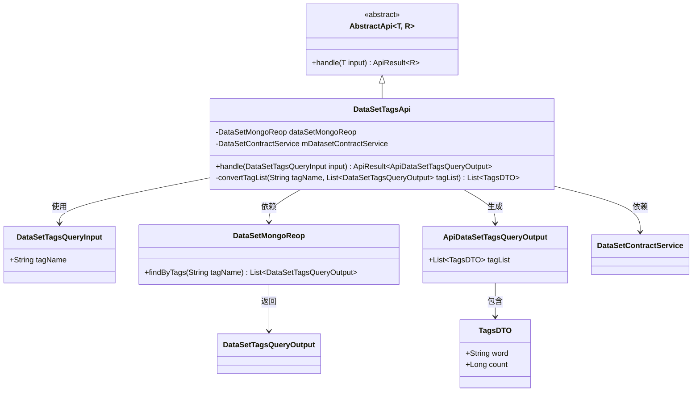

# 基础信息

|      |      |
|------|------|
| 名称 | DataSetTagsApi |
| 编码语言 | .java |
| 代码路径 | WeFe/manager/manager-service/src/main/java/com/welab/wefe/manager/service/api/dataset/DataSetTagsApi.java |
| 包名 | com.welab.wefe.manager.service.api.dataset |
| 依赖项 | ['com.welab.wefe.common.data.mongodb.dto.dataset.DataSetTagsQueryOutput', 'com.welab.wefe.common.data.mongodb.repo.DataSetMongoReop', 'com.welab.wefe.common.util.StringUtil', 'com.welab.wefe.common.web.api.base.AbstractApi', 'com.welab.wefe.common.web.api.base.Api', 'com.welab.wefe.common.web.dto.ApiResult', 'com.welab.wefe.manager.service.dto.tag.ApiDataSetTagsQueryOutput', 'com.welab.wefe.manager.service.dto.tag.DataSetTagsQueryInput', 'com.welab.wefe.manager.service.dto.tag.TagsDTO', 'com.welab.wefe.manager.service.service.DataSetContractService', 'org.springframework.beans.factory.annotation.Autowired', 'java.util', 'java.util.stream.Collectors'] |
| 概述说明 | 数据集标签查询API类，通过MongoDB和合约服务查询标签数据，处理输入并返回去重排序后的标签列表及计数。 |

# 说明

这是一个名为DataSetTagsApi的Java类，用于处理数据集标签查询。它继承自AbstractApi，接收DataSetTagsQueryInput输入并返回ApiDataSetTagsQueryOutput。类中注入了DataSetMongoReop和DataSetContractService两个依赖。主要逻辑在handle方法中，通过dataSetMongoReop根据标签名查询数据，然后使用convertTagList方法处理结果：分割标签、去重、排序，并统计每个标签的出现次数，最后转换为TagsDTO列表返回。整个过程实现了基于标签名的数据集查询和统计功能。

# 类列表 Class Summary

| 名称   | 类型  | 说明 |
|-------|------|-------------|
| DataSetTagsApi | class | 数据集标签查询API，通过标签名从MongoDB获取数据集，处理后返回去重排序的标签列表及出现次数。 |

## 类 DataSetTagsApi

|      |      |
|------|------|
| 访问范围 | @Api(path = "data_set/tags/query", name = "dataset_tags_query");public |
| 类型 | class |
| 名称 | DataSetTagsApi |
| 说明 | 数据集标签查询API，通过标签名从MongoDB获取数据集，处理后返回去重排序的标签列表及出现次数。 |

### UML类图

这段代码展示了一个数据集标签查询API的实现。DataSetTagsApi继承自泛型抽象类AbstractApi，通过Autowired注入DataSetMongoReop和DataSetContractService两个依赖服务。主要功能是处理包含标签名的查询请求，从MongoDB中获取匹配的数据集标签记录，经过流式处理去重、过滤和统计后，转换为包含标签词频统计的DTO列表返回。convertTagList方法实现了核心的业务逻辑，包括标签分割、空值过滤、关键词匹配和词频统计功能。

### 内部方法调用关系图

流程图描述：该流程图展示了DataSetTagsApi类的完整处理流程。从入口方法handle开始，首先通过dataSetMongoReop查询数据，然后创建输出对象并设置经过convertTagList方法处理的标签列表。convertTagList方法包含复杂的流式处理逻辑，包括标签分割、过滤、去重和计数，最终生成TagsDTO列表返回。整个过程体现了从数据查询到结果转换的完整业务逻辑。

### 字段列表 Field List

| 名称  | 类型  | 说明 |
|-------|-------|------|
| dataSetMongoReop | DataSetMongoReop | 使用@Autowired自动注入DataSetMongoReop仓库实例。 |
| mDatasetContractService | DataSetContractService | 使用@Autowired自动注入DataSetContractService实例变量mDatasetContractService。 |

### 方法列表

| 名称  | 类型  | 说明 |
|-------|-------|------|
| handle | ApiResult<ApiDataSetTagsQueryOutput> | 该方法处理数据集标签查询，通过输入标签名从MongoDB获取匹配列表，转换后返回成功结果。 |
| convertTagList | List<TagsDTO> | 将数据库标签字段拆分、去重、排序后，根据输入标签名过滤并统计出现次数，返回标签DTO列表。 |

