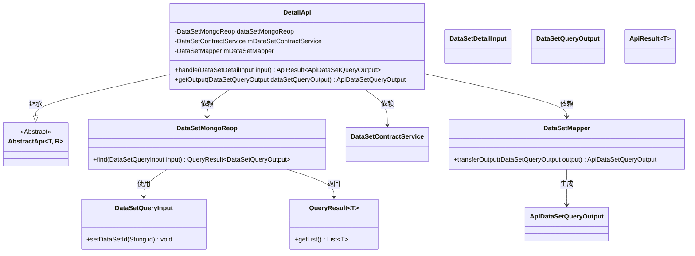
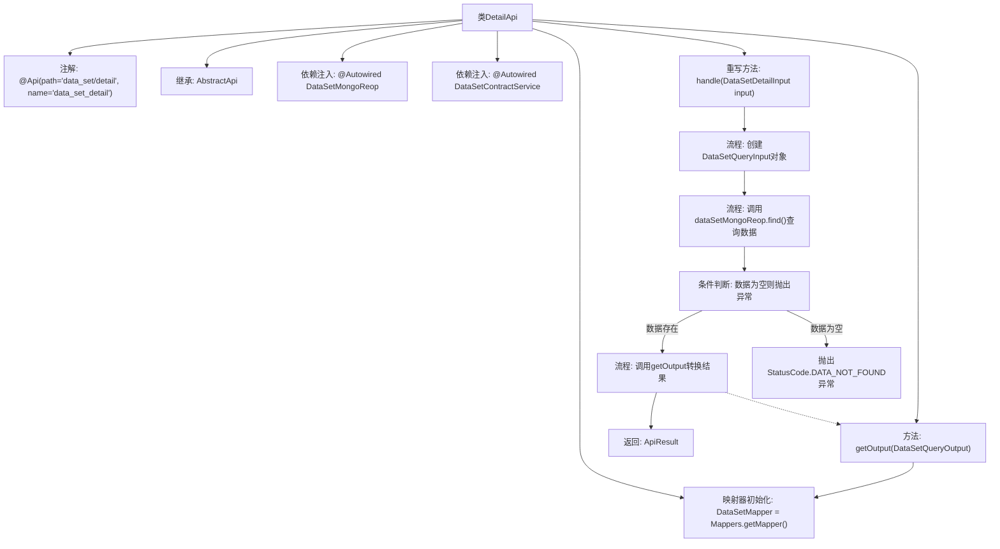

# 基础信息

|      |      |
|------|------|
| 名称 | DetailApi |
| 编码语言 | .java |
| 代码路径 | WeFe/manager/manager-service/src/main/java/com/welab/wefe/manager/service/api/dataset/DetailApi.java |
| 包名 | com.welab.wefe.manager.service.api.dataset |
| 依赖项 | ['com.welab.wefe.common.StatusCode', 'com.welab.wefe.common.data.mongodb.dto.dataset.DataSetQueryInput', 'com.welab.wefe.common.data.mongodb.dto.dataset.DataSetQueryOutput', 'com.welab.wefe.common.data.mongodb.repo.DataSetMongoReop', 'com.welab.wefe.common.exception.StatusCodeWithException', 'com.welab.wefe.common.web.api.base.AbstractApi', 'com.welab.wefe.common.web.api.base.Api', 'com.welab.wefe.common.web.dto.ApiResult', 'com.welab.wefe.manager.service.dto.dataset.ApiDataSetQueryOutput', 'com.welab.wefe.manager.service.dto.dataset.DataSetDetailInput', 'com.welab.wefe.manager.service.mapper.DataSetMapper', 'com.welab.wefe.manager.service.service.DataSetContractService', 'org.mapstruct.factory.Mappers', 'org.springframework.beans.factory.annotation.Autowired', 'java.util.List'] |
| 概述说明 | DetailApi类处理数据集详情查询，通过MongoDB和映射器获取数据，若数据不存在则抛出异常。 |

# 说明

该代码定义了一个名为DetailApi的API类，用于处理数据集详情查询请求。类继承自AbstractApi，指定了输入类型DataSetDetailInput和输出类型ApiDataSetQueryOutput。通过Autowired注入了DataSetMongoReop和DataSetContractService两个依赖组件，并使用DataSetMapper进行对象转换。主要逻辑在handle方法中实现：根据输入ID查询MongoDB，若无结果则抛出DATA_NOT_FOUND异常，否则通过getOutput方法转换查询结果并返回成功响应。整个类标注了Api注解，路径为data_set/detail。

# 类列表 Class Summary

| 名称   | 类型  | 说明 |
|-------|------|-------------|
| DetailApi | class | DetailApi类处理数据集详情查询，通过MongoDB和ContractService获取数据，若数据不存在则抛出异常，最终返回转换后的查询结果。 |

## 类 DetailApi

|      |      |
|------|------|
| 访问范围 | @Api(path = "data_set/detail", name = "data_set_detail");public |
| 类型 | class |
| 名称 | DetailApi |
| 说明 | DetailApi类处理数据集详情查询，通过MongoDB和ContractService获取数据，若数据不存在则抛出异常，最终返回转换后的查询结果。 |

### UML类图

类图描述：DetailApi继承自泛型抽象类AbstractApi，通过Autowired注入DataSetMongoReop和DataSetContractService依赖，并持有DataSetMapper实例。核心方法handle处理DataSetDetailInput参数，调用MongoDB查询并转换结果，getOutput方法通过Mapper实现DTO转换。整体实现数据集详情查询的API逻辑，包含数据访问、业务逻辑和DTO映射三层协作。

### 内部方法调用关系图

该流程图展示了DetailApi类的核心结构和处理流程。类继承AbstractApi并标注API元数据，通过依赖注入获取数据访问组件。主要逻辑在handle方法中：先构建查询参数，通过MongoDB查询数据，校验结果非空后，使用Mapper转换数据格式，最终返回API响应。异常情况下会抛出预定义状态码异常，体现了完整的数据查询和转换处理链。

### 字段列表 Field List

| 名称  | 类型  | 说明 |
|-------|-------|------|
| mDataSetMapper = Mappers.getMapper(DataSetMapper.class) | DataSetMapper | 定义受保护变量mDataSetMapper，通过Mappers.getMapper获取DataSetMapper类实例。 |
| mDataSetContractService | DataSetContractService | 使用@Autowired自动注入DataSetContractService实例。 |
| dataSetMongoReop | DataSetMongoReop | 使用@Autowired自动注入DataSetMongoReop数据仓库实例。 |

### 方法列表

| 名称  | 类型  | 说明 |
|-------|-------|------|
| getOutput | ApiDataSetQueryOutput | 该方法将DataSetQueryOutput转换为ApiDataSetQueryOutput并返回结果。 |
| handle | ApiResult<ApiDataSetQueryOutput> | 处理数据集查询请求，检查结果非空后返回首个数据项，若空则抛出异常。 |

