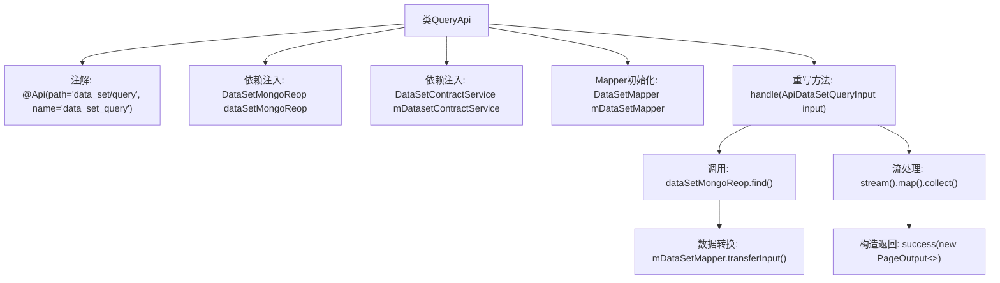

# 基础信息

|      |      |
|------|------|
| 名称 | QueryApi |
| 编码语言 | .java |
| 代码路径 | WeFe/manager/manager-service/src/main/java/com/welab/wefe/manager/service/api/dataset/QueryApi.java |
| 包名 | com.welab.wefe.manager.service.api.dataset |
| 依赖项 | ['com.welab.wefe.common.data.mongodb.dto.PageOutput', 'com.welab.wefe.common.data.mongodb.dto.dataset.DataSetQueryOutput', 'com.welab.wefe.common.data.mongodb.repo.DataSetMongoReop', 'com.welab.wefe.common.web.api.base.AbstractApi', 'com.welab.wefe.common.web.api.base.Api', 'com.welab.wefe.common.web.dto.ApiResult', 'com.welab.wefe.manager.service.dto.dataset.ApiDataSetQueryInput', 'com.welab.wefe.manager.service.dto.dataset.ApiDataSetQueryOutput', 'com.welab.wefe.manager.service.mapper.DataSetMapper', 'com.welab.wefe.manager.service.service.DataSetContractService', 'org.mapstruct.factory.Mappers', 'org.springframework.beans.factory.annotation.Autowired', 'java.util.List', 'java.util.stream.Collectors'] |
| 概述说明 | 这是一个名为QueryApi的Java类，用于处理数据集查询请求。它继承自AbstractApi，接收ApiDataSetQueryInput输入，返回分页的ApiDataSetQueryOutput结果。通过DataSetMongoReop和DataSetContractService进行数据操作，使用DataSetMapper进行输入输出转换。 |

# 说明

这是一个名为QueryApi的Java类，继承自AbstractApi，用于处理数据集查询请求。类上标注了Api注解，指定路径为"data_set/query"。它注入了DataSetMongoReop和DataSetContractService两个依赖，并初始化了DataSetMapper映射器。核心方法handle接收ApiDataSetQueryInput输入参数，通过MongoDB仓库查询数据，使用映射器转换输入输出，最终返回分页格式的ApiResult结果，包含页码、总数、页大小、总页数和转换后的数据列表。整个过程实现了从输入到输出的完整数据处理流程。

# 类列表 Class Summary

| 名称   | 类型  | 说明 |
|-------|------|-------------|
| QueryApi | class | 这是一个查询数据集的API类，通过MongoDB存储库获取数据，使用映射器转换输入输出，返回分页结果。 |


## 类 QueryApi

|      |      |
|------|------|
| 访问范围 | @Api(path = "data_set/query", name = "data_set_query");public |
| 类型 | class |
| 名称 | QueryApi |
| 说明 | 这是一个查询数据集的API类，通过MongoDB存储库获取数据，使用映射器转换输入输出，返回分页结果。 |


### UML类图

```mermaid
classDiagram
    class QueryApi {
        -DataSetMongoReop dataSetMongoReop
        -DataSetContractService mDatasetContractService
        -DataSetMapper mDataSetMapper
        +handle(ApiDataSetQueryInput input) ApiResult~PageOutput~ApiDataSetQueryOutput~~
    }
    class AbstractApi~T, R~ {
        <<Abstract>>
        +handle(T input) R
    }
    class ApiDataSetQueryInput
    class PageOutput~T~ {
        +List~T~ list
        +int pageIndex
        +long total
        +int pageSize
        +int totalPage
    }
    class ApiDataSetQueryOutput
    class DataSetQueryOutput
    class DataSetMapper {
        +transferInput(ApiDataSetQueryInput) DataSetQueryInput
        +transferOutput(DataSetQueryOutput) ApiDataSetQueryOutput
    }
    class DataSetMongoReop {
        +find(DataSetQueryInput) PageOutput~DataSetQueryOutput~
    }
    class DataSetContractService

    QueryApi --|> AbstractApi~ApiDataSetQueryInput, PageOutput~ApiDataSetQueryOutput~~ : 继承
    QueryApi --> DataSetMongoReop : 依赖
    QueryApi --> DataSetContractService : 依赖
    QueryApi --> DataSetMapper : 依赖
    DataSetMapper --> ApiDataSetQueryInput : 转换
    DataSetMapper --> DataSetQueryOutput : 转换
    DataSetMapper --> ApiDataSetQueryOutput : 转换
    DataSetMongoReop --> PageOutput~DataSetQueryOutput~ : 返回
```

这段代码展示了一个查询API的实现类QueryApi，它继承自泛型抽象类AbstractApi，处理数据集查询请求。QueryApi通过依赖注入使用DataSetMongoReop进行MongoDB查询，并借助DataSetMapper实现输入输出类型转换。核心流程包括：将API输入转换为查询条件，执行分页查询，再将结果转换为API输出格式。类图清晰地呈现了各组件间的依赖关系和类型转换逻辑，体现了分层架构和职责分离的设计思想。


### 内部方法调用关系图



该流程图展示了QueryApi类的核心结构和处理流程。类通过注解定义API路径，注入MongoDB仓库和服务依赖，初始化数据转换Mapper。主要业务逻辑在handle方法中实现：先通过Mapper转换输入参数并查询MongoDB，接着用流处理转换输出数据，最后构造分页响应结果。整个过程体现了从输入参数到分页输出的完整数据处理链。

### 字段列表 Field List

| 名称  | 类型  | 说明 |
|-------|-------|------|
| mDatasetContractService | DataSetContractService | 自动注入受保护的数据集合约服务实例。 |
| dataSetMongoReop | DataSetMongoReop | 使用@Autowired自动注入DataSetMongoReop数据仓库实例。 |
| mDataSetMapper = Mappers.getMapper(DataSetMapper.class) | DataSetMapper | 声明并初始化一个受保护的数据集映射器实例，使用Mapper工具类获取映射类对象。 |

### 方法列表

| 名称  | 类型  | 说明 |
|-------|-------|------|
| handle | ApiResult<PageOutput<ApiDataSetQueryOutput>> | 该方法处理数据集查询请求，将输入参数转换为查询条件，从MongoDB获取分页结果，转换输出格式后返回分页数据。 |


