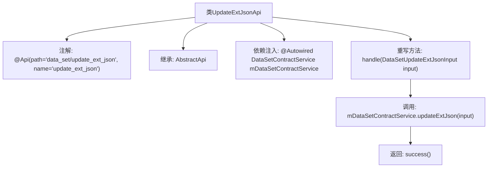

# 基础信息

|      |      |
|------|------|
| 名称 | UpdateExtJsonApi |
| 编码语言 | .java |
| 代码路径 | WeFe/manager/manager-service/src/main/java/com/welab/wefe/manager/service/api/dataset/UpdateExtJsonApi.java |
| 包名 | com.welab.wefe.manager.service.api.dataset |
| 依赖项 | ['com.welab.wefe.common.exception.StatusCodeWithException', 'com.welab.wefe.common.web.api.base.AbstractApi', 'com.welab.wefe.common.web.api.base.Api', 'com.welab.wefe.common.web.dto.AbstractApiOutput', 'com.welab.wefe.common.web.dto.ApiResult', 'com.welab.wefe.manager.service.dto.dataset.DataSetUpdateExtJsonInput', 'com.welab.wefe.manager.service.service.DataSetContractService', 'org.springframework.beans.factory.annotation.Autowired'] |
| 概述说明 | 这是一个名为UpdateExtJsonApi的API类，用于处理数据集扩展JSON的更新请求。它继承自AbstractApi，接受DataSetUpdateExtJsonInput输入并返回AbstractApiOutput。通过调用mDataSetContractService的updateExtJson方法实现功能。 |

# 说明

这是一个名为UpdateExtJsonApi的API类，用于更新数据集的外部JSON信息。它继承自AbstractApi基类，接收DataSetUpdateExtJsonInput类型的输入参数，返回AbstractApiOutput类型的结果。类中注入了DataSetContractService服务，并通过其updateExtJson方法处理业务逻辑。API路径为"data_set/update_ext_json"，处理过程中可能抛出StatusCodeWithException异常。

# 类列表 Class Summary

| 名称   | 类型  | 说明 |
|-------|------|-------------|
| UpdateExtJsonApi | class | 这是一个名为UpdateExtJsonApi的API类，用于处理数据集外部JSON更新请求。它继承自AbstractApi，接受DataSetUpdateExtJsonInput输入并返回AbstractApiOutput。通过调用mDataSetContractService的updateExtJson方法完成核心逻辑。 |


## 类 UpdateExtJsonApi

|      |      |
|------|------|
| 访问范围 | @Api(path = "data_set/update_ext_json", name = "update_ext_json");public |
| 类型 | class |
| 名称 | UpdateExtJsonApi |
| 说明 | 这是一个名为UpdateExtJsonApi的API类，用于处理数据集外部JSON更新请求。它继承自AbstractApi，接受DataSetUpdateExtJsonInput输入并返回AbstractApiOutput。通过调用mDataSetContractService的updateExtJson方法完成核心逻辑。 |


### UML类图

```mermaid
classDiagram
    class AbstractApi~T, R~ {
        <<Abstract>>
        +handle(T input) ApiResult~R~
    }
    // AbstractApi是泛型基类，定义核心处理逻辑

    class UpdateExtJsonApi {
        -DataSetContractService mDataSetContractService
        +handle(DataSetUpdateExtJsonInput input) ApiResult~AbstractApiOutput~
    }
    // 实现具体业务逻辑的API类

    class DataSetUpdateExtJsonInput {
        // 输入参数DTO
    }

    class AbstractApiOutput {
        <<Abstract>>
        // 基础输出类型
    }

    class DataSetContractService {
        <<Interface>>
        +updateExtJson(DataSetUpdateExtJsonInput input)
    }
    // 数据服务契约接口

    UpdateExtJsonApi --|> AbstractApi : 继承
    UpdateExtJsonApi --> DataSetContractService : 依赖
    UpdateExtJsonApi ..> DataSetUpdateExtJsonInput : 使用
    UpdateExtJsonApi ..> AbstractApiOutput : 使用
```

这段代码展示了一个基于抽象模板的API实现结构。UpdateExtJsonApi继承自泛型抽象类AbstractApi，通过依赖注入获取DataSetContractService服务实例，实现了处理DataSetUpdateExtJsonInput输入参数的核心业务逻辑。类图中清晰呈现了继承关系、接口依赖以及输入输出类型的关联，体现了典型的模板方法模式在API开发中的应用。


### 内部方法调用关系图



该流程图展示了UpdateExtJsonApi类的核心结构，这是一个继承自AbstractApi的API实现类，通过@Api注解定义接口路径。主要逻辑在handle方法中，先调用mDataSetContractService的updateExtJson方法处理输入参数，最后返回成功结果。类通过@Autowired自动注入DataSetContractService服务依赖。

### 字段列表 Field List

| 名称  | 类型  | 说明 |
|-------|-------|------|
| mDataSetContractService | DataSetContractService | 自动注入数据集合约服务实例。 |

### 方法列表

| 名称  | 类型  | 说明 |
|-------|-------|------|
| handle | ApiResult<AbstractApiOutput> | 该方法重写父类逻辑，调用服务更新数据集扩展JSON，成功时返回空结果。 |


