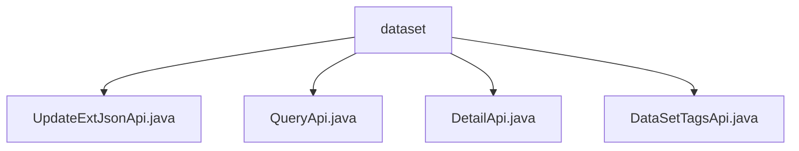

# 基础信息

|      |      |
|------|------|
| 名称 | dataset |
| 编码语言 | .java |
| 代码路径 | WeFe/manager/manager-service/src/main/java/com/welab/wefe/manager/service/api/dataset |
| 包名 | docs.manager.manager-service.src.main.java.com.welab.wefe.manager.service.api.dataset |
| 概述说明 | 四个API类：UpdateExtJsonApi更新数据集JSON，QueryApi查询数据集，DetailApi获取详情，DataSetTagsApi处理标签查询。均继承AbstractApi，注入服务处理逻辑，指定路径并返回结果。 |

# 说明

## 概述  
该模块核心职责为提供数据集管理功能，包括更新JSON元信息、查询数据集、获取详情及标签统计。接口规范遵循统一设计：继承AbstractApi基类，使用Api注解定义路径（如"data_set/update_ext_json"），输入输出均为特定DTO类型（例如DataSetUpdateExtJsonInput）。  

关键数据结构包含DataSetUpdateExtJsonInput、ApiDataSetQueryOutput等，通过DataSetMapper实现对象转换。外部依赖包括DataSetContractService（合约服务）和DataSetMongoReop（MongoDB操作），例如DetailApi通过MongoDB查询详情数据。  

## 主要业务场景  
模块支持典型数据集操作流程：更新元信息（UpdateExtJsonApi）、分页查询（QueryApi）、详情获取（DetailApi）和标签分析（DataSetTagsApi）。交互模式类似CRUD增强版，如DataSetTagsApi实现标签统计时进行分割、去重和排序。  

功能完整性体现在全链路处理：输入验证→数据操作→结果转换→异常处理（如DATA_NOT_FOUND）。典型应用包括数据检索（QueryApi）和标签云生成（DataSetTagsApi）。API类型涵盖写操作（UpdateExtJsonApi）和读操作（DetailApi），集成案例如通过MongoDB和合约服务协同处理数据。

### 包内部结构视图

该流程图展示了数据集服务API的层级结构，根节点为dataset文件夹，包含四个具体的API实现文件：UpdateExtJsonApi、QueryApi、DetailApi和DataSetTagsApi。这些文件都位于同一层级，直接隶属于dataset目录下，没有更深层次的嵌套关系。

# 文件列表

| 名称   | 类型  | 说明 |
|-------|------|-------------|
| [UpdateExtJsonApi.java](UpdateExtJsonApi.md) | file | 这是一个名为UpdateExtJsonApi的API类，用于处理数据集扩展JSON的更新请求。它继承自AbstractApi，接受DataSetUpdateExtJsonInput输入并返回AbstractApiOutput。通过调用mDataSetContractService的updateExtJson方法实现功能。 |
| [QueryApi.java](QueryApi.md) | file | 这是一个名为QueryApi的Java类，用于处理数据集查询请求。它继承自AbstractApi，接收ApiDataSetQueryInput输入，返回分页的ApiDataSetQueryOutput结果。通过DataSetMongoReop和DataSetContractService进行数据操作，使用DataSetMapper进行输入输出转换。 |
| [DetailApi.java](DetailApi.md) | file | DetailApi类处理数据集详情查询，通过MongoDB和映射器获取数据，若数据不存在则抛出异常。 |
| [DataSetTagsApi.java](DataSetTagsApi.md) | file | 数据集标签查询API类，通过MongoDB和合约服务查询标签数据，处理输入并返回去重排序后的标签列表及计数。 |

