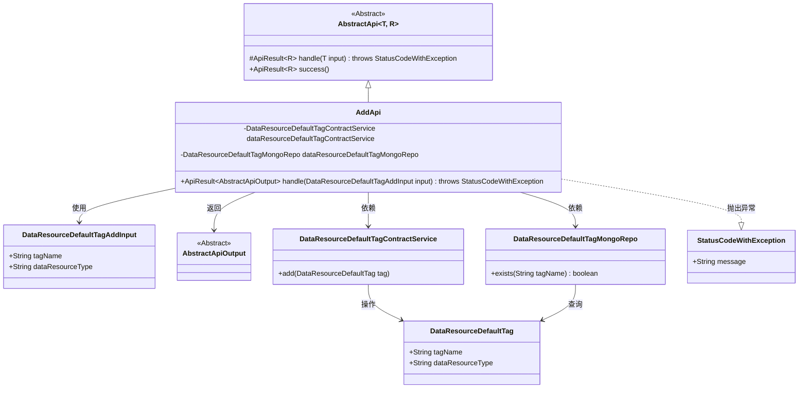
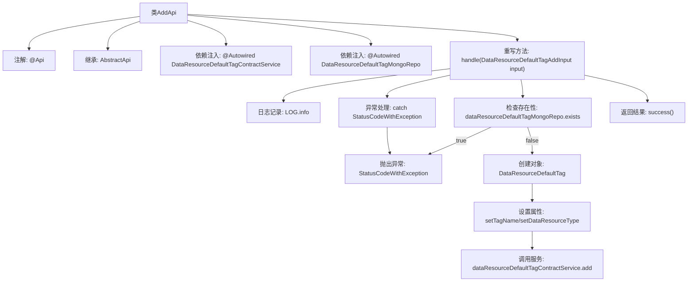

# 基础信息

|      |      |
|------|------|
| 名称 | AddApi |
| 编码语言 | .java |
| 代码路径 | WeFe/manager/manager-service/src/main/java/com/welab/wefe/manager/service/api/defaulttag/AddApi.java |
| 包名 | com.welab.wefe.manager.service.api.defaulttag |
| 依赖项 | ['com.welab.wefe.common.StatusCode', 'com.welab.wefe.common.data.mongodb.entity.union.DataResourceDefaultTag', 'com.welab.wefe.common.data.mongodb.repo.DataResourceDefaultTagMongoRepo', 'com.welab.wefe.common.exception.StatusCodeWithException', 'com.welab.wefe.common.web.api.base.AbstractApi', 'com.welab.wefe.common.web.api.base.Api', 'com.welab.wefe.common.web.dto.AbstractApiOutput', 'com.welab.wefe.common.web.dto.ApiResult', 'com.welab.wefe.manager.service.dto.tag.DataResourceDefaultTagAddInput', 'com.welab.wefe.manager.service.service.DataResourceDefaultTagContractService', 'org.springframework.beans.factory.annotation.Autowired'] |
| 概述说明 | 这是一个Java类AddApi，用于添加默认标签。它检查标签是否存在，不存在则创建新标签，存在则抛出异常。使用MongoDB存储和验证数据。 |

# 说明

这是一个名为AddApi的Java类，用于处理添加默认标签的API请求。它继承自AbstractApi类，接受DataResourceDefaultTagAddInput作为输入，返回AbstractApiOutput。类中注入了DataResourceDefaultTagContractService和DataResourceDefaultTagMongoRepo两个服务。主要逻辑在handle方法中实现：首先检查标签是否已存在，若存在则抛出异常；否则创建新标签对象并设置名称和类型，最后调用服务添加标签。处理过程中会捕获并重新抛出异常，成功时返回成功结果。

# 类列表 Class Summary

| 名称   | 类型  | 说明 |
|-------|------|-------------|
| AddApi | class | 这是一个添加默认标签的API类，检查标签名是否存在，不存在则创建新标签，存在则抛出异常。 |

## 类 AddApi

|      |      |
|------|------|
| 访问范围 | @Api(path = "data_resource/default_tag/add", name = "default_tag_add");public |
| 类型 | class |
| 名称 | AddApi |
| 说明 | 这是一个添加默认标签的API类，检查标签名是否存在，不存在则创建新标签，存在则抛出异常。 |

### UML类图

类图描述：该图展示了AddApi类继承自泛型抽象类AbstractApi，并依赖DataResourceDefaultTagContractService和DataResourceDefaultTagMongoRepo两个服务类。AddApi处理DataResourceDefaultTagAddInput输入参数，返回AbstractApiOutput结果，可能抛出StatusCodeWithException异常。DataResourceDefaultTag作为数据实体被服务和仓库类操作，体现了标签添加功能的完整调用链。

### 内部方法调用关系图

该流程图展示了AddApi类的核心处理流程。首先通过注解定义API路径，继承抽象父类并注入两个服务依赖。主要逻辑在handle方法中实现：先检查标签是否存在，存在则抛异常；不存在则创建新标签对象并设置属性，通过合约服务完成添加操作。整个过程包含异常处理和日志记录，最终返回成功结果。流程清晰展现了数据校验、业务处理和异常管理的完整链路。

### 字段列表 Field List

| 名称  | 类型  | 说明 |
|-------|-------|------|
| dataResourceDefaultTagMongoRepo | DataResourceDefaultTagMongoRepo | 使用@Autowired自动注入DataResourceDefaultTagMongoRepo实例。 |
| dataResourceDefaultTagContractService | DataResourceDefaultTagContractService | 自动注入默认标签合约服务实例。 |

### 方法列表

| 名称  | 类型  | 说明 |
|-------|-------|------|
| handle | ApiResult<AbstractApiOutput> | 处理添加默认标签请求，检查标签名是否存在，存在则报错，否则创建新标签并保存。异常时返回系统错误。 |

