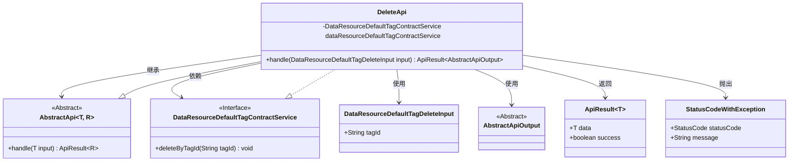
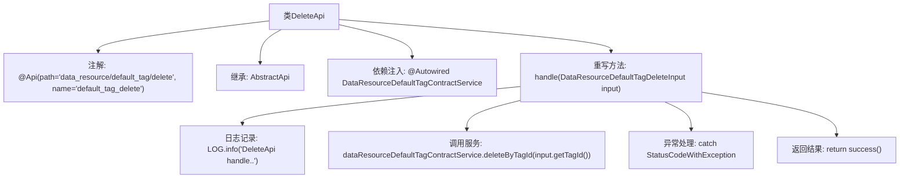

# 基础信息

|      |      |
|------|------|
| 名称 | DeleteApi |
| 编码语言 | .java |
| 代码路径 | WeFe/manager/manager-service/src/main/java/com/welab/wefe/manager/service/api/defaulttag/DeleteApi.java |
| 包名 | com.welab.wefe.manager.service.api.defaulttag |
| 依赖项 | ['com.welab.wefe.common.StatusCode', 'com.welab.wefe.common.exception.StatusCodeWithException', 'com.welab.wefe.common.web.api.base.AbstractApi', 'com.welab.wefe.common.web.api.base.Api', 'com.welab.wefe.common.web.dto.AbstractApiOutput', 'com.welab.wefe.common.web.dto.ApiResult', 'com.welab.wefe.manager.service.dto.tag.DataResourceDefaultTagDeleteInput', 'com.welab.wefe.manager.service.service.DataResourceDefaultTagContractService', 'org.springframework.beans.factory.annotation.Autowired'] |
| 概述说明 | DeleteApi类处理删除默认标签请求，调用dataResourceDefaultTagContractService的deleteByTagId方法，捕获异常并返回成功或错误状态。 |

# 说明

这是一个名为DeleteApi的Java类，用于处理默认标签删除的API请求。它继承自AbstractApi基类，接收DataResourceDefaultTagDeleteInput作为输入参数，返回AbstractApiOutput类型结果。类中注入了DataResourceDefaultTagContractService服务，通过调用其deleteByTagId方法实现标签删除功能。处理过程中会记录日志，并捕获可能出现的StatusCodeWithException异常，转换为系统错误状态码后重新抛出。成功执行后会返回成功状态。

# 类列表 Class Summary

| 名称   | 类型  | 说明 |
|-------|------|-------------|
| DeleteApi | class | 这是一个删除默认标签的API类，通过调用服务层方法根据标签ID删除数据，处理异常并返回成功结果。 |

## 类 DeleteApi

|      |      |
|------|------|
| 访问范围 | @Api(path = "data_resource/default_tag/delete", name = "default_tag_delete");public |
| 类型 | class |
| 名称 | DeleteApi |
| 说明 | 这是一个删除默认标签的API类，通过调用服务层方法根据标签ID删除数据，处理异常并返回成功结果。 |

### UML类图

这段代码展示了一个删除API的实现类DeleteApi，它继承自泛型抽象类AbstractApi，处理DataResourceDefaultTagDeleteInput类型的输入并返回ApiResult<AbstractApiOutput>。该类通过依赖注入的DataResourceDefaultTagContractService接口实现删除逻辑，可能抛出StatusCodeWithException异常。类图清晰地展示了继承关系、依赖关系和类型参数的使用，体现了Spring风格的API控制器实现方式。

### 内部方法调用关系图

该流程图展示了DeleteApi类的核心结构和工作流程。类通过@Api注解定义API路径，继承AbstractApi模板类并注入DataResourceDefaultTagContractService服务。主要处理逻辑在handle方法中：先记录日志，然后调用服务删除标签，捕获异常时包装为系统错误，最后返回成功响应。整个流程体现了标准的API处理模式，包含输入参数验证、业务操作、异常处理和结果返回等关键环节。

### 字段列表 Field List

| 名称  | 类型  | 说明 |
|-------|-------|------|
| dataResourceDefaultTagContractService | DataResourceDefaultTagContractService | 自动注入默认标签合约服务实例。 |

### 方法列表

| 名称  | 类型  | 说明 |
|-------|-------|------|
| handle | ApiResult<AbstractApiOutput> | 该方法处理删除默认标签请求，调用服务删除指定标签ID，捕获异常并返回成功或系统错误。 |

