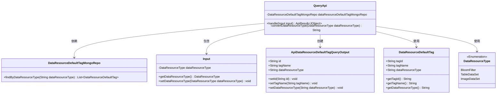
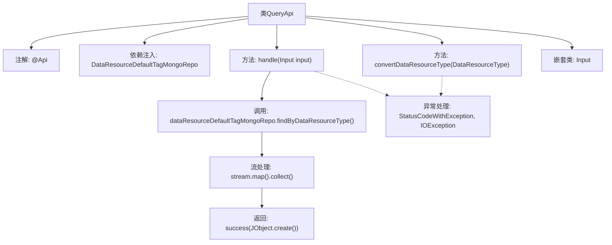
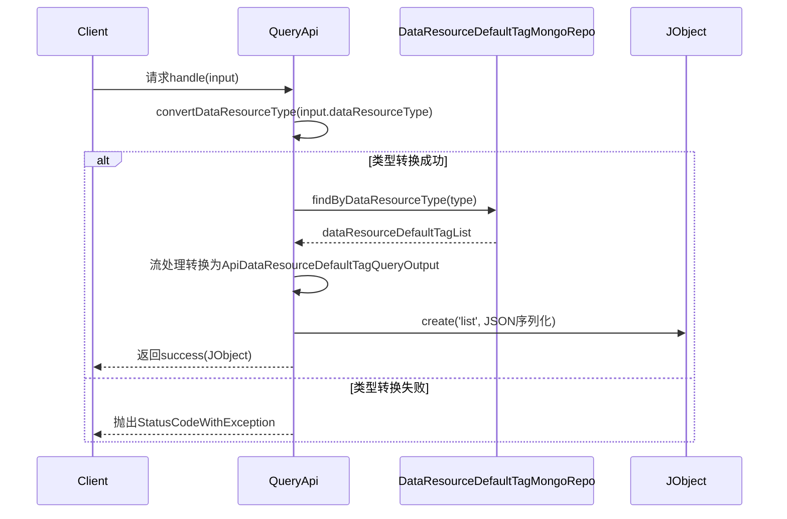

# 基础信息

|      |      |
|------|------|
| 名称 | QueryApi |
| 编码语言 | .java |
| 代码路径 | WeFe/manager/manager-service/src/main/java/com/welab/wefe/manager/service/api/defaulttag/QueryApi.java |
| 包名 | com.welab.wefe.manager.service.api.defaulttag |
| 依赖项 | ['com.welab.wefe.common.StatusCode', 'com.welab.wefe.common.data.mongodb.entity.union.DataResourceDefaultTag', 'com.welab.wefe.common.data.mongodb.repo.DataResourceDefaultTagMongoRepo', 'com.welab.wefe.common.exception.StatusCodeWithException', 'com.welab.wefe.common.util.JObject', 'com.welab.wefe.common.web.api.base.AbstractApi', 'com.welab.wefe.common.web.api.base.Api', 'com.welab.wefe.common.web.dto.ApiResult', 'com.welab.wefe.common.wefe.enums.DataResourceType', 'com.welab.wefe.manager.service.dto.base.BaseInput', 'com.welab.wefe.manager.service.dto.tag.ApiDataResourceDefaultTagQueryOutput', 'org.springframework.beans.factory.annotation.Autowired', 'java.io.IOException', 'java.util.List', 'java.util.stream.Collectors'] |
| 概述说明 | 查询API类，通过MongoDB获取数据资源默认标签列表，支持按类型筛选并返回JSON格式结果。输入含资源类型参数，处理时进行类型转换。 |

# 说明

该代码定义了一个名为QueryApi的API类，用于查询默认标签数据。API路径为"data_resource/default_tag/query"，无需登录。它继承自AbstractApi，输入类型为Input，输出为JObject。主要功能是通过DataResourceDefaultTagMongoRepo从MongoDB查询数据，根据输入的数据资源类型过滤结果，并将查询结果转换为ApiDataResourceDefaultTagQueryOutput对象列表返回。convertDataResourceType方法处理数据资源类型的转换逻辑。Input内部类包含一个DataResourceType类型的字段dataResourceType及其getter和setter方法。

# 类列表 Class Summary

| 名称   | 类型  | 说明 |
|-------|------|-------------|
| QueryApi | class | 这是一个查询默认标签的API类，通过MongoDB存储库获取数据资源类型对应的标签列表，并转换为输出格式返回。支持多种数据资源类型转换处理。 |

## 类 QueryApi

|      |      |
|------|------|
| 访问范围 | @Api(path = "data_resource/default_tag/query", name = "default_tag_query", login = false);public |
| 类型 | class |
| 名称 | QueryApi |
| 说明 | 这是一个查询默认标签的API类，通过MongoDB存储库获取数据资源类型对应的标签列表，并转换为输出格式返回。支持多种数据资源类型转换处理。 |

### UML类图

这段代码定义了一个查询API类QueryApi，继承自AbstractApi，用于处理数据资源默认标签的查询请求。主要功能是通过DataResourceDefaultTagMongoRepo从数据库查询数据，并将结果转换为ApiDataResourceDefaultTagQueryOutput格式后返回。Input类作为输入参数，包含一个DataResourceType枚举类型的字段。代码中包含了类型转换逻辑和异常处理，整体结构清晰，职责明确。

### 内部方法调用关系图

该流程图展示了QueryApi类的核心结构，包含注解声明、依赖注入、主要业务方法handle()和类型转换方法convertDataResourceType()的处理流程。时序图详细描述了客户端请求到响应的完整过程，重点突出了数据资源类型转换、MongoDB查询、结果集转换和JSON序列化等关键步骤，同时包含异常处理路径。整个流程实现了根据输入参数查询默认标签数据并格式化输出的功能。

### 字段列表 Field List

| 名称  | 类型  | 说明 |
|-------|-------|------|
| dataResourceDefaultTagMongoRepo | DataResourceDefaultTagMongoRepo | 使用@Autowired自动注入DataResourceDefaultTagMongoRepo实例。 |

### 方法列表

| 名称  | 类型  | 说明 |
|-------|-------|------|
| handle | ApiResult<JObject> | 方法根据输入查询数据资源默认标签列表，转换后返回JSON格式结果。处理可能抛出异常。 |
| convertDataResourceType | String | 该方法将DataResourceType枚举转换为字符串。若为BloomFilter或TableDataSet返回TableDataSet，ImageDataSet返回自身，其他情况抛出异常。 |

