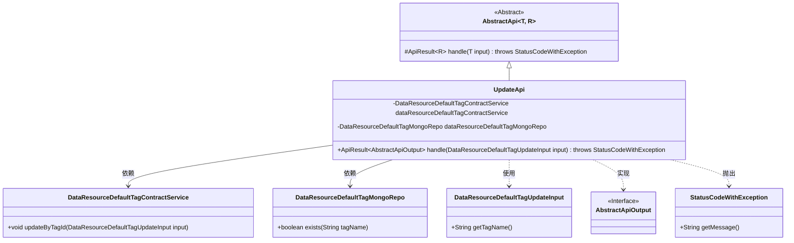
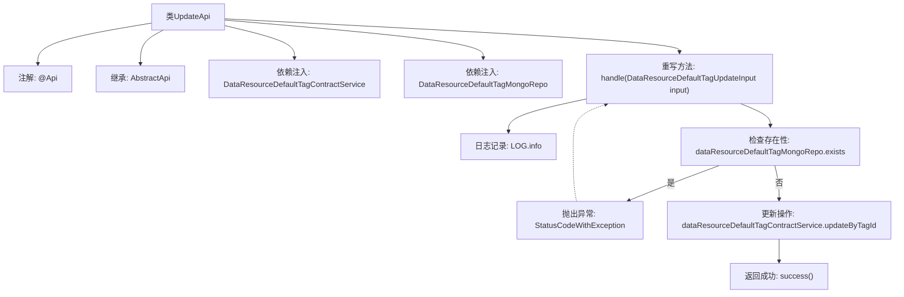

# 基础信息

|      |      |
|------|------|
| 名称 | UpdateApi |
| 编码语言 | .java |
| 代码路径 | WeFe/manager/manager-service/src/main/java/com/welab/wefe/manager/service/api/defaulttag/UpdateApi.java |
| 包名 | com.welab.wefe.manager.service.api.defaulttag |
| 依赖项 | ['com.welab.wefe.common.StatusCode', 'com.welab.wefe.common.data.mongodb.repo.DataResourceDefaultTagMongoRepo', 'com.welab.wefe.common.exception.StatusCodeWithException', 'com.welab.wefe.common.web.api.base.AbstractApi', 'com.welab.wefe.common.web.api.base.Api', 'com.welab.wefe.common.web.dto.AbstractApiOutput', 'com.welab.wefe.common.web.dto.ApiResult', 'com.welab.wefe.manager.service.dto.tag.DataResourceDefaultTagUpdateInput', 'com.welab.wefe.manager.service.service.DataResourceDefaultTagContractService', 'org.springframework.beans.factory.annotation.Autowired'] |
| 概述说明 | 更新默认标签的API类，检查标签是否存在后调用服务更新，处理异常并返回结果。 |

# 说明

该代码定义了一个名为UpdateApi的类，用于处理默认标签更新请求。类路径为data_resource/default_tag/update，继承自AbstractApi，输入类型为DataResourceDefaultTagUpdateInput，输出为AbstractApiOutput。通过注入DataResourceDefaultTagContractService和DataResourceDefaultTagMongoRepo服务实现业务逻辑。主要功能包括检查标签是否存在，若存在则抛出异常，否则调用服务更新标签。异常处理捕获StatusCodeWithException并重新抛出系统错误。成功执行后返回成功结果。

# 类列表 Class Summary

| 名称   | 类型  | 说明 |
|-------|------|-------------|
| UpdateApi | class | 更新默认标签的API类，检查标签存在性后调用服务更新，异常时返回系统错误。 |

## 类 UpdateApi

|      |      |
|------|------|
| 访问范围 | @Api(path = "data_resource/default_tag/update", name = "default_tag_update");public |
| 类型 | class |
| 名称 | UpdateApi |
| 说明 | 更新默认标签的API类，检查标签存在性后调用服务更新，异常时返回系统错误。 |

### UML类图

这段代码展示了一个用于更新数据资源默认标签的API实现类UpdateApi，它继承自泛型抽象类AbstractApi。类图清晰地呈现了UpdateApi与周边组件的关系：通过Autowired注入DataResourceDefaultTagContractService和DataResourceDefaultTagMongoRepo两个服务类，处理DataResourceDefaultTagUpdateInput输入参数并返回AbstractApiOutput接口类型结果。其中包含对标签存在性的检查逻辑，以及异常处理机制，整体结构体现了典型的Spring Boot服务层设计模式。

### 内部方法调用关系图

该流程图描述了UpdateApi类的核心处理流程：首先通过注解定义API路径，继承抽象父类并注入两个服务依赖。核心方法handle()会先检查标签是否存在，存在则抛异常，否则执行更新操作后返回成功。图中清晰展示了条件分支和异常处理路径，体现了数据校验和业务逻辑的完整调用链。

### 字段列表 Field List

| 名称  | 类型  | 说明 |
|-------|-------|------|
| dataResourceDefaultTagContractService | DataResourceDefaultTagContractService | 自动注入默认标签合约服务实例。 |
| dataResourceDefaultTagMongoRepo | DataResourceDefaultTagMongoRepo | 使用@Autowired自动注入DataResourceDefaultTagMongoRepo实例。 |

### 方法列表

| 名称  | 类型  | 说明 |
|-------|-------|------|
| handle | ApiResult<AbstractApiOutput> | 处理数据资源默认标签更新，检查标签存在性，存在则报错，否则更新标签。异常时抛出系统错误。 |

